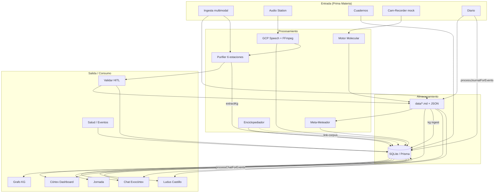

# Deprocast — Única Fuente de Verdad (SSOT)

> **Repositorio:** `deprocast2` · **Versión:** 0.1.0 · **Referencia:** 29 de junio de 2026  
> Documento maestro para humanos y agentes de IA. Describe el estado **verificable** del código actual.

---

## 1. Visión General del Producto

**Deprocast** es un **Exoesqueleto Cognitivo local-first**: una aplicación web que captura materia prima (audio, texto, tablas, imágenes, cuadernos, screen recordings, bookmarks de X), la procesa con IA bajo supervisión humana (HITL) y la convierte en conocimiento estructurado, proyectos y un grafo relacional — sin ceder soberanía de los datos.

**Propósito central:** cerrar el circuito **Información → Conocimiento → Acción** mediante:

- **Ingesta multimodal** en la máquina local (`data/`, SQLite).
- **Purificación y metadatos** con las *Siete Dimensiones* (materia, partícula, posición, onda, tiempo, espacio, field).
- **Grafo de conocimiento (KG)** y **Córtex** como nexo de indexación semántica.
- **Gamificación (Ludus)** y **Jornada** para traducir corpus validado en foco y micro-acción.
- **Agentes especializados** (STT, Purifier, Enciclopediador, Meta-Meteador, Exocórtex Chat) orquestados desde Next.js en `localhost:3000`.

La especificación de producto vive en `deprocast_master_plan.md` (Grimorio). El catálogo de agentes operativos está en `lib/agentes/catalog.ts` y `agentes.md`.

---

## 2. Arquitectura de Módulos Actuales

La navegación principal está definida en `components/app-header.tsx`. El dashboard raíz (`/`) es **El Córtex**, no un home genérico.

| Módulo | Ruta(s) | Funcionalidad Detectada | Estado Aparente |
|--------|---------|-------------------------|-----------------|
| **Córtex** | `/`, `/api/cortex` | Centro de control: snapshot de nodos `DocumentMeta`, sesgo semántico por áreas (Salud, Legal, Finanzas, Tecnología, Arte, Comunidad), filtros, ingesta rápida de estímulos | **Operativo** |
| **Ingesta** | `/ingesta`, `/ingesta/cuadernos` | Aduana multimodal: texto, audio, tablas (xlsx/csv), visión (OCR/PDF), bookmarks X; panel de gravedad dimensional | **Operativo** |
| **Audio / STT** | `/audio`, `/audio/[id]`, `/api/upload`, `/api/process/*`, `/api/audio-station/*` | Biblioteca de `AudioAsset`, deduplicación HITL, cola in-process, transcripción GCP Chirp_2 + FFmpeg | **Operativo** |
| **Cuadernos** | `/ingesta/cuadernos`, `/api/cuadernos/*` | Entidades físicas digitales: `Notebook` + `NotebookPage` con OCR, vectores semánticos/estructurales y quanta | **Operativo** |
| **Diario** | `/diario`, `/api/journal/*` | Entradas Markdown mensuales en `data/journal/`; ingesta al KG al guardar | **Operativo** |
| **Validar (Purifier HITL)** | `/validar`, `/api/purifier/*` | Pipeline de 6 estaciones (+ KG opcional): regex → semántica → dedup → esencias → archivista → segmentación; revisión en SQLite (`PurifierReview`) | **Operativo** |
| **Molecular** | `/molecular`, `/api/molecular/*` | Pipeline Chunkear → Calibrar → Validar partículas; persistencia en JSON local (`data/molecular/`) | **Operativo** |
| **Enciclopedia** | `/enciclopedia`, `/api/enciclopedia/*` | Enciclopediador generativo (Gemini): entradas explorables, grafo de sesión, feedback HITL, vínculo opcional al KG | **Operativo** |
| **Grafo (KG)** | `/grafo`, `/api/kg/*` | Visualización force-directed propia; búsqueda semántica, duplicados, merge, export, centralidad, personas/proyectos | **Operativo** |
| **Chat Exocórtex** | `/chat`, `/api/chat/*` | Conversación con @mentions tipadas, búsqueda híbrida (KG + diario + proyectos), historial en SQLite | **Operativo** |
| **Jornada** | `/jornada` | Motor tiempo-espacio: reloj vivo, barra de energía, ticker de eventos, 3 prioridades doradas (Ley del Mínimo Esfuerzo) | **En Desarrollo** (estado React + mocks) |
| **Salud** | `/salud`, `/api/salud/records`, `/api/events/*` | Telemetría en 4 pilares (rendimiento, combustible, recuperación, estado base); `HealthRecord` + `ContextEvent` en SQLite | **Operativo** (manual; sin wearables) |
| **Cam-Recorder Watcher** | `/cam-recorder`, `/api/cam-recorder/*` | Ingesta de screen recordings; stream NDJSON mock de "notas de conciencia"; inyección a Molecular/Jornada | **Esqueleto / Mock** |
| **Calibrador de Vibe** | `/calibrador`, `/api/vibe-calibrator/*` | Votación HITL 1–12 sobre tarjetas; sesiones en SQLite; cola `generated` stub vacía | **Parcial** |
| **Proyectos** | `/proyectos`, `/proyectos/nuevo`, `/api/proyectos/*` | CRUD Markdown por *Campos* (`data/projects/{campoSlug}/`); incubadora `ProjectProposal` en SQLite | **Operativo** |
| **Personas** | `/personas`, `/personas/[id]`, `/api/personas/*` | CRM de contexto sobre nodos KG tipo persona; relaciones y grafo social | **Operativo** |
| **Agentes** | `/agentes`, `/api/agentes/meta-meteador` | Mapa del ecosistema cognitivo; panel Meta-Meteador (matriz cuántica + `DocumentMeta`); laboratorio de incubación | **Operativo** |
| **Meta-Meteador** | (integrado en Córtex + Agentes) | Títulos, Siete Dimensiones y relevancia por área; desacoplado del `.md` en SQLite | **Operativo** |
| **Ludus** | `/ludus`, `/ludus/castillo`, `/ludus/campamento`, `/ludus/trinchera` | Modo videojuego: **Castillo** operativo (canvas `react-grid-layout`, `CastleGrid`/`CastleCard`); Campamento y Trinchera bloqueados | **Parcial** |
| **Memorias** | `/api/memorias/analyze` | Análisis/segmentación de memorias (script `memorias:verify`) | **En Desarrollo** |
| **Laboral (legacy)** | `/laboral` → redirect, `/api/laboral/*` | Import CSV Varona, challenges, focus stub; UI no montada | **Esqueleto** |
| **Respaldo** | `/respaldo`, `/api/backup/*` | Export/import ZIP del estado local (SQLite + `data/`) | **Operativo** |
| **X Bookmarks** | (canal Ingesta), `/api/ingesta/x-bookmarks/*` | Importación, calibración vibe, enriquecimiento mock (`mockEnrichXBookmark`) | **Parcial** |

### Submódulos clave del Purifier (Estaciones)

| Estación | Tipo | Función |
|----------|------|---------|
| 1 | Regex | Amputación de loops STT, dedup consecutiva |
| 2 | LLM | Limpieza semántica, marcadores `==DUDA:==` |
| 3 | Determinístico | Deduplicación Jaccard ≥ 0.82 |
| 4 | LLM | Extracción de esencias (tags) |
| 4.1 | LLM | Extracción KG → SQLite |
| 5 | LLM | Archivista: frontmatter YAML + Markdown |
| 6 | Determinístico | Segmentación fractal padre/hijo |

---

## 3. Stack Tecnológico e Infraestructura

### Core

| Capa | Tecnología |
|------|------------|
| Framework | **Next.js 16.2** (App Router) · React 19 |
| Lenguaje | **TypeScript 5** |
| Estilos / UI | **Tailwind CSS 4**, shadcn/ui, `@base-ui/react`, lucide-react, next-themes |
| Validación | **Zod 3** |
| Layout gamificado | **react-grid-layout** |

### Persistencia

| Almacén | Uso |
|---------|-----|
| **SQLite** (Prisma 7.8 + `better-sqlite3`) | Audio, KG, Chat, Eventos, Salud, Enciclopedia, Ludus, Cuadernos, PurifierReview, DocumentMeta, XBookmarks, ProjectProposal |
| **Filesystem `data/`** | Journal, proyectos Markdown, raw_documents, tacho, molecular, cam-recorder-watcher |
| **`public/uploads/`** | Binarios de audio (local); `/api/uploads/` en Vercel |

### IA y procesamiento

| Servicio | Librería / Config | Uso |
|----------|-------------------|-----|
| **Google Cloud Speech** | `@google-cloud/speech`, Chirp_2, `es-ES` | Transcripción de audio |
| **Vertex AI / Gemini** | `@google-cloud/vertexai`, `gemini-2.5-flash` | Purifier, visión, KG, chat, enciclopedia, meta-meteador, eventos |
| **FFmpeg / FFprobe** | `ffmpeg-static`, `ffprobe-static` | Conversión de audio |
| **Excel/CSV** | `xlsx` | Ingesta de tablas → proyectos |
| **Backup** | `jszip` | Export/import de estado |

### Infraestructura y despliegue

- **Desarrollo:** `npm run dev` → `localhost:3000`
- **Build:** `scripts/build.js` (Prisma generate + Next build)
- **Vercel:** soportado con limitaciones (`/tmp`, cold starts, plan Pro para `maxDuration: 120`)
- **Variables:** `.env.example` — credenciales GCP Speech y Vertex en proyectos distintos
- **APIs:** ~**99 route handlers** en `app/api/` — **sin autenticación** (asume uso local)
- **Scripts CLI:** `context`, `kg:scan`, `kg:backfill`, `kg:reconcile`, `memorias:verify`, `db:meta`

### Lo que **no** está implementado

- Embeddings / RAG vectorial
- Whisper + VAD local (grimorio planifica; pipeline activo usa GCP)
- Daemon `.exe` de ingesta
- Tests automatizados (`*.test.*` / `*.spec.*`)
- Autenticación / multi-usuario

---

## 4. Estado del Flujo de Datos



### Conexiones críticas entre módulos

1. **Ingesta → Purifier → Validar → Proyectos/Córtex**  
   Texto, visión y capturas pasan por `captureAndPurify`; tras aprobación HITL el Markdown validado alimenta `data/projects/` y dispara ingesta KG.

2. **Audio → STT → Purifier → Grafo**  
   `AudioAsset` → `Transcript` → pipeline Purifier; entidades y aristas persisten en `KgNode`/`KgEdge` si `extractKg: true`.

3. **Córtex ↔ Meta-Meteador ↔ Ludus**  
   `DocumentMeta` (SQLite) proyecta nodos al Córtex; el Castillo consume catálogo multi-fuente (Córtex, KG, cuadernos, eventos, enciclopedia, bookmarks) vía `lib/castillo/catalog.ts`.

4. **Enciclopedia ↔ KG**  
   Entradas generativas en `EncyclopediaEntry`/`EncyclopediaEdge`; opcionalmente vinculadas al corpus vía `/api/enciclopedia/link-corpus`.

5. **Chat / Diario → Eventos → Salud / Jornada**  
   `processChatForEvents` y `processJournalForEvents` crean `ContextEvent` propuestos; Salud persiste `HealthRecord`; Jornada consume ticker (parcialmente mock).

6. **Molecular ↔ Cam-Recorder ↔ Jornada**  
   Partículas validadas en JSON local; watcher inyecta bloques consolidados para calibración molecular y auditoría de jornada.

7. **Personas ↔ KG**  
   Nodos tipo `persona` en KG + CRM en `/personas` con relaciones explícitas.

---

## 5. Deuda Técnica y Próximos Pasos Evidentes

### Estado local / temporal detectado

| Área | Evidencia | Impacto |
|------|-----------|---------|
| **Cola de audio** | `lib/processing-queue.ts` — singleton en memoria | Se pierde al reiniciar el servidor |
| **Jornada** | `MOCK_SCHEDULED_EVENTS`, `MOCK_JORNADA_TASKS` en `lib/jornada/constants.ts`; estado solo en React | Sin persistencia ni sync con `ContextEvent` real |
| **Cam-Recorder** | `MOCK_CONSCIOUSNESS_SCENARIOS` en `lib/cam-recorder-watcher/` | Simula análisis visual; no hay CV real |
| **X Bookmarks enrich** | `mockEnrichXBookmark` en `lib/ingesta/x-bookmarks/enrich.ts` | Enriquecimiento IA simulado |
| **Calibrador generated** | Stub vacío en `lib/vibe-calibrator/adapters/generated.ts` | Mitad de la cola de calibración sin fuente |
| **Focus Work / Laboral** | `/laboral` redirige a `/proyectos`; `POST /api/laboral/focus` stub; sin modelos Prisma de gamificación | Grimorio sin cerrar |
| **Ludus Campamento/Trinchera** | `available: false` en `lib/ludus/constants.ts` | Solo Castillo operativo |
| **Mnemosyne / RAG** | Mencionado en metadata y grimorio; sin índice vectorial | Chat limitado a 10 turnos + búsqueda híbrica heurística |
| **Metadata layout** | `app/layout.tsx` dice "transcripción simulada" | Documentación desactualizada |
| **Mock processor** | `lib/mock-processor.ts` existe pero pipeline activo usa GCP | Código huérfano |
| **Vercel `/tmp`** | README advierte no-persistencia | Inadecuado para producción sin Turso/S3 |

### Rutas vacías, bloqueadas o desconectadas

| Ruta | Situación |
|------|-----------|
| `/laboral` | Redirect a `/proyectos` — dashboard laboral no montado |
| `/ludus/campamento` | Pantalla "próximamente" (`LudusLockedArea`) |
| `/ludus/trinchera` | Pantalla "próximamente" |
| `data/projects/laboral/pending/` | Retos CSV separados del listado general de proyectos |
| `/focus` | No existe — planificado en grimorio |

### Prioridades técnicas inmediatas

**Alta (cierre de producto / coherencia del circuito)**

1. **Persistir Jornada** — conectar `ContextEvent`, Molecular y proyectos; eliminar mocks del ticker y backlog.
2. **Unificar almacén laboral** — integrar `laboral/pending/` en `listProjects()` o migrar a Campamento/Trinchera.
3. **Activar Ludus Campamento** — Focus Work ≤15 min, microtareas, `signalPoints` reales (modelos Prisma o JSON persistido).
4. **Cola de audio persistente** — sobrevivir reinicios del dev server.
5. **Cam-Recorder real o explicitar scope** — reemplazar mock NDJSON o documentar como demo permanente.

**Media (calidad y mantenibilidad)**

6. **Enriquecimiento real de X Bookmarks** — sustituir `mockEnrichXBookmark` por Vertex.
7. **Calibrador: fuente `generated`** — conectar pipeline Molecular/Purifier a la cola de vibe.
8. **Tests smoke** — upload, process, purifier, KG ingest, chat send.
9. **Sincronizar docs** — README, grimorio, `layout.tsx` metadata, `agentes.md`.
10. **Migrar PurifierReview** — completar migración filesystem → SQLite (`review-store.ts` tiene utilidad de backfill).

**Baja / techo premium (grimorio)**

11. RAG con embeddings locales (Mnemosyne).
12. Pipeline STT offline (Whisper + VAD).
13. Daemon `.exe` con watchers de `data/tacho/`.
14. Somatometrón — telemetría biométrica real.
15. Autenticación si se expone fuera de localhost.

### Comandos de mantenimiento de contexto

```bash
npm run context       # Regenera deprocast_state.md
npm run kg:scan       # Subgrafo de código → KG
npm run kg:backfill   # Ingesta completa al KG (requiere Vertex)
npm run db:meta       # prisma db push && generate
```

---

## Referencias canónicas en el repo

| Archivo | Propósito |
|---------|-----------|
| `deprocast_master_plan.md` | Grimorio de arquitectura y producto |
| `agentes.md` | Catálogo de agentes (SSOT documental) |
| `lib/agentes/catalog.ts` | Catálogo en código (mantener sincronizado) |
| `prisma/schema.prisma` | Esquema SQLite canónico |
| `docs/knowledge-graph.md` | Modelo y operación del KG |
| `.env.example` | Variables de entorno |
| `resumen integral deprocast.md` | Análisis previo (parcialmente desactualizado) |

---

*Actualizar este documento cuando cambien módulos críticos: schema Prisma, rutas de navegación, flujos de ingesta o hitos de producto.*
