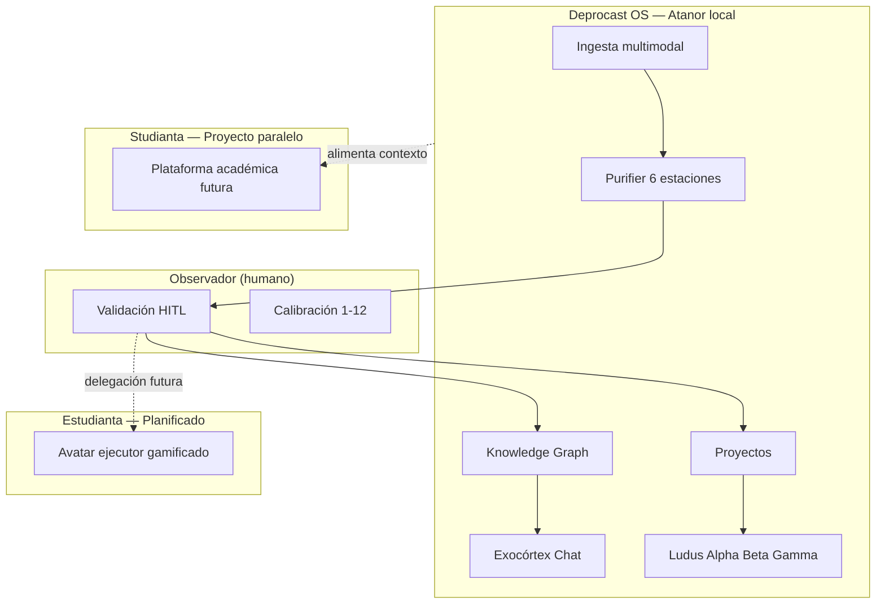
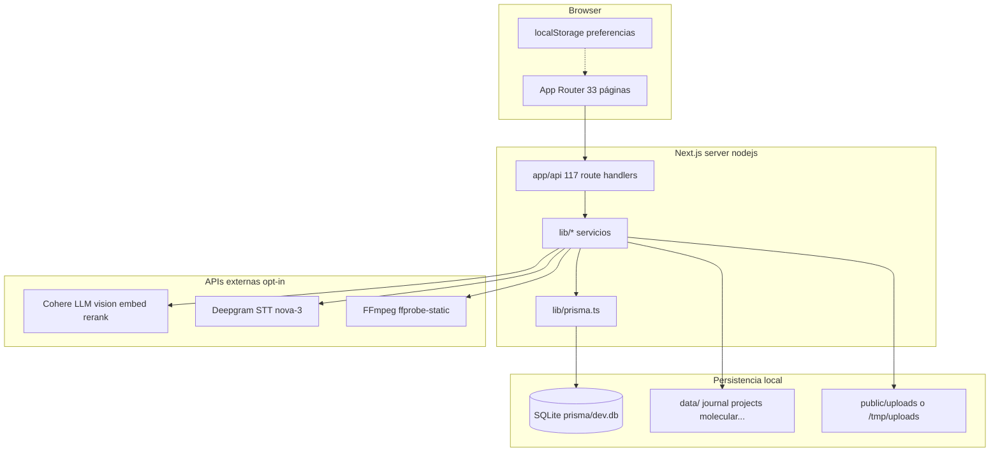
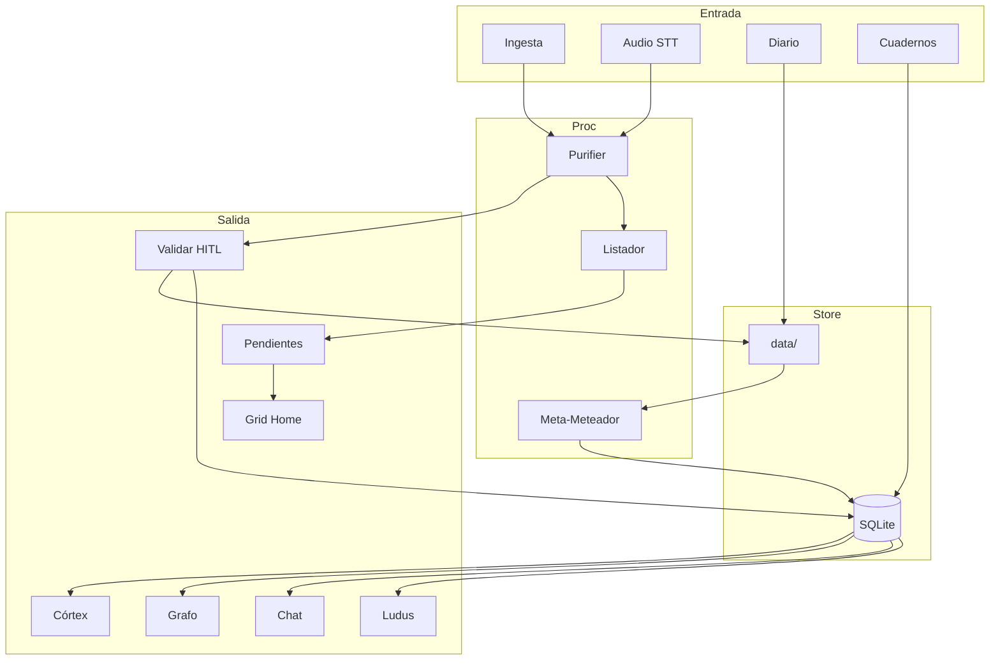
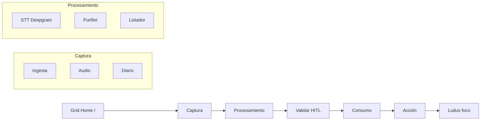

# Deprocast OS — Contexto Absoluto del Sistema

> **Repositorio:** `deprocast2` · **Versión npm:** `0.1.0` · **Fecha de auditoría:** 10 de julio de 2026  
> **Commit de referencia:** `82866a5636862ba98c4f6628f1aff33bfa0bc68c`  
> **Criterio editorial:** Este documento describe **únicamente el estado verificable en el código fuente**. Donde la visión de producto (grimorio, Studianta, Supabase, cifrado) difiere del código, se marca explícitamente como **Planificado (no en código)**.

---

## Índice

1. [Propósito general y filosofía del sistema](#1-propósito-general-y-filosofía-del-sistema)
2. [Estado actual de la arquitectura y código fuente](#2-estado-actual-de-la-arquitectura-y-código-fuente)
3. [Mapa de experiencia de usuario (UX) y flujos](#3-mapa-de-experiencia-de-usuario-ux-y-flujos)
4. [Sistema de diseño e interfaz (UI)](#4-sistema-de-diseño-e-interfaz-ui)
5. [Inventario completo de funcionalidades activas](#5-inventario-completo-de-funcionalidades-activas)
6. [Diagnóstico técnico y próximos pasos](#6-diagnóstico-técnico-y-próximos-pasos)
- [Apéndice A — Catálogo de rutas API](#apéndice-a--catálogo-completo-de-rutas-api)
- [Apéndice B — Árbol de directorios](#apéndice-b--árbol-de-directorios-principales)
- [Apéndice C — Comandos de mantenimiento](#apéndice-c--comandos-de-mantenimiento)
- [Apéndice D — Referencias cruzadas](#apéndice-d--referencias-cruzadas)

---

# 1. Propósito general y filosofía del sistema

## 1.1 Qué es Deprocast OS

**Deprocast OS** (paquete npm: `deprocast2`) es un **exoesqueleto cognitivo local-first**: una aplicación web que opera como sistema operativo de vida y bienestar orientado a **mitigar la procrastinación** transformando materia prima desordenada (audio, texto, imágenes, tablas, cuadernos, bookmarks, screen recordings) en conocimiento estructurado, proyectos accionables y micro-acciones gamificadas — sin ceder soberanía de los datos al usuario.

No es una app de productividad genérica ni un gestor de tareas clásico. Su propósito central es cerrar el circuito:

```
Información → Conocimiento → Acción
```

| Fase | Qué hace Deprocast | Módulos involucrados |
|------|-------------------|----------------------|
| **Información** | Captura multimodal en la máquina local | Ingesta, Audio, Diario, Cuadernos, Cam-Recorder |
| **Conocimiento** | Purificación HITL, grafo relacional, RAG, enciclopedia | Purifier, Validar, KG, Chat, Enciclopedia, Mnemosyne |
| **Acción** | Proyectos, pendientes, jornada, Ludus (foco) | Proyectos, Pendientes, Jornada, Ludus Trinchera |

El sistema asume un **único usuario soberano** en `localhost:3000` (o despliegue Vercel con limitaciones). No hay multi-tenancy ni autenticación implementada.

## 1.2 Filosofía: Exoesqueleto Cognitivo de Circuito Cerrado

Deprocast amplifica la capacidad atencional del usuario mediante una capa externa de procesamiento que **nunca abandona el perímetro local por defecto**:

- **Soberanía de datos:** SQLite (`prisma/dev.db`) + filesystem (`data/`) en disco local.
- **HITL obligatorio:** La IA propone; el humano valida antes de que el conocimiento entre al corpus definitivo (Purifier → Validar).
- **Mejora infinita:** Ningún fragmento es "archivo muerto"; todo puede re-indexarse, re-pesar (gravedad 1–12) y re-encadenarse en el KG.
- **Anti-procrastinación por diseño:** Microtareas ≤15 min, Puntos de Señal, bloques de foco (Trinchera), prioridades doradas (Jornada).

### Diagrama conceptual del ecosistema



## 1.3 Núcleo binario: Observador y Estudianta

Definido en `deprocast_master_plan.md` §1.2:

| Actor | Rol | Estado en código |
|-------|-----|------------------|
| **Observador** | Usuario humano soberano. Valida transcripciones, aprueba PurifierReview, calibra pesos 1–12, cierra sesiones de foco. | **Implementado** — toda la UI asume un solo operador |
| **Estudianta** | Avatar ejecutor gamificado. Acumula Puntos de Señal, ejecuta microtareas atómicas en ventanas <15 min. | **Planificado (no en código)** — sin motor LLM ni UI de avatar. Referencias en `lib/kg/prompts.ts`, `lib/ingesta/x-bookmarks/types.ts`, `components/home/gnosis-metrics.tsx` ("Focus Work en preparación") |

La relación es asimétrica: el Observador **piensa**; Estudianta **hará** (cuando exista) en ventanas cortas.

## 1.4 Relación con Studianta

**Studianta** es una plataforma paralela del ecosistema Deprocast, concebida como interfaz académica gamificada. En este repositorio:

- **No existe** como aplicación separada ni ruta `/studianta`.
- Aparece como **Campo semántico** en metadatos X-Bookmarks (`lib/ingesta/x-bookmarks/types.ts`).
- El KG distingue el avatar Estudianta en extracción de entidades (`lib/kg/prompts.ts`).
- Deprocast actúa como **Atanor** (núcleo de ingesta, purificación, KG, Ludus) que **alimentará** Studianta con corpus validado, proyectos y contexto.

## 1.5 Las Siete Dimensiones

Contrato universal de metadatos YAML para todo fragmento de conocimiento:

| Dimensión | Semántica | Ejemplo |
|-----------|-----------|---------|
| **materia** | Formato físico/lógico del soporte | `audio/wav`, `text/markdown` |
| **particula** | Identificador único estable | `boss-varona-001` |
| **posicion** | Tríada Observador \| Jugador \| Avatar | `lautaro\|margarita\|estudianta` |
| **onda** | Área taxonómica / dominio | `PROCESAL`, `personal-health` |
| **tiempo** | Temporalidad ISO-8601 | `2026-07-10` |
| **espacio** | Entorno de captura | `local-atanor` |
| **field** | Campo de influencia cruzada | `cognitive-exo-cortex` |

**Implementado en:** Purifier estación 5 (Archivista), Meta-Meteador (`DocumentMeta`), frontmatter de proyectos Markdown.

## 1.6 Ludus: Gamificación Alpha / Beta / Gamma

| Área | Frecuencia | Horizonte | Ruta | Función |
|------|----------|-----------|------|---------|
| **Castillo** | Alpha | Macro | `/ludus/castillo` | Canvas estratégico con `react-grid-layout` |
| **Campamento** | Beta | Meso | `/ludus/campamento` | Preparación semanal, microtareas |
| **Trinchera** | Gamma | Micro | `/ludus/trinchera` | Bloques de foco + binaural/isocrónico |

Puntos de Señal (`LudusState.signalPoints`), estatuas desbloqueables y asaltos (`LudusAssaultSession`) están en schema Prisma; la integración con Estudianta/Focus Work completo permanece parcial.

## 1.7 Principios no negociables (grimorio vs código)

| Principio | Grimorio | Código actual |
|-----------|----------|---------------|
| Daemon `.exe` local | Planificado | **No implementado** |
| Whisper + VAD offline | Planificado | Deepgram cloud |
| Supabase / Postgres | Planificado en brief externo | **SQLite local** |
| Cifrado de diario | Mencionado en brief externo | **Markdown plano en `data/journal/`** |
| Pagos / suscripciones | No en grimorio local | **No implementado** |
| Autenticación | Planificado si se expone | **No implementado** |

---

# 2. Estado actual de la arquitectura y código fuente

## 2.1 Stack tecnológico

| Capa | Tecnología | Versión |
|------|------------|---------|
| Framework | Next.js App Router | 16.2.7 |
| UI | React | 19.2.4 |
| Lenguaje | TypeScript | 5.x |
| Estilos | Tailwind CSS | 4.x |
| Componentes | shadcn/ui (`base-nova`), `@base-ui/react` | 4.10.0 |
| ORM | Prisma + `better-sqlite3` | 7.8.0 |
| Validación | Zod | 3.25.76 |
| Layout gamificado | react-grid-layout | 2.2.3 |
| Toasts | Sonner | 2.0.7 |
| Tema | next-themes | 0.4.6 |

## 2.2 Infraestructura de datos — NO Supabase

**Corrección explícita:** Este repositorio **no usa Supabase**. La persistencia es **SQLite + filesystem local**.



### Resolución de rutas (`lib/runtime-paths.ts`)

| Recurso | Desarrollo local | Vercel / `DEPROCAST_DATA_ROOT` |
|---------|------------------|-------------------------------|
| Datos app | `{APP_ROOT}/data/` | `{tmp\|custom}/data/` |
| Uploads audio | `public/uploads/` | `{tmp\|custom}/uploads/` → `/api/uploads/[filename]` |
| SQLite | `prisma/dev.db` | `/tmp/deprocast/deprocast.db` (seed desde `prisma/vercel-build.db`) |

`ensureRuntimeDirs()` crea al arrancar: `data/journal/`, `data/projects/`, `data/raw_documents/{pending,completed,pending_purification,review}/`, `data/tacho/`, `data/molecular/`, `data/cam-recorder-watcher/`, `data/projects/laboral/pending/`.

### Autenticación

**Ausente.** Sin `middleware.ts`, sin NextAuth/Clerk, sin páginas `/login`. Las ~117 API routes son accesibles sin credenciales. Diseño explícito para uso local de confianza.

### Pagos y suscripciones

**No implementado.** Sin Stripe, Paddle ni modelos Prisma de billing. Única mención de "payment": manejo HTTP 402 en `lib/cohere/errors.ts` y `lib/deepgram/errors.ts`.

### Storage

**Filesystem local**, no Supabase Storage ni S3. Backup ZIP en `lib/backup/` exporta `database.sqlite` + `data/**` + `uploads/**` + `manifest.json`.

## 2.3 Esquema Prisma — 38 modelos SQLite

Motor: SQLite vía `DATABASE_URL="file:./prisma/dev.db"`. Cliente: `lib/prisma.ts` con `@prisma/adapter-better-sqlite3`.

### Audio y transcripción

| Modelo | Campos clave | Relaciones |
|--------|-------------|------------|
| `AudioAsset` | id, filename, fileUrl, status (PENDING\|PROCESSING\|COMPLETED\|ERROR), durationMs | → Transcript |
| `Transcript` | assetId, rawText, confidence | → ParentChunk[] |
| `ParentChunk` | content, startTimeMs, endTimeMs, summary | → ChildChunk[], Entity, Tag (legacy) |
| `ChildChunk` | content | parent |
| `Entity`, `Tag`, `ParentChunkEntity`, `ParentChunkTag` | **Legacy** — pendiente eliminación (`prisma/pending/`) |

### Knowledge Graph

| Modelo | Campos clave |
|--------|-------------|
| `KgNode` | primaryName, type, aliases (Json), metadata, confidence |
| `KgEdge` | sourceNodeId, targetNodeId, relationType, context, weight 1-12 |
| `KgMention` | nodeId, sourceType, sourceId, fragment |
| `KgSource` | sourceType, sourceId, contentHash — ingesta incremental |

### Chat Exocórtex

| Modelo | Campos clave |
|--------|-------------|
| `ChatSession` | title, updatedAt |
| `ChatMessage` | role, content, contentDisplay, injectedContext, model |
| `ChatContextRelation` | entityType, entityId, entityLabel — @mentions |

### Eventos, salud y pendientes

| Modelo | Campos clave |
|--------|-------------|
| `ContextEvent` | occurredAt, source, pillar, status (proposed\|...) |
| `ContextEventLink` | eventId, entityType, entityId |
| `HealthRecord` | pillar, metrics (Json), sourceEventId |
| `PendingTask` | title, status (suggested\|recognized\|calibrated\|completed), source, targetDay, weight, bloque |

### Proyectos e incubación

| Modelo | Campos clave |
|--------|-------------|
| `ProjectProposal` | status, originContext, suggestedCampoSlug, mvp, firstStep |
| `ProjectIncubationSession` | messages (Json), extractionState — conversación /proyectos/nuevo |

### Cuadernos y purificador

| Modelo | Campos clave |
|--------|-------------|
| `Notebook`, `NotebookPage` | imagePath, semanticVector, quanta, status |
| `PurifierReview` | reviewId, payload (Json) — cola HITL |
| `DocumentMeta` | Siete dimensiones + areas (Json) — Meta-Meteador |

### Enciclopedia, Ludus, X, Mnemosyne

| Modelo | Dominio |
|--------|---------|
| `EncyclopediaEntry`, `EncyclopediaEdge`, `EncyclopediaReport` | Enciclopediador |
| `CastleGrid`, `CastleCard` | Ludus Castillo |
| `LudusState`, `LudusProjectRegistry`, `LudusMicrotask`, `LudusAssaultSession` | Gamificación |
| `XBookmark` | Bookmarks X con peso 1-12 |
| `VibeCalibrationSession`, `VibeCalibrationVote` | Calibrador |
| `MemoryEmbedding` | Mnemosyne RAG — embedding como JSON string |

### Desfase migraciones

Modelos en schema **sin migración SQL** en `prisma/migrations/`: `ProjectIncubationSession`, `LudusState`, `LudusProjectRegistry`, `LudusMicrotask`, `LudusAssaultSession`, `MemoryEmbedding`, `PendingTask`. Requieren `npm run db:meta` (`prisma db push`).

14 migraciones aplicadas desde `20260610120000_init_core_tables` hasta `20260628140000_castillo`.

## 2.4 Integraciones de Inteligencia Artificial

**Estado verificable:** Runtime usa **Cohere + Deepgram**, no Gemini/Vertex/GCP Speech.

> **Desfase documental:** `README.md`, `DEPROCAST_SSOT.md` y metadata de `app/layout.tsx` aún mencionan Vertex AI y GCP Speech. Esas dependencias **no están en `package.json`** ni en código activo. `lib/gcp-credentials.ts` existe pero no se importa.

### Patrón: API routes como proxy server-only

```
Browser → app/api/*/route.ts → lib/cohere/* | lib/deepgram/* → APIs externas
```

Módulos marcados `import "server-only"`. API keys nunca al cliente. `maxDuration: 120` en `vercel.json` para rutas pesadas.

### Cohere (`lib/cohere/`)

| Archivo | Función |
|---------|---------|
| `config.ts` | Lee `COHERE_*` de entorno |
| `client.ts` | Singleton `CohereClient` (cohere-ai v8) |
| `chat.ts` | `cohereGenerateText`, `cohereGenerateJson` |
| `vision.ts` | `cohereChatWithImages` multimodal |
| `embed.ts` | Embeddings Mnemosyne |
| `rerank.ts` | Rerank búsqueda híbrida chat |
| `retry.ts` | Reintentos exponenciales |

| Variable (.env.example) | Default | Uso |
|-----------------------|---------|-----|
| `COHERE_API_KEY` | — | Requerida |
| `COHERE_MODEL` | command-r-plus-08-2024 | Chat, Purifier, KG, Enciclopedia |
| `COHERE_MODEL_FAST` | command-r-08-2024 | Tareas alto volumen |
| `COHERE_VISION_MODEL` | command-a-vision-07-2025 | OCR visión + cuadernos |
| `COHERE_EMBED_MODEL` | embed-v4.0 | Mnemosyne |
| `COHERE_RERANK_MODEL` | rerank-v3.5 | Chat híbrido |
| `COHERE_REQUEST_DELAY_MS` | 500 | Throttle Purifier |

**Consumidores:** `lib/purifier/engine.ts`, `lib/chat/engine.ts`, `lib/kg/extract.ts`, `lib/enciclopedia/generator.ts`, `lib/meta-meteador/engine.ts`, `lib/events/extract.ts`, `lib/listador/extract.ts`, `lib/cuadernos/vision-agent.ts`, `lib/mnemosyne/`.

### Deepgram STT (`lib/deepgram/`)

| Variable | Default |
|----------|---------|
| `DEEPGRAM_API_KEY` | Requerida |
| `DEEPGRAM_MODEL` | nova-3 |
| `DEEPGRAM_LANGUAGE` | es |
| `DEEPGRAM_CHUNK_SECONDS` | 50 |

Pipeline: `POST /api/upload` → `lib/processing-queue.ts` (singleton in-memory) → `lib/deepgram-speech-processor.ts` (FFmpeg → Deepgram → `Transcript`).

### Mnemosyne (RAG vectorial ligero)

- Tabla `MemoryEmbedding` en SQLite.
- Embeddings serializados como JSON string (no pgvector).
- Búsqueda: `lib/mnemosyne/search.ts` + `lib/chat/hybrid-search.ts` (léxica + vector + Cohere rerank).
- Backfill: `npm run mnemosyne:backfill`.

## 2.5 Punto de entrada de la aplicación (equivalente a App.tsx)

No existe `App.tsx`. La cadena de arranque es:

```
app/layout.tsx
  ├── Geist fonts (--font-geist-sans, --font-geist-mono)
  ├── Providers (ThemeProvider next-themes)
  ├── AppHeader (navegación global o LudusHeader en /ludus/*)
  ├── <main>{children}</main>
  └── Toaster (Sonner)
```

**Página raíz actual:** `app/page.tsx` → `GridHome` (hub móvil-first), **no** El Córtex. El Córtex vive en `app/cortex/page.tsx` → `CortexDashboard`.

## 2.6 Servicios núcleo y responsabilidades

### `lib/purifier/engine.ts` (~645 líneas)

Pipeline de 6 estaciones (+ 4.1 KG opcional):

| Estación | Tipo | Función |
|----------|------|---------|
| 1 | Regex | Amputación loops STT, dedup consecutiva |
| 2 | LLM Cohere | Limpieza semántica, `==DUDA:==` |
| 3 | Determinístico | Deduplicación Jaccard ≥0.82 |
| 4 | LLM | Extracción esencias (tags) |
| 4.1 | LLM | Extracción KG → SQLite |
| 5 | LLM | Archivista: frontmatter YAML + Markdown |
| 6 | Determinístico | Segmentación fractal padre/hijo |

Entrada: `captureAndPurify` (`lib/purifier/capture.ts`). Salida: `PurifierReview` en SQLite + JSON en `data/raw_documents/review/`.

### `lib/chat/engine.ts` + `lib/chat/hybrid-search.ts`

- Últimos 10 turnos de historial.
- @mentions tipadas → `ChatContextRelation`.
- Búsqueda híbrida: léxica + Mnemosyne + Cohere rerank.
- Modelo: `command-r-plus-08-2024`.

### `lib/projects/service.ts`

CRUD de proyectos como Markdown en `data/projects/{campoSlug}/`. Campos definidos en `.campo.json`. Integración con KG, eventos y Ludus.

### `lib/kg/*`

- `extract.ts` + `ingest.ts`: extracción e ingesta LLM.
- `merge.ts`, `duplicates`: deduplicación HITL.
- `graph-search.ts`: búsqueda semántica en grafo.
- Fuentes: `lib/kg/sources/` (projects, journal, bookmarks, health, documents).

### `lib/listador/process.ts` + `lib/pendientes/`

**El Listador:** extrae tareas sugeridas de texto (post-ingesta/Purifier) vía Cohere → crea `PendingTask` con status `suggested`. Alimenta `/pendientes` y el Grid home.

### `lib/castillo/catalog.ts`

Catálogo multi-fuente para Ludus Castillo: Córtex, KG, cuadernos, eventos, enciclopedia, bookmarks.

### `lib/ludus/service.ts` (~376 líneas)

Puntos de Señal, microtareas (`LudusMicrotask`), asaltos (`LudusAssaultSession`), estatuas, calibración de reino.

### `lib/processing-queue.ts`

Cola STT **singleton en memoria** — se pierde al reiniciar el servidor de desarrollo.

### `lib/runtime-paths.ts` + `lib/runtime-setup.ts`

Resolución de paths local/Vercel, copia de seed DB, creación de directorios.

### `lib/backup/`

Export/import ZIP `.deprocast-backup.zip` con 15 dominios exportables (`lib/backup/domains.ts`).

## 2.7 Flujo de datos entre módulos



### Conexiones críticas

1. **Ingesta → Purifier → Validar → Proyectos/Córtex** — texto/visión/audio pasa por `captureAndPurify`; aprobación HITL alimenta `data/projects/` e ingesta KG.
2. **Purifier → Listador → Pendientes → Grid** — tareas sugeridas aparecen en `/pendientes` y resumen del Grid.
3. **Córtex ↔ Meta-Meteador ↔ Ludus** — `DocumentMeta` proyecta al Córtex; Castillo consume catálogo multi-fuente.
4. **Chat/Diario → Eventos → Salud/Jornada** — `processChatForEvents`, `processJournalForEvents` crean `ContextEvent`.
5. **Mnemosyne → Chat** — RAG vectorial en búsqueda híbrida.

---

# 3. Mapa de experiencia de usuario (UX) y flujos

## 3.1 Modelo de navegación dual

Deprocast opera con **dos capas de navegación**:

| Capa | Componente | Alcance |
|------|------------|---------|
| **Header global** | `components/app-header.tsx` | 19 enlaces horizontales + CTA "Entrar" (Ludus) + toggle tema |
| **Grid bottom nav** | `components/grid/grid-bottom-nav.tsx` | Hub móvil en `/` — Calendario, Pendientes, Diario, Asignaturas, botón + |

En rutas `/ludus/*` el header se reemplaza por `LudusHeader` (`components/ludus/ludus-header.tsx`) con logo noir, puntos de señal y botón "Salir" → `/`.

### Enlaces del header global (`NAV_LINKS`)

| Etiqueta | Ruta | Workspace |
|----------|------|-----------|
| Grid | `/` | `GridHome` |
| Córtex | `/cortex` | `CortexDashboard` |
| Ingesta | `/ingesta` | `IngestaWorkspace` |
| Audio | `/audio` | `AudioStationWorkspace` |
| Diario | `/diario` | `DiarioWorkspace` |
| Jornada | `/jornada` | `JornadaWorkspace` |
| Salud | `/salud` | `SaludWorkspace` |
| Chat | `/chat` | `ChatWorkspace` |
| Validar | `/validar` | `ValidarWorkspace` |
| Molecular | `/molecular` | `MolecularWorkspace` |
| Archivo | `/archivo` | `ArchivoWorkspace` |
| Enciclopedia | `/enciclopedia` | `EnciclopediaWorkspace` |
| Watcher | `/cam-recorder` | `CamRecorderWorkspace` |
| Calibrador | `/calibrador` | `CalibradorWorkspace` |
| Proyectos | `/proyectos` | `ProyectosDashboard` |
| Personas | `/personas` | `PersonasDashboard` |
| Grafo | `/grafo` | `GrafoWorkspace` |
| Agentes | `/agentes` | `AgentesWorkspace` |
| Respaldo | `/respaldo` | `BackupWorkspace` |

### Rutas fuera del header (acceso secundario)

| Ruta | Acceso | Workspace |
|------|--------|-----------|
| `/pendientes` | Grid bottom nav | `PendientesWorkspace` |
| `/calendario` | Grid bottom nav | `CalendarioWorkspace` |
| `/ingesta/cuadernos` | Link en Ingesta | `CuadernosWorkspace` |
| `/ingesta/cuadernos/[id]` | Listado cuadernos | `NotebookViewer` |
| `/audio/[id]` | Biblioteca audio | Server component detalle |
| `/proyectos/nuevo` | Botón en Proyectos | `IncubationWorkspace` |
| `/personas/[id]` | Listado personas | `PersonaDetailWorkspace` |
| `/agentes/binauralizer` | Catálogo agentes | `BinauralizerWorkspace` |
| `/ludus`, `/ludus/castillo`, `/ludus/campamento`, `/ludus/trinchera` | CTA Entrar / Ludus | Ludus workspaces |
| `/laboral` | Redirect | → `/proyectos` |

## 3.2 Autenticación y onboarding

| Aspecto | Estado |
|---------|--------|
| Registro / login | **No existe** |
| Onboarding / tour | **No existe** |
| Middleware de auth | **No existe** |
| Sesiones de usuario | Solo dominio: `ChatSession`, `VibeCalibrationSession`, `ProjectIncubationSession` |

El usuario entra directamente en `/` (Grid Home). No hay wizard de configuración inicial.

## 3.3 Recorrido completo del usuario

### Flujo diario canónico



**Paso a paso narrado:**

1. **Ingreso** — El usuario abre `http://localhost:3000/`. Ve el **Grid Home**: navegador de día (`DayNavigator`), panel Trinchera (`TrincheraPanel`), resumen de actividades (`ActividadesResumen`) y navegación inferior 3×3. Fondo `#050506`, viewport fijo sin scroll (`h-[calc(100dvh-3.5rem)]`).

2. **Captura de prima materia** — Desde el botón `+` del Grid o el header:
   - `/ingesta`: canales Texto, Audio, Tablas (xlsx/csv), Visión (OCR/PDF), X Bookmarks + link a Cuadernos.
   - `/audio`: drag-and-drop de `AudioAsset`, cola STT, deduplicación HITL.
   - `/diario`: entradas Markdown mensuales con ondas (diario/sueños/visiones).
   - `/ingesta/cuadernos`: cuadernos físicos digitalizados (`Notebook` + `NotebookPage`).

3. **Procesamiento automático** — Audio: FFmpeg → Deepgram → `Transcript`. Texto: Purifier 6 estaciones. Post-Purifier: **El Listador** extrae `PendingTask` sugeridas.

4. **Validación humana** — `/validar`: cola `PurifierReview`. El Observador revisa metadatos (Siete Dimensiones), edita tags, vincula a proyectos, aprueba o rechaza. Deep link: `/validar?id={reviewId}`.

5. **Gestión de pendientes** — `/pendientes`: pestañas Sugeridas (Listador), Manual, Calibrador (peso 1–12). También accesible desde Grid.

6. **Consumo de conocimiento** — `/cortex` (snapshot DocumentMeta), `/grafo` (force-directed), `/chat` (@mentions + RAG), `/enciclopedia` (exploración generativa), `/archivo` (repositorio unificado).

7. **Organización de acción** — `/proyectos` (vistas `?view=activos|campos|propuestas|archivo`), `/personas` (CRM KG), `/jornada` (prioridades — parcialmente mock), `/salud` (telemetría manual 4 pilares).

8. **Gamificación** — Botón **Entrar** → `/ludus` (mapa mundos) → Castillo (macro) / Campamento (meso) / Trinchera (micro + binaural).

9. **Respaldo** — `/respaldo`: export/import ZIP del estado local completo o por dominios.

### Flujo Grid Home (hub principal)

`components/grid/grid-home.tsx`:

- `selectedDay`: `"yesterday" | "today" | "tomorrow"` — filtra pendientes y actividades.
- `TrincheraPanel`: acceso rápido a bloque de foco del día.
- `ActividadesResumen`: resumen de tareas/eventos del día seleccionado.
- Bottom nav: Calendario, Asignaturas (→ `/enciclopedia`), Pendientes, Diario, botón + (sheet con Córtex, Ingesta, Audio, Chat, Validar, Ludus, Enciclopedia).

## 3.4 Estados de carga y transiciones

### Patrones UI recurrentes

| Patrón | Implementación | Ejemplos |
|--------|----------------|----------|
| Fetch + useState | `useEffect` + `fetch('/api/...')` | Todos los workspaces |
| Loading spinner | `Loader2Icon` + `isLoading` | Pendientes, Validar, Grafo |
| Toasts | Sonner `toast.success/error` | Aprobación Purifier, guardado diario |
| Polling | Intervalo en audio processing | `/api/process/status` |
| Optimistic UI | Parcial en chat send | `ChatWorkspace` |
| Skeletons | Algunos dashboards | Córtex, Archivo |

### Transiciones de pantalla

- **Next.js App Router** — navegación cliente con `Link` y `useRouter().push()`.
- **Sin page transitions animadas** — cambio instantáneo de ruta.
- **Ludus mode switch** — al entrar en `/ludus/*`, `AppHeader` se desmonta y monta `LudusHeader`; tema noir con `ludus-noir-root`.
- **Sheets laterales** — detalle de proyecto, persona, corpus enciclopedia (`components/ui/sheet.tsx`); slide desde derecha `max-w-lg`.

### Deep links y query params

| Ruta | Parámetro | Efecto |
|------|-----------|--------|
| `/validar` | `?id={reviewId}` | Abre revisión específica |
| `/proyectos` | `?view=activos\|campos\|propuestas\|archivo` | Vista del dashboard |
| `/pendientes` | `?status=suggested` (API) | Filtro de tareas |

## 3.5 Persistencia en almacenamiento local (browser)

### localStorage

| Clave | Archivo | Contenido |
|-------|---------|-----------|
| `deprocast-theme` | `components/providers.tsx` | `"light"` \| `"dark"` \| `"system"` |
| `deprocast:trinchera:local` | `lib/trinchera/visual/session-store.ts` | Preferencias visuales Trinchera (shape, colores, notas) |
| `deprocast:trinchera:sound-lab` | `lib/trinchera/sound-lab/session-store.ts` | Sesión laboratorio sonoro |
| `deprocast:trinchera:isochronic` | `lib/trinchera/isochronic/session-store.ts` | Sesión isocrónica |
| `deprocast-proposals-density-level` | `components/proyectos/proposals-workspace.tsx` | Densidad visual propuestas |
| `deprocast:x-bookmark-calibrator` | `components/ingesta/x-bookmarks/x-bookmark-focus-calibrator.tsx` | Votos calibración bookmarks |
| `deprocast:x-bookmark-threshold` | `components/ingesta/channels/x-bookmarks-channel.tsx` | Umbral de filtro bookmarks |

Lista canónica exportable en backup: `BROWSER_PREFERENCE_KEYS` en `lib/backup/domains.ts`.

### sessionStorage

| Uso | Archivo |
|-----|---------|
| Estado temporal de challenge laboral | `components/laboral/challenge-card.tsx` |

### Diario — sin cifrado

Las entradas del diario se persisten como **Markdown plano** en `data/journal/{YYYY-MM}/` vía `lib/journal/service.ts`. **No hay encriptación AES ni cifrado de extremo a extremo** en el código actual. Al guardar se dispara indexación Mnemosyne (`indexJournalMemory`).

## 3.6 Layouts y política de scroll

Altura estándar: `calc(100dvh - 3.5rem)` — header `h-14` = 3.5rem.

### Viewport fijo (sin scroll de página)

| Ruta | Layout |
|------|--------|
| `/` (Grid) | Inline en `grid-home.tsx` — `overflow-hidden` |
| `/ingesta` | `app/ingesta/layout.tsx` |
| `/diario` | `app/diario/layout.tsx` |
| `/grafo` | `app/grafo/layout.tsx` |
| `/calibrador` | `app/calibrador/layout.tsx` |
| `/ludus/trinchera` | `app/ludus/trinchera/layout.tsx` |
| `/salud` | `app/salud/layout.tsx` — altura fija |

### Scroll vertical permitido

| Ruta | Layout |
|------|--------|
| `/audio` | `overflow-y-auto bg-black` |
| `/molecular` | `overflow-y-auto bg-black` |
| `/archivo` | `overflow-y-auto bg-black` |
| `/enciclopedia` | `overflow-y-auto bg-black` |
| `/cam-recorder` | `overflow-y-auto bg-black` |
| `/ludus` (hub) | `overflow-y-auto` con dot grid |
| `/agentes/binauralizer` | `overflow-y-auto bg-black` |

### Sidebars fijos (riesgo móvil)

| Módulo | Ancho | Colapso móvil |
|--------|-------|---------------|
| Chat | `w-64` | No |
| Castillo catálogo | `w-72 lg:w-80` | No |
| Diario | `w-[30%] min-w-[220px]` | No |
| Ingesta gravedad | `w-[20%] min-w-[200px]` | No |

---

# 4. Sistema de diseño e interfaz (UI)

## 4.1 Stack de diseño

| Pieza | Ubicación |
|-------|-----------|
| Tailwind CSS v4 | `app/globals.css` — sin `tailwind.config.js` |
| PostCSS | `postcss.config.mjs` → `@tailwindcss/postcss` |
| shadcn/ui | `components.json` — estilo `base-nova`, `baseColor: neutral` |
| Animaciones | `tw-animate-css` |
| Utilidad clases | `cn()` = clsx + tailwind-merge (`lib/utils.ts`) |
| Variantes | CVA en Button, Badge |

## 4.2 Paleta semántica global (OKLCH)

**Radio base:** `--radius: 0.625rem` (10px)

### Modo claro (`:root`)

| Token | Valor OKLCH |
|-------|-------------|
| `--background` | `oklch(0.985 0.004 85)` |
| `--foreground` | `oklch(0.21 0.02 265)` |
| `--primary` | `oklch(0.28 0.03 265)` |
| `--primary-foreground` | `oklch(0.99 0.002 85)` |
| `--muted-foreground` | `oklch(0.46 0.02 265)` |
| `--destructive` | `oklch(0.52 0.19 27)` |
| `--border` | `oklch(0.88 0.008 85)` |
| `--ring` | `oklch(0.55 0.04 265)` |

### Modo oscuro (`.dark`)

| Token | Valor OKLCH |
|-------|-------------|
| `--background` | `oklch(0.17 0.015 265)` |
| `--foreground` | `oklch(0.93 0.01 85)` |
| `--card` | `oklch(0.21 0.018 265)` |
| `--primary` | `oklch(0.91 0.01 85)` |
| `--destructive` | `oklch(0.68 0.17 25)` |
| `--border` | `oklch(0.34 0.02 265 / 55%)` |
| `--sidebar-primary` | `oklch(0.65 0.15 265)` |

Tema gestionado por `next-themes`: `attribute="class"`, `defaultTheme="system"`, `storageKey="deprocast-theme"`, `disableTransitionOnChange`.

## 4.3 Tipografía

| Fuente | Variable CSS | Uso |
|--------|-------------|-----|
| Geist Sans | `--font-geist-sans` | UI general, títulos |
| Geist Mono | `--font-geist-mono` | Labels técnicos, timestamps, Grid nav |

Convenciones:
- UI general: `text-sm` (14px), `font-semibold` títulos de sección.
- Metadatos noir: `font-mono text-[9px]` / `text-[10px]` + `tracking-widest uppercase`.
- Títulos noir: gradientes `bg-gradient-to-r` + `bg-clip-text text-transparent`.

**Nota técnica:** `@theme` referencia `--font-sans: var(--font-sans)` (autorreferencia). El layout inyecta `--font-geist-sans` en `<html>`; verificar mapeo si la fuente no aplica correctamente.

## 4.4 Componentes UI reutilizables (`components/ui/`)

| Componente | Variantes / notas |
|------------|-------------------|
| `button.tsx` | default, outline, secondary, ghost, destructive, link; tamaños xs–lg, icon |
| `badge.tsx` | default, secondary, destructive, outline, ghost, link; pill |
| `card.tsx` | Compound: Header, Title, Description, Action, Content, Footer |
| `accordion.tsx` | Base UI con animaciones accordion-down/up |
| `table.tsx` | Wrapper `overflow-x-auto`, hover muted |
| `sheet.tsx` | Custom lateral derecho `max-w-lg`, overlay `bg-black/40` |
| `sonner.tsx` | Toasts con iconos Lucide, vars CSS popover |

### Componentes compartidos raíz

| Componente | Rol |
|------------|-----|
| `app-header.tsx` | Navegación global 19 enlaces |
| `providers.tsx` | ThemeProvider |
| `theme-toggle.tsx` | Sun/Moon icon |
| `status-badge.tsx` | Estados assets audio |
| `upload-dropzone.tsx` | Dropzone archivos |

## 4.5 Capa noir por módulo

Estética terminal/laboratorio con fondos negros fijos, **independiente del toggle light/dark** en muchos módulos.

| Clase CSS | Módulo | Fondo / acentos |
|-----------|--------|-----------------|
| `.x-bookmark-noir-root` | X Bookmarks calibrator | `#050505`, blanco rgba |
| `.jornada-noir-root` | Jornada | `oklch(0.12 0.02 265)`, cyan + amber radial |
| `.molecular-noir-root` | Molecular | `#000000`, emerald + violet |
| `.audio-noir-root` | Audio | `#000000`, sky + emerald |
| `.archivo-noir-root` | Archivo | `#000000`, sky |
| `.enciclopedia-noir-root` | Enciclopedia | `#000000`, amber, términos `#fde68a` |
| `.binauralizer-noir-root` | Binauralizer | amber + emerald |
| `.isochronic-noir-root` | Trinchera isocrónico | `#070708`, rose |
| `.cam-recorder-noir-root` | Cam-Recorder | `#000000`, timestamps emerald |
| `.ludus-noir-root` | Ludus / Castillo | `#0a0a0c`, dot grid blanco 14% |

Grid Home usa inline `bg-[#050506]` sin clase noir dedicada en `globals.css`.

### Ludus como sub-tema

- Header: `bg-[#0a0a0c]/95`, acentos amber.
- CTA Entrar: gradiente `from-amber-600 to-violet-600`.
- Castillo acentos: `.castillo-accent-orange`, blue, green, cyan, violet, amber, zinc.

## 4.6 Responsividad

### Enfoque

- Solo breakpoints Tailwind (`sm:`, `md:`, `lg:`, `xl:`, `2xl:`).
- Sin hook `useMediaQuery` global.
- **Sin menú hamburguesa** en `app-header.tsx` — 19 enlaces en fila desbordan en móvil.
- Grid bottom nav es la estrategia móvil principal para `/`.

### Patrones recurrentes

| Patrón | Ejemplo |
|--------|---------|
| Padding | `px-4 sm:px-6` |
| Stack → fila | `flex-col sm:flex-row` |
| Grids | `lg:grid-cols-2`, `sm:grid-cols-2 lg:grid-cols-3` |
| Ocultar columnas tabla | `hidden md:table-cell` |
| Ocultar texto móvil | `hidden sm:inline` |
| Tipografía escalada | `text-2xl sm:text-3xl` |

### Contenedores de ancho

- `max-w-7xl` — mayoría workspaces.
- `max-w-6xl` — jornada.
- `max-w-5xl` — ludus hub, campamento.

---

# 5. Inventario completo de funcionalidades activas

## 5.1 Tabla maestra de módulos

| Módulo | Ruta(s) | Madurez | APIs principales | Persistencia | IA |
|--------|---------|---------|------------------|--------------|-----|
| **Grid Home** | `/` | Estable | `/api/pendientes`, `/api/ludus/trinchera` | SQLite pendientes | — |
| **Córtex** | `/cortex` | Estable | `/api/cortex` | DocumentMeta SQLite | — |
| **Ingesta** | `/ingesta` | Estable | `/api/ingesta/*`, `/api/upload` | data/raw_documents | Cohere visión |
| **Audio / STT** | `/audio`, `/audio/[id]` | Estable | `/api/upload`, `/api/process/*`, `/api/audio-station/*` | AudioAsset, Transcript | Deepgram |
| **Cuadernos** | `/ingesta/cuadernos`, `[id]` | Estable | `/api/cuadernos/*` | Notebook, NotebookPage | Cohere vision |
| **Diario** | `/diario` | Estable | `/api/journal/*` | data/journal/ Markdown | Cohere eventos |
| **Validar (Purifier HITL)** | `/validar` | Estable | `/api/purifier/*` | PurifierReview | Cohere pipeline |
| **Pendientes / Listador** | `/pendientes` | Desarrollo activo | `/api/pendientes/*` | PendingTask | Cohere extract |
| **Calendario** | `/calendario` | Desarrollo activo | `/api/calendario` | ContextEvent | — |
| **Molecular** | `/molecular` | Estable | `/api/molecular/*` | data/molecular/ JSON | Cohere chunk |
| **Archivo** | `/archivo` | Estable | `/api/archivo/*` | Agregación multi-fuente | — |
| **Enciclopedia** | `/enciclopedia` | Estable | `/api/enciclopedia/*` | EncyclopediaEntry | Cohere generate |
| **Grafo KG** | `/grafo` | Estable | `/api/kg/*` | KgNode, KgEdge | Cohere extract |
| **Chat Exocórtex** | `/chat` | Estable | `/api/chat/*` | ChatSession | Cohere + Mnemosyne |
| **Jornada** | `/jornada` | Desarrollo activo | — (mocks) | React state + mocks | — |
| **Salud** | `/salud` | Estable | `/api/salud/records`, `/api/events/*` | HealthRecord | Cohere eventos |
| **Cam-Recorder** | `/cam-recorder` | Esqueleto/Mock | `/api/cam-recorder/*` | data/cam-recorder-watcher | Mock NDJSON |
| **Calibrador Vibe** | `/calibrador` | Parcial | `/api/vibe-calibrator/*` | VibeCalibrationSession | Cola generated stub |
| **Proyectos** | `/proyectos`, `/nuevo` | Estable | `/api/proyectos/*`, `/api/campos/*` | data/projects/ + Proposal | Cohere incubación |
| **Personas** | `/personas`, `/[id]` | Estable | `/api/personas/*` | KgNode tipo persona | — |
| **Agentes** | `/agentes` | Estable | `/api/agentes/meta-meteador` | DocumentMeta | Cohere |
| **Binauralizer** | `/agentes/binauralizer` | Estable | — (Web Audio API) | localStorage Trinchera | — |
| **Ludus Castillo** | `/ludus/castillo` | Parcial | `/api/castillo/*` | CastleGrid, CastleCard | — |
| **Ludus Campamento** | `/ludus/campamento` | Parcial | `/api/ludus/campamento` | LudusMicrotask | — |
| **Ludus Trinchera** | `/ludus/trinchera` | Parcial | `/api/ludus/trinchera` | LudusAssaultSession | — |
| **Respaldo** | `/respaldo` | Estable | `/api/backup/*` | ZIP completo | — |
| **X Bookmarks** | (canal Ingesta) | Parcial | `/api/ingesta/x-bookmarks/*` | XBookmark | mockEnrich |
| **Laboral** | `/laboral` → redirect | Esqueleto | `/api/laboral/*` | data/projects/laboral/ | — |
| **Mnemosyne RAG** | (integrado Chat) | Parcial | — | MemoryEmbedding | Cohere embed |
| **Memorias** | — | Desarrollo | `/api/memorias/analyze` | scripts CLI | — |

### Leyenda de madurez

| Etiqueta | Significado |
|----------|-------------|
| **Estable** | Flujo end-to-end operativo con persistencia real |
| **Desarrollo activo** | UI funcional pero integración incompleta o mocks parciales |
| **Parcial** | Módulo accesible; subcomponentes stub o desconectados |
| **Esqueleto/Mock** | UI mínima; datos simulados |
| **Planificado (no en código)** | Solo en grimorio/documentación |

## 5.2 Agentes operativos (`lib/agentes/catalog.ts`)

| ID | Nombre | Tecnología | Ruta UI |
|----|--------|------------|---------|
| `exocortex` | Exocórtex Interactivo | Cohere Command R+ | `/chat` |
| `stt` | Motor STT | Deepgram nova-3 | `/audio` |
| `vision` | Agente Visión OCR | Cohere Command A Vision | `/ingesta` |
| `editor-semantico` | Editor Semántico STT | Purifier est. 2 | — |
| `extractor-esencias` | Extractor de Esencias | Purifier est. 4 | — |
| `motor-kg` | Motor Extracción KG | Purifier est. 4.1 | `/grafo` |
| `archivista` | Archivista Deprocast | Purifier est. 5 | — |
| `orquestador` | Orquestador Purifier | Pipeline mixto | `/validar` |
| `meta-meteador` | Meta-Meteador | Cohere + DocumentMeta | `/cortex`, `/agentes` |
| `enciclopediador` | Enciclopediador | Cohere generativo | `/enciclopedia` |
| `listador` | El Listador | Cohere extract tareas | `/pendientes` |
| `task-calibrator` | Calibrador de Tareas | HITL escala 1–12 | `/pendientes` |
| `calibrador` | Calibrador de Vibe | HITL sin LLM | `/calibrador` |
| `cam-recorder-watcher` | Cam-Recorder Watcher | Mock NDJSON | `/cam-recorder` |
| `binauralizer` | Binauralizer | Web Audio API local | `/agentes/binauralizer` |

### Agentes de diseño (no operativos)

| ID | Nombre | Estado |
|----|--------|--------|
| `estudianta` | Estudianta / Director de juego | Planificado — sin motor ejecutor |
| `somatometron` | Somatometrón | Planificado — telemetría biométrica |
| `daemon-ingesta` | Daemon .exe | Planificado — watchers carpeta |

## 5.3 Purifier — estaciones detalladas

| Est. | Nombre | Tipo | Entrada → Salida |
|------|--------|------|------------------|
| 1 | Regex Cleanup | Determinístico | Texto crudo → sin loops STT |
| 2 | Editor Semántico | LLM | → prosa escrita + `==DUDA:==` |
| 3 | Dedup Jaccard | Determinístico | → texto sin redundancia ≥0.82 |
| 4 | Esencias | LLM | → array tags (máx 30) |
| 4.1 | KG Extract | LLM | → KgNode/KgEdge en SQLite |
| 5 | Archivista | LLM | → Markdown + YAML siete dimensiones |
| 6 | Segmentación | Determinístico | → chunks padre/hijo |

## 5.4 Ludus — tres horizontes temporales

Definido en `lib/ludus/constants.ts` — las tres áreas tienen `available: true`:

| Área | Frecuencia | Horizonte | Funcionalidad verificable |
|------|----------|-----------|---------------------------|
| Castillo | Alpha | Macro | Canvas `react-grid-layout`, catálogo multi-fuente, grids/cards SQLite |
| Campamento | Beta | Meso | Forjado microtareas, energía, API campamento |
| Trinchera | Gamma | Micro | Asaltos 15/25/45 min, binaural, isocrónico, Mandelbrot visual |

Puntos de Señal, estatuas (`LUDUS_STATUES`), racha de asaltos: modelos Prisma presentes; integración completa con Estudianta/Focus Work: **parcial**.

## 5.6 Descripción de workspaces principales (25 componentes)

Cada módulo de la UI se orquesta desde un `*-workspace.tsx` en `components/`:

| Workspace | Archivo | Responsabilidad UI |
|-----------|---------|-------------------|
| Grid Home | `grid/grid-home.tsx` | Hub día: navigator, trinchera, actividades, bottom nav |
| Córtex | `cortex/cortex-dashboard.tsx` | Filtros área, knowledge grid, métricas, ingest modal |
| Ingesta | `ingesta/ingesta-workspace.tsx` | Tabs canales + gravity panel dimensional |
| Audio | `audio-station/audio-station-workspace.tsx` | Biblioteca, cola STT, dedup, downstream |
| Diario | `diario/diario-workspace.tsx` | Sidebar mensual, canvas editor, preview |
| Validar | `validar/validar-workspace.tsx` | Cola PurifierReview, metadatos, diff estaciones |
| Pendientes | `pendientes/pendientes-workspace.tsx` | Sugeridas Listador, manual, calibrador 1–12 |
| Calendario | `calendario/calendario-workspace.tsx` | Eventos ContextEvent por día + mini-calendar |
| Molecular | `molecular/molecular-workspace.tsx` | Chunk → calibrate → validate partículas |
| Archivo | `archivo/archivo-workspace.tsx` | Repositorio unificado materia prima |
| Enciclopedia | `enciclopedia/enciclopedia-workspace.tsx` | Exploración generativa + grafo sesión |
| Grafo | `grafo/grafo-workspace.tsx` | Force-directed KG, búsqueda, duplicados (~700 líneas) |
| Chat | `chat/chat-workspace.tsx` | Sidebar sesiones, mentions, message list |
| Jornada | `jornada/jornada-workspace.tsx` | Reloj, ticker, prioridades doradas (mocks) |
| Salud | `salud/salud-workspace.tsx` | 4 pilares, formulario, timeline |
| Cam-Recorder | `cam-recorder/cam-recorder-workspace.tsx` | Upload video, timeline conciencia mock |
| Calibrador | `vibe-calibrator/calibrador-workspace.tsx` | Votación HITL tarjetas 1–12 |
| Proyectos | `proyectos/proyectos-dashboard.tsx` | Vistas activos/campos/propuestas/archivo |
| Incubación | `proyectos/incubation-workspace.tsx` | Chat Atanor para nuevo proyecto |
| Personas | `personas/personas-dashboard.tsx` | Tabla + grafo social |
| Agentes | `agentes/agentes-workspace.tsx` | Mapa agentes + Meta-Meteador panel |
| Binauralizer | `binauralizer/binauralizer-workspace.tsx` | Presets Gamma/Alpha/Theta/Delta |
| Castillo | `castillo/castillo-workspace.tsx` | Canvas react-grid-layout + catálogo |
| Campamento | `ludus/campamento-workspace.tsx` | Microtareas, energía semanal |
| Trinchera | `ludus/trinchera-workspace.tsx` | Asaltos foco + isocrónico + sound lab |
| Backup | `backup/backup-workspace.tsx` | Export/import ZIP por dominios |
| Cuadernos | `cuadernos/cuadernos-workspace.tsx` | Galería notebooks |

## 5.7 Funcionalidades planificadas (no en código)

| Funcionalidad | Fuente | Estado |
|---------------|--------|--------|
| Supabase / Postgres | Brief externo | No implementado — SQLite local |
| Gemini / Vertex AI | README legacy | No implementado — Cohere |
| GCP Speech / Chirp_2 | README legacy | No implementado — Deepgram |
| Cifrado diario AES | Brief externo | No implementado — Markdown plano |
| Autenticación multi-usuario | Grimorio | No implementado |
| Pagos / suscripciones | Brief externo | No implementado |
| Daemon .exe ingesta | Grimorio | No implementado |
| Whisper + VAD local | Grimorio | No implementado |
| Estudianta avatar ejecutor | Grimorio | Prototipo roadmap |
| Tests automatizados | — | Ausentes (`*.test.*`, `*.spec.*`) |

---

# 6. Diagnóstico técnico y próximos pasos

## 6.1 Cuellos de botella urgentes

| # | Área | Evidencia | Impacto |
|---|------|-----------|---------|
| 1 | Cola audio in-memory | `lib/processing-queue.ts` singleton | Se pierde al reiniciar dev server |
| 2 | Jornada desconectada | `MOCK_SCHEDULED_EVENTS`, `MOCK_JORNADA_TASKS` en `lib/jornada/constants.ts` | Sin sync con `ContextEvent`/`PendingTask` real |
| 3 | Documentación desactualizada | `README.md` GCP, `DEPROCAST_SSOT.md` Gemini, `app/layout.tsx` "transcripción simulada" | Confusión para agentes y devs |
| 4 | APIs sin autenticación | ~117 routes sin guards | Riesgo crítico si se expone fuera localhost |
| 5 | Vercel `/tmp` efímero | `lib/runtime-paths.ts` | Inadecuado para producción sin Turso/S3 |
| 6 | Desfase migraciones Prisma | Ludus, PendingTask, MemoryEmbedding sin migración SQL | Requiere `db:meta` además de `migrate deploy` |
| 7 | Header sin menú móvil | 19 enlaces en `app-header.tsx` | UX rota en pantallas estrechas |
| 8 | Cam-Recorder mock | `MOCK_CONSCIOUSNESS_SCENARIOS` | Simula análisis; no CV real |
| 9 | X Bookmarks enrich mock | `mockEnrichXBookmark` en `lib/ingesta/x-bookmarks/enrich.ts` | Enriquecimiento IA simulado |
| 10 | Calibrador cola generated | Stub vacío en `lib/vibe-calibrator/adapters/generated.ts` | Mitad de cola sin fuente |

## 6.2 Archivos monolíticos a dividir

| Archivo | Líneas aprox. | Sugerencia |
|---------|---------------|------------|
| `components/grafo/grafo-workspace.tsx` | ~700 | Extraer búsqueda, panel duplicados, controles grafo |
| `components/agentes/meta-meteador-modal.tsx` | ~650 | Separar matriz cuántica, preview, acciones |
| `lib/purifier/engine.ts` | ~645 | Una función por estación en archivos dedicados |
| `components/personas/personas-force-graph.tsx` | ~572 | Extraer layout force, tooltips, leyenda |
| `lib/archivo/service.ts` | ~558 | Un adapter por fuente de datos |
| `components/backup/backup-workspace.tsx` | ~535 | Separar preview, export, import, wipe |
| `components/validar/validar-workspace.tsx` | ~523 | Extraer panel metadatos, diff estaciones, acciones |
| `components/molecular/molecular-context.tsx` | ~491 | Separar estado chunk/calibrate/validate |

## 6.3 UX: scrolls verticales y pantalla única

### Objetivo del producto

Garantizar que la interfaz fluya en **pantalla única libre de scrolls verticales innecesarios** — patrón ya adoptado en Grid, Ingesta, Diario, Grafo, Calibrador, Trinchera.

### Módulos a migrar a viewport fijo

| Módulo actual | Layout actual | Acción recomendada |
|---------------|---------------|-------------------|
| Audio | `min-h` + `overflow-y-auto` | Panel interno scroll; página fija |
| Molecular | `min-h` + `overflow-y-auto` | Tabs con scroll interno por estación |
| Archivo | `min-h` + `overflow-y-auto` | Grid fijo + detalle en Sheet |
| Enciclopedia | `min-h` + `overflow-y-auto` | Grafo fijo + panel lateral scroll |
| Cam-Recorder | `min-h` + `overflow-y-auto` | Timeline interno scroll |
| Ludus hub | `overflow-y-auto` | Mapa fijo viewport |

### Navegación móvil

1. Implementar menú hamburguesa o drawer en `app-header.tsx`.
2. Promover Grid bottom nav como patrón principal en móvil.
3. Colapsar sidebars (chat, diario, castillo) en Sheet bajo `md:`.

## 6.4 Lista priorizada de acciones

### Alta — cierre de producto / coherencia del circuito

1. **Conectar Jornada a datos reales** — reemplazar mocks por `ContextEvent`, `PendingTask`, `HealthRecord`.
2. **Persistir cola de audio** — sobrevivir reinicios del dev server.
3. **Completar circuito Grid ↔ Pendientes ↔ Trinchera** — unificar día seleccionado con asaltos Ludus.
4. **Nav móvil en AppHeader** — drawer o truncar enlaces secundarios.
5. **Sincronizar documentación** — README, DEPROCAST_SSOT.md, layout metadata → Cohere/Deepgram.
6. **Seguridad si se expone** — auth mínima o reverse proxy local.

### Media — calidad y mantenibilidad

7. **Dividir monolitos** — empezar por `grafo-workspace.tsx` y `purifier/engine.ts`.
8. **Enriquecimiento real X Bookmarks** — sustituir `mockEnrichXBookmark` por Cohere.
9. **Calibrador: fuente `generated`** — conectar Molecular/Purifier a cola vibe.
10. **Migraciones Prisma** — generar SQL para Ludus, PendingTask, MemoryEmbedding.
11. **Tests smoke** — upload, process, purifier approve, KG ingest, chat send, pendientes.
12. **Unificar capa noir** — mapear acentos a tokens semánticos donde sea posible.

### Baja — techo premium (grimorio)

13. Mnemosyne backfill automático post-validación.
14. Pipeline STT offline (Whisper + VAD).
15. Daemon `.exe` con watchers `data/tacho/`.
16. Somatometrón — telemetría biométrica real.
17. Motor Estudianta — avatar ejecutor con Focus Work ≤15 min.
18. Migración SQLite → Turso/Postgres para producción cloud.

---

# Apéndice A — Catálogo completo de rutas API

Total: **117** route handlers en `app/api/`. Sin autenticación. Runtime `nodejs` en rutas pesadas.

## agentes (1)

| Ruta | Métodos |
|------|---------|
| `/api/agentes/meta-meteador` | GET, POST, PUT |

## archivo (3)

| Ruta | Métodos |
|------|---------|
| `/api/archivo` | GET |
| `/api/archivo/[id]` | GET |
| `/api/archivo/search` | GET |

## assets (2)

| Ruta | Métodos |
|------|---------|
| `/api/assets` | GET |
| `/api/assets/[id]` | GET, DELETE |

## audio-station (3)

| Ruta | Métodos |
|------|---------|
| `/api/audio-station/deduplicate` | GET |
| `/api/audio-station/deduplicate/apply` | POST |
| `/api/audio-station/purify-pending` | POST |

## backup (4)

| Ruta | Métodos |
|------|---------|
| `/api/backup/export` | GET |
| `/api/backup/import` | POST |
| `/api/backup/preview` | GET |
| `/api/backup/validate` | POST |

## calendario (1)

| Ruta | Métodos |
|------|---------|
| `/api/calendario` | GET |

## cam-recorder (2)

| Ruta | Métodos |
|------|---------|
| `/api/cam-recorder/analyze` | POST |
| `/api/cam-recorder/inject` | POST |

## campos (2)

| Ruta | Métodos |
|------|---------|
| `/api/campos` | GET, POST |
| `/api/campos/[slug]` | GET |

## castillo (5)

| Ruta | Métodos |
|------|---------|
| `/api/castillo` | GET |
| `/api/castillo/cards` | POST |
| `/api/castillo/cards/[id]` | PATCH |
| `/api/castillo/catalog` | GET |
| `/api/castillo/grids` | POST |

## chat (5)

| Ruta | Métodos |
|------|---------|
| `/api/chat/mentions` | GET |
| `/api/chat/send` | POST |
| `/api/chat/sessions` | GET, POST |
| `/api/chat/sessions/[id]` | PATCH, DELETE |
| `/api/chat/sessions/[id]/messages` | GET |

## cortex (1)

| Ruta | Métodos |
|------|---------|
| `/api/cortex` | GET |

## cuadernos (5)

| Ruta | Métodos |
|------|---------|
| `/api/cuadernos` | GET, POST |
| `/api/cuadernos/[id]` | GET |
| `/api/cuadernos/[id]/pages` | POST |
| `/api/cuadernos/media/[...path]` | GET |
| `/api/cuadernos/pages/[pageId]/process` | POST |

## documents (1)

| Ruta | Métodos |
|------|---------|
| `/api/documents` | POST |

## enciclopedia (5)

| Ruta | Métodos |
|------|---------|
| `/api/enciclopedia/entries/[id]` | GET |
| `/api/enciclopedia/explore` | POST |
| `/api/enciclopedia/graph` | GET |
| `/api/enciclopedia/link-corpus` | POST |
| `/api/enciclopedia/report` | POST |

## events (3)

| Ruta | Métodos |
|------|---------|
| `/api/events` | GET |
| `/api/events/[id]` | GET, POST, DELETE |
| `/api/events/correlate` | GET |

## health (1)

| Ruta | Métodos |
|------|---------|
| `/api/health` | GET |

## ingesta (6)

| Ruta | Métodos |
|------|---------|
| `/api/ingesta/capture` | POST |
| `/api/ingesta/tablas` | POST |
| `/api/ingesta/vision` | POST |
| `/api/ingesta/x-bookmarks` | GET |
| `/api/ingesta/x-bookmarks/[id]/calibrate` | PATCH |
| `/api/ingesta/x-bookmarks/process` | POST |

## journal (4)

| Ruta | Métodos |
|------|---------|
| `/api/journal/[id]` | GET |
| `/api/journal/list` | GET |
| `/api/journal/process` | POST |
| `/api/journal/save` | POST |

## kg (14)

| Ruta | Métodos |
|------|---------|
| `/api/kg/centrality` | GET |
| `/api/kg/code/[id]` | GET |
| `/api/kg/duplicates` | GET |
| `/api/kg/export` | GET |
| `/api/kg/graph` | GET |
| `/api/kg/ideas/repeated` | GET |
| `/api/kg/ingest` | POST |
| `/api/kg/merge` | POST |
| `/api/kg/nodes` | GET |
| `/api/kg/nodes/[id]` | GET |
| `/api/kg/personas` | GET, POST |
| `/api/kg/projects/[id]/people` | GET |
| `/api/kg/projects/[id]/related` | GET |
| `/api/kg/stats` | GET |

## laboral (3)

| Ruta | Métodos |
|------|---------|
| `/api/laboral/challenges` | GET |
| `/api/laboral/focus` | POST (stub) |
| `/api/laboral/import` | POST |

## ludus (5)

| Ruta | Métodos |
|------|---------|
| `/api/ludus/calibration` | GET, PATCH |
| `/api/ludus/campamento` | GET, POST |
| `/api/ludus/statues` | GET, POST |
| `/api/ludus/stats` | GET |
| `/api/ludus/trinchera` | GET, POST |

## memorias (1)

| Ruta | Métodos |
|------|---------|
| `/api/memorias/analyze` | POST |

## metrics (1)

| Ruta | Métodos |
|------|---------|
| `/api/metrics` | GET |

## molecular (4)

| Ruta | Métodos |
|------|---------|
| `/api/molecular/calibrate` | POST |
| `/api/molecular/chunk` | POST |
| `/api/molecular/sources` | GET |
| `/api/molecular/validate` | POST, GET |

## pendientes (3)

| Ruta | Métodos |
|------|---------|
| `/api/pendientes` | GET, POST |
| `/api/pendientes/[id]` | GET, PATCH |
| `/api/pendientes/[id]/calibrate` | POST |

## personas (6)

| Ruta | Métodos |
|------|---------|
| `/api/personas` | GET, POST |
| `/api/personas/[id]` | GET, DELETE |
| `/api/personas/graph` | GET |
| `/api/personas/link-targets` | GET |
| `/api/personas/relations` | POST |
| `/api/personas/relations/[edgeId]` | PATCH, DELETE |

## process (3)

| Ruta | Métodos |
|------|---------|
| `/api/process/[id]` | POST |
| `/api/process/queue` | POST |
| `/api/process/status` | GET |

## proyectos (10)

| Ruta | Métodos |
|------|---------|
| `/api/proyectos` | GET |
| `/api/proyectos/[id]/campo` | PATCH |
| `/api/proyectos/[id]/progress` | POST |
| `/api/proyectos/incubation/sessions` | POST |
| `/api/proyectos/incubation/sessions/[id]/consolidate` | POST |
| `/api/proyectos/incubation/sessions/[id]/turn` | POST |
| `/api/proyectos/proposals` | GET, POST |
| `/api/proyectos/proposals/[id]` | GET |
| `/api/proyectos/proposals/[id]/approve` | POST |
| `/api/proyectos/proposals/[id]/archive` | POST |

## purifier (5)

| Ruta | Métodos |
|------|---------|
| `/api/purifier/approve` | POST |
| `/api/purifier/purify` | POST |
| `/api/purifier/reject` | POST |
| `/api/purifier/review` | GET |
| `/api/purifier/review/[id]` | GET |

## salud (1)

| Ruta | Métodos |
|------|---------|
| `/api/salud/records` | GET, POST |

## transcripts (2)

| Ruta | Métodos |
|------|---------|
| `/api/transcripts/[id]/download` | GET |
| `/api/transcripts/download-all` | GET |

## upload (1)

| Ruta | Métodos |
|------|---------|
| `/api/upload` | POST |

## uploads (1)

| Ruta | Métodos |
|------|---------|
| `/api/uploads/[filename]` | GET |

## vibe-calibrator (3)

| Ruta | Métodos |
|------|---------|
| `/api/vibe-calibrator/queue` | GET |
| `/api/vibe-calibrator/session` | GET, POST |
| `/api/vibe-calibrator/vote` | POST |

---

# Apéndice B — Árbol de directorios principales

## `app/` — App Router (33 páginas)

| Carpeta / archivo | Descripción |
|-------------------|-------------|
| `layout.tsx` | Layout raíz: fonts, Providers, AppHeader, Toaster |
| `page.tsx` | `/` — Grid Home hub móvil |
| `globals.css` | Tokens OKLCH + clases noir por módulo |
| `cortex/` | El Córtex — dashboard DocumentMeta |
| `ingesta/` | Aduana multimodal + cuadernos |
| `audio/` | Estación de audio STT |
| `diario/` | Diario de Gnosis Markdown |
| `jornada/` | Motor tiempo-espacio (mocks parciales) |
| `salud/` | Telemetría 4 pilares |
| `chat/` | Exocórtex conversacional |
| `validar/` | HITL Purifier |
| `pendientes/` | Listador + calibración tareas |
| `calendario/` | Vista compacta eventos del día |
| `molecular/` | Pipeline chunk/calibrate/validate |
| `archivo/` | Repositorio materia prima unificado |
| `enciclopedia/` | Enciclopediador generativo |
| `cam-recorder/` | Watcher screen recordings (mock) |
| `calibrador/` | Vibe calibrator 1–12 |
| `proyectos/` | Tablero + incubador conversacional |
| `personas/` | CRM sobre KG personas |
| `grafo/` | Visualización force-directed KG |
| `agentes/` | Mapa ecosistema + binauralizer |
| `respaldo/` | Export/import ZIP |
| `laboral/` | Redirect → proyectos |
| `ludus/` | Hub gamificado + castillo/campamento/trinchera |
| `api/` | 117 route handlers REST |

## `lib/` — Lógica de negocio (~265 archivos)

| Carpeta | Descripción |
|---------|-------------|
| `agentes/` | Catálogo estático agentes operativos |
| `archivo/` | Agregación multi-fuente materia prima |
| `audio-station/` | Biblioteca audio, dedup, auto-purify |
| `backup/` | Export/import/wipe ZIP por dominios |
| `binauralizer/` | Web Audio API tonos binaurales |
| `cam-recorder-watcher/` | Mock análisis screen recordings |
| `castillo/` | Catálogo y servicio Ludus Castillo |
| `chat/` | Engine, hybrid-search, mentions, prompts |
| `cohere/` | Cliente LLM, visión, embed, rerank |
| `cortex/` | Tipos y queries dashboard Córtex |
| `cuadernos/` | CRUD notebooks, OCR, enrichment |
| `deepgram/` | Cliente STT, transcribe sync/chunked |
| `enciclopedia/` | Generador exploración concepto a concepto |
| `events/` | ContextEvent extract y process |
| `ingesta/` | Canales: vision, tablas, x-bookmarks |
| `journal/` | Servicio diario Markdown en filesystem |
| `jornada/` | Constantes, tipos, mocks ticker |
| `kg/` | Grafo: extract, ingest, merge, search, sources |
| `laboral/` | CSV Varona, challenges (legacy) |
| `listador/` | Extracción tareas → PendingTask |
| `ludus/` | Puntos señal, microtareas, asaltos |
| `memorias/` | Segmentación memorias (scripts) |
| `meta-meteador/` | Siete dimensiones → DocumentMeta |
| `mnemosyne/` | Embeddings, chunker, search RAG |
| `molecular-processing/` | Chunk, calibrate, validate partículas |
| `pendientes/` | Store y tipos PendingTask |
| `personas/` | CRM, relaciones, grafo social |
| `projects/` | CRUD Markdown, campos, incubación |
| `purifier/` | Pipeline 6 estaciones + capture/approve |
| `runtime-paths.ts` | Resolución paths local/Vercel |
| `runtime-setup.ts` | Bootstrap DB seed en Vercel |
| `stt/` | FFmpeg binarios, prep audio |
| `trinchera/` | Visual, sound-lab, isochronic engines |
| `vibe-calibrator/` | Sesiones votación HITL 1–12 |

## `components/` — UI (~213 archivos)

| Carpeta | Descripción |
|---------|-------------|
| `ui/` | 7 primitivos shadcn base-nova |
| `grid/` | Grid Home, day navigator, bottom nav, trinchera panel |
| `cortex/` | Dashboard, knowledge grid, ingest modal |
| `ingesta/` | Workspace multimodal, canales, gravity panel |
| `audio-station/` | Biblioteca, cola STT, downstream |
| `diario/` | Sidebar calendario, canvas, preview |
| `validar/` | HITL purifier, tag pills, audit stepper |
| `pendientes/` | Sugeridas, manual, calibrador tareas |
| `chat/` | Session sidebar, mentions, message list |
| `grafo/` | Force graph, semantic search |
| `enciclopedia/` | Workspace exploración, corpus link |
| `molecular/` | Chunker, calibrator, context provider |
| `proyectos/` | Dashboard, proposals, incubation |
| `personas/` | Table, graph, detail, relations sheet |
| `ludus/` | World map, campamento, trinchera, isochronic |
| `castillo/` | Canvas grid-layout, catalog, cards |
| `salud/` | Records form, timeline |
| `jornada/` | Workspace noir, task backlog, ticker |
| `backup/` | Export/import domain selector |
| `agentes/` | Cards, meta-meteador modal, subprocessors |
| `binauralizer/` | Presets, custom controls |
| `cam-recorder/` | Timeline conciencia, video player |
| `calendario/` | Vista eventos día |
| `archivo/` | Item cards, detail panel |

## `prisma/`

| Archivo | Descripción |
|---------|-------------|
| `schema.prisma` | 40 modelos SQLite canónicos |
| `migrations/` | 14 migraciones SQL aplicadas |
| `pending/` | SQL legacy entity removal pendiente |

## `data/` — Filesystem (creado en runtime)

| Path | Contenido |
|------|-----------|
| `journal/` | Entradas diario Markdown mensuales |
| `projects/` | Proyectos .md por campo + .campo.json |
| `projects/laboral/pending/` | Retos CSV laborales |
| `raw_documents/` | pending, completed, review, pending_purification |
| `molecular/` | Partículas validadas JSON |
| `tacho/` | Binarios visión OCR |
| `cam-recorder-watcher/` | Screen recordings |

---

# Apéndice C — Comandos de mantenimiento

```bash
# Desarrollo
npm install
cp .env.example .env   # Completar COHERE_API_KEY y DEEPGRAM_API_KEY
npx prisma migrate deploy
npm run dev            # localhost:3000

# Base de datos
npm run db:meta        # prisma db push && generate (modelos sin migración)

# Contexto y KG
npm run context        # Regenera deprocast_state.md
npm run kg:scan        # Subgrafo código → KG
npm run kg:backfill    # Ingesta completa al KG (requiere Cohere)
npm run kg:reconcile   # Reconciliar entidades legacy

# Mnemosyne
npm run mnemosyne:backfill

# Scripts
npm run memorias:verify
npm run build          # scripts/build.js (prisma generate + next build)
npm run lint
```

### Variables de entorno requeridas (`.env.example`)

| Variable | Requerida | Descripción |
|----------|-----------|-------------|
| `DATABASE_URL` | Sí | `file:./prisma/dev.db` |
| `COHERE_API_KEY` | Sí | LLM, visión, embeddings |
| `DEEPGRAM_API_KEY` | Sí | Transcripción audio |
| `DEPROCAST_DATA_ROOT` | No | Raíz custom datos |
| `FFMPEG_PATH` / `FFPROBE_PATH` | No | Binarios custom |

---

# Apéndice D — Referencias cruzadas

| Archivo | Propósito | Relación con este documento |
|---------|-----------|----------------------------|
| `deprocast_master_plan.md` | Grimorio arquitectura y producto | Filosofía, Siete Dimensiones, Estudianta — visión |
| `DEPROCAST_SSOT.md` | SSOT anterior (jun 2026) | Parcialmente desactualizado (Gemini, rutas) |
| `agentes.md` | Catálogo agentes documental | Sincronizar con `lib/agentes/catalog.ts` |
| `lib/agentes/catalog.ts` | Catálogo agentes en código | Fuente verificable agentes operativos |
| `prisma/schema.prisma` | Esquema SQLite canónico | Fuente verificable modelos |
| `docs/knowledge-graph.md` | Modelo y operación KG | Detalle grafo |
| `.env.example` | Variables entorno | Cohere + Deepgram activos |
| `README.md` | Setup desarrollo | **Desactualizado** — aún menciona GCP |
| `deprocast_spec.md` | Especificación maestra histórica | Referencia histórica |
| `resumen integral deprocast.md` | Análisis previo | Parcialmente desactualizado |
| `datainfo.md` | Inventario datos | Complementario |

---

## Metadatos del documento

| Campo | Valor |
|-------|-------|
| **Título** | Deprocast OS — Contexto Absoluto del Sistema |
| **Archivo** | `contextos/DEPROCAST_OS_CONTEXT_2026-07-10.md` |
| **Fecha de auditoría** | 10 de julio de 2026 |
| **Versión npm** | 0.1.0 (`deprocast2`) |
| **Commit** | `82866a5636862ba98c4f6628f1aff33bfa0bc68c` |
| **Páginas App Router** | 33 |
| **API route handlers** | 117 |
| **Modelos Prisma** | 38 |
| **Criterio** | Solo estado verificable en código |

---

*Actualizar este documento cuando cambien: schema Prisma, rutas de navegación (`app-header.tsx`, `grid-bottom-nav.tsx`), proveedores IA, o hitos de producto críticos.*


