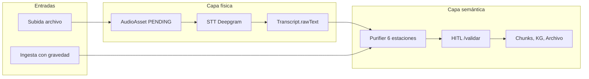
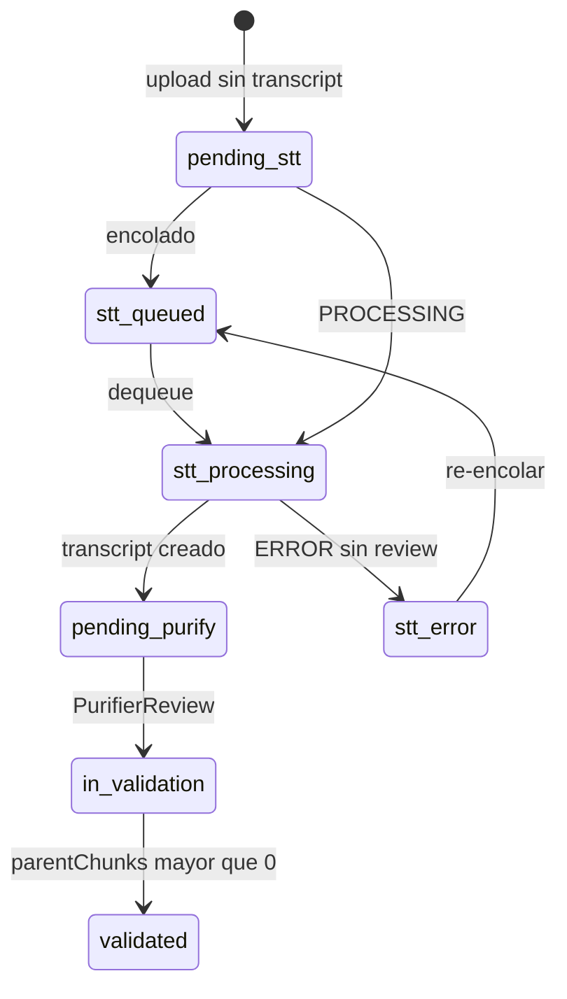

# Procesamiento de audio en Deprocast

> **Documento:** `docs/Audio.md`  
> **Última revisión:** julio 2026  
> **Runtime verificado:** Deepgram `nova-3` + FFmpeg + Purifier (Cohere)

Este documento describe en detalle cómo funciona el pipeline de audio en Deprocast: todas las formas de ingresar material, qué ocurre en cada etapa intermedia, qué outputs produce el sistema hoy, y qué agentes participan en el proceso.

---

## 1. Visión general

Deprocast convierte grabaciones de voz en **conocimiento estructurado** dentro del ecosistema (chunks semánticos, propuestas, grafo de conocimiento, archivo). El pipeline se divide en **dos capas independientes**:

| Capa | Qué hace | Persistencia |
|------|----------|--------------|
| **Física** | Subida del archivo de audio → transcripción STT | `AudioAsset`, `Transcript`, binario en disco |
| **Semántica** | Purificación del texto → revisión humana → integración | `PurifierReview`, `Proposal`, `ParentChunk`/`ChildChunk`, `KgNode`/`KgEdge` |



### Rutas principales en la UI

| Ruta | Rol |
|------|-----|
| `/ingesta` (canal Audio) | Subida + configuración de gravedad + ingesta semántica con metadatos |
| `/audio` | Estación operativa: Biblioteca → Pre-proceso → STT → Downstream |
| `/audio/[id]` | Detalle de un audio individual post-STT |
| `/validar` | Revisión humana (HITL) de transcripciones purificadas |

---

## 2. Puntos de entrada del usuario

Todas las formas en que el usuario puede interactuar con audio en el sistema:

| # | Entrada | Ubicación | Acción |
|---|---------|-----------|--------|
| 1 | **Drag-and-drop** | `/ingesta` (canal Audio), `/audio` (Biblioteca) | Sube archivo vía `POST /api/upload` → biblioteca |
| 2 | **File picker** (múltiple) | Mismo dropzone, acepta `.mp3,.m4a,.wav,.ogg,audio/*` | Igual que drag-and-drop |
| 3 | **Modal de ingesta** | Dashboard Cortex (`IngestModal`) | Sube audio a biblioteca o ingiere texto directo |
| 4 | **Procesar** | Pestaña STT en `/audio` | Encola STT de un archivo individual |
| 5 | **Procesar todos** | Pestaña STT en `/audio` | Encola todos los pendientes (`POST /api/process/queue`) |
| 6 | **Ingestar / Ingestar todo** | Canal audio en `/ingesta` | Purifica transcripción **con gravedad del panel lateral** |
| 7 | **Enviar a Validar** | Downstream `/audio`, detalle `/audio/[id]` | Purifica con defaults (`personal_writing`, título = nombre archivo) |
| 8 | **Purificar todos** | Panel Downstream | `POST /api/audio-station/purify-pending` en lote |
| 9 | **Auto-purify** | Automático tras STT exitoso | `autoPurifyAudioAsset()` en background (sin intervención) |
| 10 | **Descargar transcript** | Detalle / APIs | `.md` individual o descarga combinada |
| 11 | **Eliminar archivo** | Biblioteca `/audio` | `DELETE /api/assets/[id]` |
| 12 | **Cancelar STT** | Cola STT | `DELETE /api/process/[id]` |

### Formatos soportados

Definidos en `lib/audio-validation.ts`:

- **Extensiones:** `.mp3`, `.m4a`, `.wav`, `.ogg`
- **MIME types:** `audio/mpeg`, `audio/mp3`, `audio/mp4`, `audio/x-m4a`, `audio/m4a`, `audio/wav`, `audio/wave`, `audio/x-wav`, `audio/ogg`, `application/ogg`, `audio/opus`
- También acepta `application/octet-stream` si la extensión es válida

### Nota crítica

La subida de un archivo **no encola STT automáticamente**. Tras subir, el audio queda en estado `PENDING` hasta que el usuario vaya a `/audio` → pestaña **STT** y pulse **Procesar** o **Procesar todos**.

---

## 3. Configuración de gravedad (solo en `/ingesta`)

El panel lateral **Anclaje** (`components/ingesta/gravity-panel.tsx`) permite configurar metadatos semánticos antes de la ingesta:

| Campo | Clave | Default | Descripción |
|-------|-------|---------|-------------|
| **Título** | `gravity.title` | `""` | Opcional; si vacío, usa el nombre del archivo |
| **Campo** | `gravity.campoSlug` | campo por defecto del sistema | Destino semántico (select cargado desde proyectos) |
| **Onda** | `gravity.onda` | `"sin-clasificar"` | Clasificación temática libre. Sugerencias: `procesal`, `laboral`, `tecnico`, `salud`, `personal`, `legal`, `finanzas` |
| **Tipo de fuente** | `gravity.sourceType` | `"ai_chat"` | Origen del contenido (ver tabla abajo) |

### Tipos de fuente

| Valor interno | Etiqueta UI |
|---------------|-------------|
| `personal_writing` | Escrito personal |
| `ai_chat` | Chat IA |
| `ai_report` | Reporte IA |
| `web_clip` | Recorte web |
| `social_bookmark` | Marcador X |
| `book_excerpt` | Extracto libro |

### Dónde aplica la gravedad

| Acción | ¿Usa panel de gravedad? | Valores usados |
|--------|-------------------------|----------------|
| **"Ingestar"** en `/ingesta` | **Sí** | Campo, onda, source_type y título del panel |
| **Auto-purify** tras STT | **No** | `sourceType: "personal_writing"`, título = nombre del archivo |
| **"Enviar a Validar"** en estación audio | **No** | `sourceType: "personal_writing"`, título = nombre del archivo |

Los vectores de gravedad finos (prioridad, impacto, dificultad) se calibran **después** en `/validar` durante la revisión HITL.

Al purificar, estos metadatos se serializan en el frontmatter Markdown:

```yaml
campo, field, onda, source_type, context_seal, universe, channel: "audio", asset_id
```

---

## 4. Estación de Audio (`/audio`)

La Estación de Audio es el centro operativo del Motor de Transcripción. Se organiza en cuatro pestañas:

```
Biblioteca → Pre-proceso → STT → Downstream
```

El encabezado muestra el **Flujo Operacional de Audio** con contadores en tiempo real:
- Pendiente STT
- STT activo
- Esperando purificar
- En validación

### 4.1 Biblioteca

**Qué hace:** punto de entrada y gestión de la biblioteca de audios importados.

- Lista todos los `AudioAsset` con estadísticas (total, transcritos, pendientes)
- Upload integrado (drag-and-drop o selector de archivos)
- Eliminar archivos individuales
- Enlace a **Ingesta general** (`/ingesta`) para ingesta con metadatos
- Botón **Actualizar** para refrescar el estado

**Archivos clave:** `components/audio-station/audio-library-panel.tsx`, `app/api/assets/route.ts`

### 4.2 Pre-proceso

Herramientas para preparar el audio **antes** de encolar STT. Definidas en `lib/audio-station/constants.ts`:

| Herramienta | Estado | Función |
|-------------|--------|---------|
| **Desduplicar** | ✅ Operativo | Detecta copias por nombre normalizado, sufijos `(1)/(2)` y colisiones numéricas |
| **Aislamiento de voz (ENR)** | 🔜 Próximo | Reduce ruido ambiental, deja la voz principal |
| **Recorte de silencios** | 🔜 Próximo | Elimina pausas largas al inicio, medio y final |
| **Normalizar niveles** | 🔜 Próximo | Estandariza volumen antes de enviar a Deepgram |

#### Desduplicación (operativa)

La herramienta de deduplicación escanea la biblioteca buscando:

1. **Nombres normalizados** — elimina sufijos como `(1)`, `[2]`, `- copia`, etc.
2. **Colisiones numéricas** — secuencias de 4+ dígitos compartidas con patrón de copia
3. **Sufijos de copia explícitos**

**Flujo HITL:**
1. El usuario pulsa **Escanear duplicados** → `GET /api/audio-station/deduplicate`
2. Se muestran grupos con etiquetas **COPIA** y **CONSERVAR**
3. El usuario elige: **Eliminar copias** (`POST /api/audio-station/deduplicate/apply`) o **Procesar igual**

**Nota:** existe una segunda deduplicación distinta en el Purifier (estación 3, Jaccard sobre **texto** post-STT). Son procesos independientes.

**Archivos clave:** `lib/audio-station/deduplicate.ts`, `components/audio-station/deduplicate-panel.tsx`

### 4.3 STT — Cola Deepgram

**Qué hace:** convierte audio en texto usando Deepgram como motor de Speech-to-Text.

#### Configuración del motor

| Variable de entorno | Default | Descripción |
|---------------------|---------|-------------|
| `DEEPGRAM_API_KEY` | — | API key obligatoria |
| `DEEPGRAM_MODEL` | `nova-3` | Modelo de transcripción |
| `DEEPGRAM_LANGUAGE` | `es` | Idioma |
| `DEEPGRAM_CHUNK_SECONDS` | `50` | Duración de cada chunk para audios largos |
| `DEEPGRAM_SYNC_MAX_SECONDS` | `55` | Umbral para transcripción síncrona vs chunked |
| `DEEPGRAM_CHUNK_DELAY_MS` | `400` | Pausa entre chunks |

#### Pipeline técnico

```
Audio original → FFmpeg (WAV 16kHz mono + filtros) → Deepgram → Transcript
```

1. **Conversión FFmpeg** (`lib/stt/audio-prep.ts`):
   ```
   ffmpeg -y -i INPUT -ar 16000 -ac 1 -c:a pcm_s16le
          -af highpass=f=200,lowpass=f=3000,afftdn OUTPUT.wav
   ```
   Filtros aplicados: paso alto a 200 Hz, paso bajo a 3 kHz, reducción de ruido (`afftdn`).

2. **Decisión sync vs chunked:**
   - Duración ≤ 55 s → transcripción síncrona (`transcribe-sync.ts`)
   - Duración > 55 s → segmentación en chunks de 50 s + transcripción secuencial (`transcribe-chunked.ts`), con `partialText` actualizado en DB durante el proceso

3. **Persistencia:** `Transcript.rawText` + `confidence` en SQLite; `AudioAsset.status` → `COMPLETED`

4. **Limpieza:** tras STT exitoso, **se elimina el archivo de audio original** del disco. Solo queda el texto.

5. **Auto-purify:** dispara `autoPurifyAudioAsset()` en background (fire-and-forget, no bloquea la cola)

#### Cola de procesamiento

- **Tipo:** cola FIFO in-process (`lib/processing-queue.ts`)
- **Concurrencia:** un job activo a la vez
- **Persistencia:** **no** — la cola se pierde al reiniciar el servidor
- **Cancelación:** cooperativa vía `DELETE /api/process/[id]`

**Controles UI:**
- **Procesar** — encola un archivo individual
- **Procesar todos** — encola todos los `PENDING`/`ERROR`
- **Detener** — cancela el job activo o lo saca de la cola
- Panel en vivo con polling cada ~5 s (`LiveProcessingPanel`)

**Archivos clave:** `lib/deepgram-speech-processor.ts`, `lib/processing-queue.ts`, `components/audio-station/stt-queue-panel.tsx`

### 4.4 Downstream

**Qué hace:** gestiona la transición de transcripciones crudas hacia purificación y validación.

- Lista audios **pendientes de purificar** (tienen transcript pero no `PurifierReview`)
- Lista audios **en validación** (tienen `PurifierReview`, enlace a `/validar`)
- Botones: **Purificar todos**, **Enviar a Validar** (individual)
- Mapa del pipeline post-proceso

#### Mapa downstream

Definido en `POSTPROCESS_PIPELINE` (`lib/audio-station/constants.ts`):

```
STT (Deepgram) → Purifier → Segmentación fractal → Meta-Meteador → Molecular → Grafo KG
```

| Etapa | Módulo | Descripción |
|-------|--------|-------------|
| STT | `/audio` | Transcripción cruda, timestamps, texto parcial ante fallos |
| Purificación | `/validar` | Limpieza semántica, esencias, normalización, revisión HITL |
| Segmentación fractal | (Purifier est. 6) | Bloques padre/hijo para búsqueda y re-indexado |
| Clasificación | `/agentes` (Meta-Meteador) | Matriz cuántica, áreas de relevancia, títulos atómicos |
| Organización | `/molecular` | Chunkeo semántico, calibración de ejes, validación |
| Grafo | `/grafo` | Entidades, relaciones y menciones en SQLite |

**Archivos clave:** `components/audio-station/downstream-panel.tsx`, `lib/audio-station/auto-purify.ts`

---

## 5. Canal audio en Ingesta (`/ingesta`)

Además de la Estación de Audio, el workspace de Ingesta ofrece un canal dedicado a audio con un flujo orientado a la **ingesta semántica con metadatos**.

### Flujo visual en la UI

```
Input (.wav .m4a .mp3) → STT → Purificación automática → Validar
```

### Secciones del canal

1. **Dropzone** — sube archivos (mismos formatos que la estación)
2. **Transcripciones** — lista de audios transcritos organizados en buckets:
   - **Pendientes de ingesta** — transcritos pero sin purificar
   - **Ingestados** — en cola de `/validar`
   - **Validados** — aprobados en HITL
3. **Botones de acción:**
   - **Ingestar** — purifica un audio individual con gravedad del panel
   - **Ingestar todo** — purifica todos los pendientes con la misma gravedad

### Diferencia clave con la Estación de Audio

| Aspecto | `/ingesta` (canal Audio) | `/audio` (Estación) |
|---------|--------------------------|---------------------|
| Configuración de gravedad | ✅ Panel lateral | ❌ No disponible |
| STT manual | ❌ Redirige a Estación Audio | ✅ Cola STT integrada |
| Pre-proceso (dedup) | ❌ | ✅ Pestaña dedicada |
| Downstream | ❌ | ✅ Pestaña dedicada |
| Enfoque | Ingesta semántica con metadatos | Operaciones técnicas del pipeline |

**Archivo clave:** `components/ingesta/channels/audio-channel.tsx`

---

## 6. Procesamiento intermedio: Purifier

Tras obtener el texto crudo del STT, el **Orquestador Purifier** (`lib/purifier/engine.ts`) ejecuta una cadena de 6 estaciones (+ 1 opcional) que transforman la transcripción oral en documento estructurado.

### Estaciones del Purifier

| # | Nombre | Tipo | Qué hace |
|---|--------|------|----------|
| 1 | **Limpieza Regex** | Subprocesador | Amputa loops típicos de STT (artefactos Whisper), elimina oraciones duplicadas consecutivas |
| 2 | **Editor Semántico STT** | Agente LLM (Cohere) | Elimina muletillas vacías, corrige puntuación, convierte oralidad → prosa escrita, marca segmentos incomprensibles como `==DUDA: fragmento==` |
| 3 | **Deduplicación Jaccard** | Subprocesador | Fusiona párrafos con similitud Jaccard ≥ 0.82 |
| 4 | **Extractor de Esencias** | Agente LLM (Cohere) | Extrae hasta 30 tags atómicos (conceptos, bugs, tecnologías, procesos) |
| 4.1 | **Motor KG** | Agente LLM (Cohere) | Extrae entidades y relaciones → `KgNode`/`KgEdge` en SQLite (activo con `extractKg: true`) |
| 5 | **Archivista Deprocast** | Agente LLM (Cohere) | Genera Markdown completo con frontmatter YAML de las **Siete Dimensiones** (`materia: audio/transcript`) |
| 6 | **Segmentación Fractal** | Subprocesador | Divide el cuerpo en bloques padre/hijo (4 líneas por hijo) |

### Disparadores de purificación

| Disparador | Cuándo | Gravedad |
|------------|--------|----------|
| `autoPurifyAudioAsset` | Automático tras STT exitoso | Defaults (`personal_writing`) |
| "Ingestar" en `/ingesta` | Manual, por archivo o batch | Panel de gravedad |
| "Enviar a Validar" en `/audio` | Manual, individual | Defaults |
| "Purificar todos" en Downstream | Manual, batch | Defaults |
| `POST /api/purifier/purify` | API directa | Según payload |

### Proceso paralelo: El Listador

Tras `captureAndPurify`, el **Listador** (`lib/listador/process.ts`) analiza el texto en paralelo y extrae tareas, compromisos y acciones pendientes → `PendingTask` en SQLite.

### Persistencia intermedia

| Artefacto | Ubicación | Descripción |
|-----------|-----------|-------------|
| Markdown prima materia | `data/raw_documents/pending_purification/{timestamp}_{slug}.md` | Texto capturado antes de purificar |
| Review JSON | `data/raw_documents/review/{reviewId}.json` | Snapshot completo del pipeline |
| `PurifierReview` | SQLite (Prisma) | Registro para HITL en `/validar` |
| Registro Babel | SQLite | Materia prima indexada (`kind: audio`) |

---

## 7. Validación HITL (`/validar`)

La revisión humana es el paso final obligatorio antes de integrar el contenido al ecosistema.

### Qué ve el revisor

- Texto purificado con marcadores `==DUDA:...==` resaltados
- Frontmatter de las Siete Dimensiones (editable)
- Tags de esencias extraídas
- Entidades y relaciones del KG (si se extrajo)
- Bloques fractales padre/hijo

### Acciones del revisor

| Acción | API | Resultado |
|--------|-----|-----------|
| **Aprobar** | `POST /api/purifier/approve` | Crea `Proposal`, persiste `ParentChunk`/`ChildChunk`, ingesta al KG, indexa en Mnemosyne, elimina review |
| **Rechazar** | `POST /api/purifier/reject` | Descarta la revisión |

### Qué ocurre al aprobar

1. Se crea una **propuesta** en la incubadora
2. Se persisten **chunks fractales** (`ParentChunk`/`ChildChunk`) vinculados al `Transcript` del audio
3. Se ingesta al **Knowledge Graph** (menciones, nodos, aristas)
4. Se indexa en **Mnemosyne** para búsqueda vectorial
5. Se elimina el `PurifierReview` de la cola
6. El audio pasa a estado **Validado** (`parentChunks > 0`)

---

## 8. Máquina de estados

El sistema rastrea cada audio a través de estados definidos en `lib/audio-station/pipeline-status.ts`.

### Estados de la UI (`AudioPipelineStage`)



| Stage UI | Etiqueta en chips | Condición |
|----------|-------------------|-----------|
| `pending_stt` | **Pendiente STT** | Subido, sin transcript, no en cola |
| `stt_queued` | (agrupado en **STT activo**) | En cola in-memory |
| `stt_processing` | **STT activo** / Transcribiendo | `status=PROCESSING` o job activo |
| `stt_error` | Error STT | `status=ERROR`, sin transcript válido |
| `pending_purify` | **Esperando purificar** | Tiene transcript, sin `PurifierReview` |
| `in_validation` | **En validación** | Tiene `PurifierReview` pendiente |
| `validated` | **Validado** | `transcript.parentChunks > 0` |

### Estados de base de datos (`AudioAsset.status`)

| Valor | Significado |
|-------|-------------|
| `PENDING` | Subido, sin STT |
| `PROCESSING` | STT en curso |
| `COMPLETED` | STT terminado |
| `ERROR` | Fallo STT (puede tener transcript parcial en `partialText`) |

---

## 9. Outputs del sistema

Qué produce el pipeline en cada etapa:

| Etapa | Outputs |
|-------|---------|
| **Upload** | Archivo en disco (`public/uploads/` o `data/uploads/`), registro `AudioAsset`, registro Babel (`kind: audio`) |
| **Dedup apply** | Eliminación de copias (`AudioAsset` + archivo físico) |
| **STT** | `Transcript.rawText` + `confidence`; archivo de audio original **borrado** |
| **Purifier** | `.md` en `pending_purification/`, `PurifierReview` en SQLite, posible KG pre-HITL, `PendingTask` del Listador |
| **Aprobación HITL** | `Proposal`, `ParentChunk`/`ChildChunk`, índice Mnemosyne, nodos/aristas KG |
| **Downstream manual** | Partículas Molecular, calibración de ejes, visualización en Grafo, items en Archivo |

### Destinos finales del contenido validado

| Módulo | Ruta | Qué recibe |
|--------|------|------------|
| **Archivo** | `/archivo` | Transcripciones validadas como fuentes consultables |
| **Molecular** | `/molecular` | Texto para chunkeo semántico y calibración de ejes |
| **Grafo** | `/grafo` | Entidades y relaciones extraídas |
| **Enciclopedia** | `/enciclopedia` | Conocimiento estructurado |
| **Chat (Exocórtex)** | `/chat` | Contexto recuperable vía búsqueda híbrida |

---

## 10. APIs de referencia

### Upload y assets

| Método | Ruta | Descripción |
|--------|------|-------------|
| `POST` | `/api/upload` | Sube audio, crea `AudioAsset` |
| `GET` | `/api/assets` | Lista biblioteca con hints de pipeline |
| `GET` | `/api/assets/[id]` | Detalle de un asset |
| `DELETE` | `/api/assets/[id]` | Elimina asset + transcript |
| `GET` | `/api/uploads/[filename]` | Sirve binario (Vercel/custom root) |

### STT / procesamiento

| Método | Ruta | Descripción |
|--------|------|-------------|
| `POST` | `/api/process/queue` | Encola todos los `PENDING`/`ERROR` |
| `POST` | `/api/process/[id]` | Encola un asset |
| `DELETE` | `/api/process/[id]` | Cancela de cola o proceso activo |
| `GET` | `/api/process/status` | Estado cola + asset activo |

### Audio Station

| Método | Ruta | Descripción |
|--------|------|-------------|
| `GET` | `/api/audio-station/deduplicate` | Escaneo de duplicados |
| `POST` | `/api/audio-station/deduplicate/apply` | Elimina copias seleccionadas |
| `POST` | `/api/audio-station/purify-pending` | Purifica batch de pendientes |

### Purifier / Validar

| Método | Ruta | Descripción |
|--------|------|-------------|
| `POST` | `/api/purifier/purify` | Purificación directa |
| `GET` | `/api/purifier/review` | Mapa assetId → reviewId |
| `GET` | `/api/purifier/review/[id]` | Detalle de review |
| `POST` | `/api/purifier/approve` | Aprobación HITL |
| `POST` | `/api/purifier/reject` | Rechazo de review |
| `POST` | `/api/ingesta/capture` | Captura unificada (también audio con `assetId`) |

### Transcripts

| Método | Ruta | Descripción |
|--------|------|-------------|
| `GET` | `/api/transcripts/[id]/download` | Descarga transcript como `.md` |
| `GET` | `/api/transcripts/download-all` | Descarga combinada |

---

## 11. Limitaciones y deuda técnica

| Limitación | Impacto |
|------------|---------|
| STT requiere acción manual post-upload | El usuario debe ir a `/audio` → STT |
| Cola STT no persiste entre reinicios | Jobs encolados se pierden al reiniciar el servidor |
| ENR, recorte de silencios, loudnorm planificados | Sin implementación backend; solo UI "Próximo" |
| Auto-purify ignora panel de gravedad | Para aplicar campo/onda/source_type hay que usar "Ingestar" en `/ingesta` |
| Dos tipos de deduplicación | Archivos (pre-STT) vs párrafos Jaccard (Purifier est. 3) — procesos independientes |
| Audio original se borra tras STT | No hay forma de re-transcribir sin re-subir |
| Docs legacy mencionan GCP Speech | El runtime actual usa Deepgram exclusivamente |
| Sin worker externo | Todo corre en el proceso Next.js (cola in-memory, auto-purify fire-and-forget) |

---

## 12. Archivos clave en el código

| Área | Archivos |
|------|----------|
| UI Ingesta audio | `components/ingesta/channels/audio-channel.tsx` |
| UI Estación | `components/audio-station/` |
| Validación audio | `lib/audio-validation.ts` |
| STT | `lib/deepgram-speech-processor.ts`, `lib/processing-queue.ts`, `lib/stt/audio-prep.ts` |
| Deepgram | `lib/deepgram/config.ts`, `transcribe-sync.ts`, `transcribe-chunked.ts` |
| Purifier | `lib/purifier/engine.ts`, `lib/purifier/capture.ts`, `lib/purifier/approve.ts` |
| Auto-purify | `lib/audio-station/auto-purify.ts` |
| Estados pipeline | `lib/audio-station/pipeline-status.ts` |
| Constantes | `lib/audio-station/constants.ts` |
| Dedup | `lib/audio-station/deduplicate.ts` |
| Catálogo agentes | `lib/agentes/catalog.ts` |
| Modelo DB | `prisma/schema.prisma` (`AudioAsset`, `Transcript`) |

---

## Agentes

Esta sección describe todos los agentes que participan en el pipeline de audio, organizados por etapa. La fuente de verdad del catálogo es `lib/agentes/catalog.ts`, sincronizado con `docs/agentes.md`.

### Agentes operativos del pipeline de audio

#### Motor de Transcripción STT

| | |
|---|---|
| **ID** | `stt` |
| **Tecnología** | Deepgram + FFmpeg (determinístico) |
| **Ubicación** | `lib/deepgram-speech-processor.ts`, `lib/processing-queue.ts`, `lib/audio-station/` |
| **UI** | `/audio` |

**Responsabilidades específicas con audio:**

- Gestionar la biblioteca central de `AudioAsset` importados
- Pre-procesamiento: escaneo de duplicados por nombre, sufijo `(1)(2)` y colisión numérica
- Acción HITL post-escaneo: eliminar copias o procesarlas igual
- Encolar `AudioAsset` en cola in-process (`ProcessingQueue`)
- Convertir audio a WAV 16 kHz mono con FFmpeg/FFprobe
- Transcribir sincrónicamente o por chunks según duración
- Persistir `Transcript.rawText` y actualizar estado del asset
- Guardar transcripciones parciales ante fallos recuperables
- Mantener mapa downstream hacia Purifier, Molecular y Grafo

---

#### Orquestador Purifier

| | |
|---|---|
| **ID** | `orquestador` |
| **Tecnología** | Mixto (LLM + subprocesadores) |
| **Ubicación** | `lib/purifier/engine.ts`, `lib/purifier/capture.ts`, `lib/purifier/approve.ts` |
| **UI** | `/validar` |

**Responsabilidades específicas con audio:**

- Ejecutar secuencialmente estaciones 1 → 6 (+ 4.1 opcional) sobre el texto transcrito
- Resolver gravedad de entrada (`GravityInput`) y fuente KG
- Registrar snapshot por estación (`PurifierStageSnapshot[]`)
- Persistir revisión en `data/raw_documents/review/{reviewId}.json`
- Exponer aprobación HITL (`approveToProposal`)
- Al aprobar un audio: persistir chunks fractales en el `Transcript` y ingerir al KG

---

#### Editor Semántico STT

| | |
|---|---|
| **ID** | `editor-semantico` |
| **Tecnología** | Cohere Command R+ (LLM) |
| **Estación** | Purifier · Estación 2 |
| **Ubicación** | `lib/purifier/engine.ts` (`station2SemanticCleanup`) |

**Responsabilidades específicas con audio:**

- Recibir texto post-limpieza regex (Estación 1)
- Eliminar muletillas vacías sin alterar significado
- Corregir puntuación y convertir oralidad → prosa escrita
- Marcar segmentos incomprensibles como `==DUDA: fragmento==`
- Preservar bloques `==DUDA:...==` preexistentes

---

#### Extractor de Esencias

| | |
|---|---|
| **ID** | `extractor-esencias` |
| **Tecnología** | Cohere Command R (LLM) |
| **Estación** | Purifier · Estación 4 |
| **Ubicación** | `lib/purifier/engine.ts` (`station4ExtractEssences`) |

**Responsabilidades específicas con audio:**

- Analizar texto deduplicado (Estación 3)
- Devolver array JSON de conceptos atómicos (nombres propios, leyes, bugs, tecnologías, procesos)
- Limitar salida a 30 tags máximo

---

#### Motor de Extracción KG

| | |
|---|---|
| **ID** | `motor-kg` |
| **Tecnología** | Cohere Command R+ (LLM) |
| **Estación** | Purifier · Estación 4.1 |
| **Ubicación** | `lib/kg/extract.ts`, `lib/kg/ingest.ts`, `lib/purifier/engine.ts` |
| **UI** | `/grafo` |

**Responsabilidades específicas con audio:**

- Analizar texto purificado y devolver JSON de entidades y relaciones
- Tipificar nodos (persona, proyecto, idea, tecnología, etc.)
- Exigir contexto obligatorio en cada relación y weight 1–12
- Ingerir resultado en SQLite cuando `extractKg: true` (activo en auto-purify de audio)
- Al aprobar en Validar: ingerir chunks fractales al grafo

---

#### Archivista Deprocast

| | |
|---|---|
| **ID** | `archivista` |
| **Tecnología** | Cohere Command R+ (LLM) |
| **Estación** | Purifier · Estación 5 |
| **Ubicación** | `lib/purifier/engine.ts` (`station5Normalize`) |

**Responsabilidades específicas con audio:**

- Recibir texto purificado + meta tags + vectores de gravedad
- Generar Markdown completo con frontmatter YAML de las **Siete Dimensiones**
- Asignar `materia: audio/transcript`, prioridad, impacto, dificultad (1–12)
- Preservar marcadores `==DUDA:...==` en el cuerpo

---

#### El Listador

| | |
|---|---|
| **ID** | `listador` |
| **Tecnología** | Cohere (LLM) |
| **Ubicación** | `lib/listador/extract.ts`, `lib/listador/process.ts` |

**Responsabilidades específicas con audio:**

- Tras `captureAndPurify` de un audio, extraer tareas, compromisos y acciones del texto transcrito
- Crear `PendingTask` en SQLite para seguimiento posterior
- Se dispara en paralelo al Purifier (no bloquea el pipeline)

---

### Subprocesadores (sin LLM)

Estos componentes forman parte del Purifier pero no usan modelos de lenguaje:

| Nombre | Estación | Función con audio |
|--------|----------|-------------------|
| **Limpieza Regex** | 1 | Amputa loops típicos de STT, elimina oraciones duplicadas consecutivas |
| **Deduplicación Jaccard** | 3 | Fusiona párrafos del transcript con similitud ≥ 0.82 |
| **Segmentación Fractal** | 6 | Divide el cuerpo en bloques padre/hijo (4 líneas por hijo) para búsqueda y re-indexado |

---

### Agentes downstream (post-validación)

Estos agentes consumen el contenido **después** de que el audio fue aprobado en `/validar`:

#### Meta-Meteador

| | |
|---|---|
| **ID** | `meta-meteador` |
| **Tecnología** | Cohere (LLM) |
| **UI** | `/agentes` |

- Genera títulos atómicos, matriz cuántica y áreas de relevancia
- Proyecta nodos `area` al grafo de conocimiento
- Opera sobre contenido ya validado, no directamente sobre audio

#### Chunkeador Semántico (Molecular · Agente 01)

| | |
|---|---|
| **Tecnología** | Heurístico (sin LLM) |
| **UI** | `/molecular` |
| **Ubicación** | `lib/molecular-processing/semantic-chunker.ts` |

- Segmenta texto validado en partículas semánticas (párrafos → oraciones → fusión por longitud)
- Consume fuentes del Archivo, incluyendo `audio_transcript`
- No hay enlace automático post-STT; es downstream manual

#### Calibrador Central (Molecular · Agente 02)

| | |
|---|---|
| **Tecnología** | Heurístico (sin LLM) |
| **UI** | `/molecular` |
| **Ubicación** | `lib/molecular-processing/calibrator.ts` |

- Propone ejes X/Y/Z (bloque de esencia, impacto, fricción) por keywords
- Requiere validación humana (HITL) del operador
- Opera sobre partículas generadas por el Chunkeador

---

### Agentes relacionados (fuera del pipeline STT directo)

| Agente | ID | Relación con audio |
|--------|----|--------------------|
| **Universos de Babel** | `babel-universes` | Registra materia prima al subir (`kind: audio`, sello de contexto) |
| **Calibrador de Vibe** | `calibrador` | Calibración humana de peso 1–12 sobre contenido validado (incluye transcripciones) |
| **Binauralizer** | `binauralizer` | Genera tonos binaurales (Web Audio API). Es **salida** de audio, no procesa transcripciones |
| **Exocórtex Interactivo** | `exocortex` | Puede recuperar transcripciones validadas como contexto en el chat vía búsqueda híbrida |

---

### Agentes de diseño (no implementados)

| Agente | Estado | Relación futura con audio |
|--------|--------|---------------------------|
| **Somatometrón** | Diseño | Telemetría de salud; ingesta vía Purifier con `onda: personal-health` |
| **Mnemosyne** | Diseño | Memoria líquida re-indexable; serviría como capa de memoria para transcripciones validadas |

---

## Documentos relacionados

| Documento | Contenido |
|-----------|-----------|
| [`agentes.md`](agentes.md) | Catálogo narrativo completo de agentes |
| [`DEPROCAST_SSOT.md`](DEPROCAST_SSOT.md) | Single Source of Truth del producto |
| [`deprocast_master_plan.md`](deprocast_master_plan.md) | Grimorio de arquitectura y visión |
| [`knowledge-graph.md`](knowledge-graph.md) | Documentación del Knowledge Graph |
| [`lib/agentes/catalog.ts`](../lib/agentes/catalog.ts) | Catálogo verificable en código |
