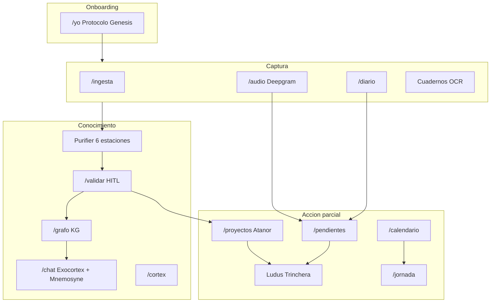

# Deprocast — Contexto Estratégico

> **Fecha:** 28 de julio de 2026  
> **Repositorio:** `deprocast2` · **Versión npm:** `0.1.0` · **Commit de referencia:** `08a42a1`  
> **Rol:** Briefing para otra IA (Gemini, NotebookLM, Cursor) y para contraste con fuentes externas del Observador (cuadernos, notas de voz, Notebooks, chats).  
> **No es:** una auditoría API completa. Para el inventario técnico profundo del 10/07 ver [`DEPROCAST_OS_CONTEXT_2026-07-10.md`](./DEPROCAST_OS_CONTEXT_2026-07-10.md).

---

## 0. Cómo usarme

### Para Gemini / otra IA

1. Leé este documento **primero** como foto del producto en código al 28/07/2026.
2. Contrastalo con las otras fuentes que te adjunte el Observador (cuadernos, voz, NotebookLM, chats previos, screenshots).
3. Tu trabajo no es reescribir el grimorio: es **detectar gaps**, priorizar frentes y proponer prompts/edits accionables hacia Cursor.
4. Cuando visión y código choquen, preferí la marca **Código** de este doc; marcá la idea externa como candidata, no como hecho.

### Criterio editorial

| Marca | Significado |
|-------|-------------|
| **Visión** | Grimorio / filosofía (puede no estar en código) |
| **Código** | Verificable en el repo hoy |
| **Delta** | Cambió después del contexto del 10/07 |
| **Brecha** | Visión o fuentes externas vs realidad del repo |
| **Obsoleto** | Docs internos que contradicen el runtime |

### Mapa de autoridad (fuentes internas)

| Prioridad | Fuente | Usar para |
|-----------|--------|-----------|
| ★★★ | Este documento (28/07) | Foto estratégica + gaps |
| ★★★ | `docs/deprocast_master_plan.md` | Filosofía / identidad (no stack) |
| ★★★ | `lib/agentes/catalog.ts` | SSOT de agentes en código |
| ★★ | `Agentes20.md` (20/07) | Inventario metacognitivo + propuestas |
| ★★ | `2707report.md` (27/07) | Génesis → Personas/Proyectos/Grafos + `reconocido` |
| ★★ | `docs/Audio.md` | Pipeline audio actual (Deepgram) |
| ★★ | `docs/contextos/DEPROCAST_OS_CONTEXT_2026-07-10.md` | Auditoría técnica profunda |
| ★ | `reporte2107.md`, `mod-eco2107.md`, `mod-salud2107.md`, `mod-calen2107.md` | Slices de módulo julio |
| △ | `README.md`, `docs/DEPROCAST_SSOT.md`, `docs/agentes.md`, `docs/datainfo.md` | **Históricos** — stack IA a menudo mentiroso (Vertex/GCP) |

**Stack de verdad (.env.example + código):** Next.js 16 · React 19 · Prisma/SQLite · **Cohere** · **Deepgram** · FFmpeg · local-first · **sin auth**.

---

## 1. Identidad y promesa

### 1.1 Qué es

**Deprocast OS** (paquete `deprocast2`) es un **exoesqueleto cognitivo local-first**: una capa externa de procesamiento que amplifica la capacidad atencional del Observador sin ceder soberanía sobre sus datos.

No es una app de productividad genérica ni un gestor de tareas clásico. Es un **Atanor** — circuito local soberano — que transforma materia prima multimodal (audio, texto, imágenes, tablas, cuadernos, bookmarks, screen recordings) en conocimiento estructurado y micro-acción.

**Visión (grimorio):** *«La procrastinación es ruido estático. DeProCast procesa luz.»*

### 1.2 Circuito central

```
Información → Conocimiento → Acción
```

| Fase | Qué hace | Madurez (28/07) |
|------|----------|-----------------|
| **Información** | Captura multimodal local | **Fuerte** — ingesta, audio STT, diario, cuadernos OCR, molecular |
| **Conocimiento** | Purifier HITL + KG + Mnemosyne + Exocórtex | **Fuerte** — coagulación, RAG, enciclopedia, personas/proyectos |
| **Acción** | Pendientes, calendario, Ludus, jornada | **Parcial** — hay superficies; falta el ejecutor dopaminérgico pleno |
| **Sabiduría / proactividad** | Loops que compostan solos, alertas, Estudianta | **Débil** — mayormente **Visión** / incubación |

### 1.3 Núcleo binario

| Actor | Rol | Estado |
|-------|-----|--------|
| **Observador** | Humano soberano. HITL, calibra 1–12, escribe = coagula | **Código** — toda la UI asume un solo operador |
| **Estudianta** | Avatar ejecutor &lt;15 min, Puntos de Señal, Trituradora | **Visión / Brecha** — menciones y UI “en preparación”; sin motor de avatar |
| **Studianta** | Plataforma académica paralela (campo semántico) | **Fuera de este repo** — Deprocast la alimentará como Atanor |

Relación asimétrica: *el Observador piensa; Estudianta hará en ventanas cortas.*

### 1.4 Contratos no negociables

1. **Soberanía local:** SQLite + `data/` en disco. Egress solo opt-in (hoy Cohere/Deepgram).
2. **HITL:** *la IA propone; el Observador confirma* — excepto cuando el Observador escribe él mismo (la escritura ya es confirmación).
3. **Coagulación (`reconocido`):** flag que decide si un nodo/arista es visible en listas verificadas y grafos. IA → `false` hasta promote; Observador → `true` inmediato.
4. **Gravedad / vibe 1–12:** peso atencional universal (tareas, asaltos, calibrador).
5. **Siete Dimensiones** (YAML): `materia`, `particula`, `posicion`, `onda`, `tiempo`, `espacio`, `field`.
6. **Mejora infinita:** ningún fragmento es archivo muerto; todo puede re-indexarse, re-pesarse y re-encadenarse.

### 1.5 Ludus (gamificación)

| Capa | Horizonte | Ruta | Función |
|------|-----------|------|---------|
| **Castillo** (Alpha) | Macro | `/castillo` | Canvas estratégico |
| **Campamento** (Beta) | Meso | `/campamento` | Plan semanal / universos; sync con calendario |
| **Trinchera** (Gamma) | Micro ≤15–45 min | `/trinchera` | Asaltos de foco + lab sonoro |

---

## 2. Cómo se construye hoy (meta-proceso)

El repositorio es el **artefacto**. El proceso creativo del Observador vive fuera y alimenta Cursor:

```
Ideas (cuadernos · notas de voz)
  → Gemini Notebooks (audios / reportes / slides)
  → Chats Gemini (contexto + prompts / edits)
  → Cursor (implementación en este repo)
  → MD de handoff + screenshots (feedback loop)
```

| Fuente externa | Qué aporta | Qué NO es |
|----------------|------------|-----------|
| Cuadernos | Ideas crudas, diagramas, vocabularios | Spec ejecutada |
| Notas de voz | Intención, priorización emocional | Inventario de código |
| Gemini Notebooks | Síntesis multimodal, slides | Estado del repo |
| Chats Gemini | Prompts y diseños de features | Verificación runtime |
| **Este .md + código** | Qué existe de verdad | Visión futura no implementada |

**Instrucción para Gemini:** cuando el Observador pegue Notebooks o voz que contradigan este doc, listá la contradicción como **Brecha candidata** y proponé si conviene (a) actualizar visión, (b) implementar en Cursor, o (c) descartar/diferir.

---

## 3. Foto del sistema (28/07)

### 3.1 Stack (**Código**)

| Capa | Tecnología |
|------|------------|
| App | Next.js 16.2.7 App Router · React 19.2.4 · Tailwind 4 |
| Datos | Prisma 7.8 + SQLite (`better-sqlite3`) + filesystem `data/` |
| LLM | Cohere (chat, vision, embed, rerank) |
| STT | Deepgram nova-3 + FFmpeg |
| Auth / multi-user / billing | **Ausentes** — single-user localhost |
| Tests automatizados | **Ausentes** |

### 3.2 Superficies activas (navegación canónica)

Categorías en `lib/navigation/routes.ts` (portal ⌘K):

| Área | Rutas clave | Qué hace |
|------|-------------|----------|
| **Núcleo** | `/yo`, `/jornada`, `/diario`, `/chat`, `/calendario`, `/pendientes` | Identidad Génesis, día, diario MD, Exocórtex, draft temporal, tareas |
| **Captura** | `/ingesta`, `/audio`, `/cam-recorder`, cuadernos | Multimodal, STT, OCR, watcher (cam aún mock en análisis) |
| **Córtex** | `/cortex`, `/validar`, `/proyectos`, `/personas`, `/grafo`, `/molecular`, `/archivo`, `/enciclopedia` | Control, HITL Purifier, Atanor, CRM, KG, chunks, wiki |
| **Ludus** | `/ludus`, `/castillo`, `/campamento`, `/trinchera`, `/mago`… | Alpha/Beta/Gamma + matriz hermética Magos |
| **Sistema** | `/salud`, `/finanzas`, `/calibrador`, `/agentes`, `/historial`, `/respaldo` | Telemetría corporal, ledger Eco, vibe, mapa agentes, backup ZIP |
| Home | `/` | HUD táctico |

### 3.3 Flujo operativo actual



### 3.4 Principio de coagulación (invariante post-27/07)

| Origen | Tratamiento |
|--------|-------------|
| **Observador** escribe (alta persona, crear/activar proyecto, Consagración) | `reconocido: true` inmediato → visible en listas/grafos |
| **IA** extrae (Purifier, motor-kg, stubs incubadora) | `reconocido: false` / candidatas → triage HITL |

Persistencia híbrida: Prisma/SQLite + Markdown en `data/projects/`. No hay Zustand/localStorage para el dominio core.

---

## 4. Delta desde el 10/07

Lo que el contexto absoluto del 10/07 **no cubría bien** o cambió después:

### 4.1 Protocolo Génesis (**Delta** · 27/07)

Onboarding real en `/yo` (no carpeta `onboarding`):

`PENDING_NAMES` → `PENDING_MISSIONS` → `COMPLETED`

`genesis-gate` bloquea el resto de la app hasta completar.

| Misión | Efecto |
|--------|--------|
| Bautismo | `Yo.operatorName` + `Yo.exocortexName` + hub Operador en KG |
| Nosce | Calibración ADN / propósito del exoesqueleto |
| Senado | Persona + vínculos coagulado (`reconocido: true`) |
| Prima Materia | Proyecto Atanor real (`.md` + KG sellado), **ya no** solo `ProjectProposal` pendiente |

Bus de UI: `notifyDomainRefresh` / `useDomainRefresh` para Personas · Proyectos · Grafo.

Fuente: [`2707report.md`](../../2707report.md).

### 4.2 Ingesta molecular (**Delta** · ~20/07)

- Modelos: `OriginAttribution`, `Quantomo`; `KgEdge.reconocido` para espejo de asaltos.
- Agente **Quantador**: fragmenta captura → Quantomos + `PendingTask` suggested.
- Espejo: al reconocer/calibrar en `/pendientes`, upsert `KgEdge` `asalto_trinchera` (peso 1–12).

Fuente: [`Agentes20.md`](../../Agentes20.md) §§8–9.

### 4.3 Módulos Eco / Salud / Calendario (**Delta** · 21/07)

| Módulo | Ruta | Agentes | Idea |
|--------|------|---------|------|
| **Eco (Finanzas)** | `/finanzas` | `financial-broker`, `eco-pulse` | Draft multimodal → un click; Runway Vital; tiers de egreso |
| **Salud** | `/salud` | `health-broker`, `nutrimetron`, `kinetometro`, `centinela-somatico` | Alimentación + entrenamiento HITL; sin wearables |
| **Calendario** | `/calendario` | `reclutador-misiones`, `coagulador-jornada`, `orquestador-temporal`, `cronista`… | Simulador de turnos: IMMUTABLE / ROUTINE / SUGGESTION; sync Campamento |

### 4.4 Personas / Proyectos / Enciclopedia / Molecular (**Delta** · 21/07)

Handoff en [`reporte2107.md`](../../reporte2107.md): CRM Personas = KG; Proyectos = Markdown Atanor; dos calibradores distintos (`calibrador` vibe vs `calibrador-central` molecular).

### 4.5 Runtime IA confirmado

Docs de junio (`README`, SSOT, partes de `agentes.md`) aún citan **Vertex / GCP Speech**. **Código:** Cohere + Deepgram. Tratar menciones Vertex/GCP como **Obsoleto**.

### 4.6 Lo que el 10/07 ya decía y sigue vigente

- Circuito Información → Conocimiento → Acción.
- Purifier 6 estaciones + HITL `/validar`.
- Mnemosyne embeddings + Exocórtex híbrido.
- Sin auth, sin Supabase, sin daemon `.exe`, sin Whisper local.
- Estudianta / Focus Work completo = planificado.

---

## 5. Ecosistema de agentes — estado y huecos

SSOT en código: `lib/agentes/catalog.ts`. Resumen alineado a `Agentes20.md` (20/07):

| Bucket | Cantidad | Notas |
|--------|----------|-------|
| Operativos | ~40 | Incluye Quantador, brokers salud/finanzas, Reclutador, Coagulador, etc. |
| Magos | 5 | Traductor + 22/3/7/12 |
| Diseño (incubación) | 2 | Somatometrón, Ambientógrafo |
| Subprocesadores Purifier | 3 | S1 regex, S3 Jaccard, S6 fractal |
| Fuentes KG | 3 | code-scanner, journal, projects |
| Pipelines agent-like sin nombre en catálogo | 9 | Ver §6 Agentes20 |
| Agentes visión sugeridos | 8 | Ver abajo |

### 5.1 Familias operativas (mapa mental)

| Familia | Ejemplos | Estado |
|---------|----------|--------|
| Conversación / memoria | `exocortex`, `mnemosyne` | Real |
| Captura | `stt`, `vision`, `vision-atomica`, `cam-recorder-watcher` | STT/visión reales; cam **mock** |
| Purifier | `orquestador`, estaciones + Meta-Meteador | Real |
| Molecular | `quantador`, `chunkeador-semantico`, `calibrador-central` | Real (julio) |
| Tareas / tiempo | `listador`, `task-calibrator`, extractores, coagulación jornada | Real (calidad variable) |
| Ludus | `ludus`, `foco-trinchera`, planificador/cartógrafo castillo-campamento | Real UI + APIs |
| Salud / Eco | brokers + nutrimetron/kinetometro/eco-pulse | Real HITL |
| Personas / audio UX | `prosopografo`, `binauralizer` | Real |
| Magos | matriz hermética | UI + store |

### 5.2 Frentes abiertos

**En catálogo, no vivos (diseño):**

| id | Nombre | Propósito |
|----|--------|-----------|
| `somatometron` | Somatometrón | Wearables / HRV / sueño → Siete Dimensiones |
| `ambientografo` | Ambientógrafo | Entorno (sol, aire, meditación) no biométrico |

**Agent-like sin registrar (candidatos a bautizo):**  
`destilador-sesiones`, `enriquecedor-bookmarks`, `hermeneuta-cuadernos`, `auditor-memorias`, `tabulador`, `monitor-cortex`, `validador-tareas`, `metabolometro-audio`, `escaner-codigo`.

**Visión 2026 (no implementados como agentes):**

| id | Por qué importa |
|----|-----------------|
| `estudianta` | Cierra el núcleo binario; ejecutor &lt;15 min |
| `trituradora-friccion` | Fragmentar Bosses → microtareas dopaminérgicas |
| `vinculador-proyectos` | Destino Campo/Proyecto post-Purifier con HITL |
| `reconciliador-identidades` | Unificar aliases en KG |
| `guardian-soberania` | Auditar egress, wipe/backup, políticas local-first |
| `contraste-jornada` | Retrospectiva diaria (cam + trinchera + salud) |
| `whisper-local` | STT on-device (objetivo grimorio) |
| `diplomata-babel` | Universos/sellos cuando la materia cruza planos |

---

## 6. Brechas estratégicas (para comparar con otras fuentes)

Usá esta lista como checklist al contrastar Notebooks / voz / cuadernos. Si una idea externa no aparece acá ni en código, es **Brecha nueva** — anotala explícitamente.

### 6.1 Cerrar Acción (prioridad conceptual del grimorio)

- **Brecha:** Estudianta como avatar ejecutor + Puntos de Señal vividos en UI.
- **Brecha:** Trituradora de Fricción plena (Boss → microtareas &lt;15 min de punta a punta).
- **Código parcial:** Trinchera, pendientes, espejo asalto_trinchera, preview de Puntos de Señal en calendario.
- **Pregunta a otras fuentes:** ¿qué ritual diario del Observador debería gatillar Estudianta primero?

### 6.2 Proactividad y compostaje continuo

- **Visión:** nada es archivo muerto; re-indexación / re-pesado / re-encadenamiento.
- **Código:** Mnemosyne + Meta-Meteador + Quantador existen, pero faltan loops autónomos (alertas, contraste jornada, compostaje nocturno).
- **Candidatos:** `contraste-jornada`, destilador de sesiones, monitor córtex.

### 6.3 Soberanía

- **Código:** local-first SQLite + FS; backup ZIP; keys solo server-side.
- **Brecha:** auth si se sale de localhost; daemon `.exe`; Whisper+VAD offline; `guardian-soberania`.
- **Obsoleto en docs:** promesas GCP/Vertex como default.

### 6.4 Consistencia documental

- README / SSOT junio / `docs/agentes.md` / partes de `datainfo.md` desfasados (stack, “sin RAG”, conteos).
- **Acción sugerida:** no reescribir todo de golpe; este contexto + Agentes20 + Audio.md mandan hasta una pasada de sync.

### 6.5 Wearables / telemetría ambiental

- Salud manual HITL **existe**; Somatometrón / Ambientógrafo **no**.
- Contrastar con Notebooks si el Observador ya diseñó sensores, HRV, o rituales de meditación.

### 6.6 Calidad de flujo / deuda conocida

| Ítem | Notas |
|------|-------|
| Cam-Recorder | UI existe; análisis real aún mock/NDJSON |
| Jornada | Superficie activa; profundidad vs grimorio variable |
| Cola audio / metabolismo | Pipeline Deepgram operativo; telemetría downstream mejorable |
| Menú móvil | Auditoría visual julio: gaps de navegación móvil |
| Laboral | Stub / redirect — Bosses Varona viven más en Markdown/KG que en módulo dedicado |
| Tests | Sin suite automatizada |

### 6.7 Madurez del circuito (síntesis)

```
Información   ████████░░  fuerte
Conocimiento  ████████░░  fuerte
Acción        █████░░░░░  parcial
Sabiduría     ██░░░░░░░░  débil / visión
```

---

## 7. Glosario mínimo

| Término | Definición corta |
|---------|------------------|
| **Atanor** | Circuito local soberano de Deprocast (ingesta → purificación → coagulación) |
| **Observador** | Usuario humano soberano; HITL y calibración |
| **Estudianta** | Avatar ejecutor gamificado (&lt;15 min); aún incubación |
| **Studianta** | Producto académico paralelo (fuera de este repo) |
| **Purifier** | Pipeline de 6 estaciones que esteriliza materia prima |
| **HITL** | Human-in-the-Loop: la IA propone, el humano valida |
| **Coagulación / `reconocido`** | Estado en que el conocimiento entra al corpus visible |
| **Gravedad 1–12** | Escala de peso atencional / vibe / costo de acción |
| **Siete Dimensiones** | Contrato YAML universal de metadatos |
| **Ludus** | Sistema de gamificación Castillo → Campamento → Trinchera |
| **Exocórtex** | Chat conversacional con contexto híbrido (@mentions + RAG) |
| **Mnemosyne** | Memoria vectorial (embeddings Cohere) |
| **Quantomo** | Fragmento molecular de una captura (vía Quantador) |
| **OriginAttribution** | Linaje ambiental de una captura |
| **Campo / Proyecto / Boss** | Jerarquía de trabajo; proyectos viven como Markdown en Atanor |
| **Trituradora de Fricción** | Visión: fragmentar retos paralizantes en micro-acciones |
| **Babel / Universos** | Planos semánticos donde se sella el KG |
| **Puntos de Señal** | Moneda dopaminérgica de Ludus (schema parcial; UI incompleta vs visión) |
| **Génesis** | Onboarding/consagración en `/yo` |
| **Eco** | Módulo finanzas (Runway Vital, tiers) |

---

## 8. Anexo — prompt listo para pegar en Gemini

```
Sos estratega de producto + arquitecto de Deprocast.

Contexto canónico del repo (28 jul 2026): el archivo
docs/contextos/DEPROCAST_CONTEXT_2026-07-28.md

Leelo como foto de CÓDIGO. Yo también te adjunto / pego otras fuentes
(cuadernos, notas de voz, NotebookLM, chats previos, screenshots).

Tu trabajo:
1) Resumí en 10 bullets el estado real del exoesqueleto (no la visión).
2) Contrastá mis otras fuentes vs este contexto: listá
   - Ideas YA cubiertas en código
   - Ideas PARCIALES
   - Ideas FALTANTES (brechas) con prioridad sugerida
3) Proponé 3–7 frentes concretos para proseguir (agentes a incorporar,
   mejoras de flujo, cierres de Acción/Estudianta, soberanía, docs).
4) Para cada frente: un prompt corto listo para llevar a Cursor
   (objetivo, invariantes HITL/reconocido, archivos/módulos a tocar).
5) No reescribas el grimorio. No inventes que algo está en el repo
   si este contexto lo marca como Visión/Brecha/Obsoleto.
6) Stack de verdad: Cohere + Deepgram + Prisma/SQLite local-first.
   Ignorá menciones Vertex/GCP en docs viejos.
```

---

## 9. Referencias cruzadas

| Documento | Relación con este contexto |
|-----------|----------------------------|
| [`docs/deprocast_master_plan.md`](../deprocast_master_plan.md) | Visión / filosofía — manda en identidad, no en stack |
| [`docs/contextos/DEPROCAST_OS_CONTEXT_2026-07-10.md`](./DEPROCAST_OS_CONTEXT_2026-07-10.md) | Auditoría técnica; complementar con §4 Delta |
| [`Agentes20.md`](../../Agentes20.md) | Inventario agentes + propuestas 20/07 |
| [`lib/agentes/catalog.ts`](../../lib/agentes/catalog.ts) | SSOT agentes en código |
| [`2707report.md`](../../2707report.md) | Génesis + coagulación `reconocido` |
| [`reporte2107.md`](../../reporte2107.md) | Personas / Proyectos / Molecular / Calibradores |
| [`mod-eco2107.md`](../../mod-eco2107.md) | Finanzas |
| [`mod-salud2107.md`](../../mod-salud2107.md) | Salud |
| [`mod-calen2107.md`](../../mod-calen2107.md) | Calendario simulador |
| [`docs/Audio.md`](../Audio.md) | Pipeline audio Deepgram |
| [`docs/knowledge-graph.md`](../knowledge-graph.md) | Modelo KG (proveedor LLM en doc puede estar viejo) |
| `.env.example` | Proveedores reales |

### En caso de conflicto

1. **Runtime / proveedores** → `.env.example` + `lib/cohere/` + `lib/deepgram/`
2. **Agentes existentes** → `lib/agentes/catalog.ts`
3. **Flujo Génesis / `reconocido`** → `2707report.md`
4. **Filosofía** → grimorio
5. **Foto estratégica 28/07** → **este archivo**
6. Docs junio con Vertex/GCP → **Obsoleto**

---

*Fin de DEPROCAST_CONTEXT_2026-07-28 — briefing estratégico generado el 28 de julio de 2026 a partir del código y docs julio en `c:\Dev\deprocast`. Pensado para importar a Gemini y contrastar con el resto del proceso creativo del Observador.*
