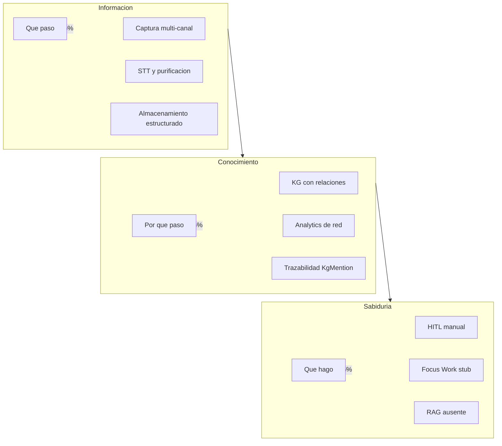

# Análisis de Procesamiento de Datos — Deprocast

> **Documento:** `datainfo.md`  
> **Fecha de análisis:** 18 de junio de 2026  
> **Repositorio:** `deprocast2` (Next.js 16, Prisma 7.8, SQLite, Vertex Gemini, GCP Speech)  
> **Metodología:** Mapeo del código verificable contra el Framework Analítico de 8 etapas (Alquimia del Dato) y el modelo de valor Información → Conocimiento → Sabiduría.

---

## Tabla de contenidos

1. [Resumen ejecutivo](#1-resumen-ejecutivo)
2. [Arquitectura actual del pipeline](#2-arquitectura-actual-del-pipeline)
3. [Inventario técnico](#3-inventario-técnico)
4. [Mapeo por las 8 etapas](#4-mapeo-por-las-8-etapas)
5. [Evaluación de valor](#5-evaluación-de-valor)
6. [Matriz de madurez](#6-matriz-de-madurez)
7. [Roadmap accionable](#7-roadmap-accionable)
8. [Apéndice: archivos clave por etapa](#8-apéndice-archivos-clave-por-etapa)

---

## 1. Resumen ejecutivo

**Deprocast** es un exoesqueleto cognitivo local-first que captura materia prima multimodal (audio, texto, tablas, visión, diario, proyectos), la purifica mediante un pipeline de 6 estaciones orquestado por Vertex Gemini, somete el resultado a validación humana (HITL) y persiste conocimiento estructurado en archivos Markdown y un Knowledge Graph en SQLite.

### Hallazgos principales

| Dimensión | Veredicto |
|-----------|-----------|
| **Cobertura del pipeline** | Las etapas 1–4 y 7 están **bien implementadas** en backend; las etapas 5–6 son **parciales**; la etapa 8 (Uso/Sabiduría) es **incipiente**. |
| **Nivel de valor global** | El sistema opera entre **Información alta (~75%)** y **Conocimiento emergente (~45%)**. La **Sabiduría (~15%)** permanece en diseño de producto. |
| **Fortaleza diferencial** | Pipeline Purifier de 6 estaciones + KG híbrido (LLM + código determinístico) + HITL en Validar. |
| **Brecha crítica** | Sin embeddings vectoriales ni RAG operativo; sin loop de decisión automatizada (Focus Work, microtareas, Puntos de Señal). |
| **Deuda estructural** | Dos pipelines purifier conviven; `Entity`/`Tag` legacy paralelos a `KgNode`; cola STT in-process no persistente. |

### Flujo de valor en una línea

```
Captura cruda → STT/Purifier → Clasificación/Esencias → KG multi-fuente → Analytics → Chunks fractales → Grafo/Dashboard → HITL (sin cierre automático de decisión)
```

---

## 2. Arquitectura actual del pipeline

### 2.1 Diagrama global

```mermaid
flowchart TB
    subgraph inputs [Etapa1_MateriaPrima]
        Audio[Audio upload]
        Texto[Texto capture]
        Vision[OCR Vision]
        Tablas[CSV XLSX]
        Diario[Journal save]
        Proyectos[Proyectos MD]
        Laboral[Laboral CSV]
    end

    subgraph stt [PrePurificacion]
        Queue[processing-queue]
        GCP[GCP Speech STT]
    end

    subgraph purify [Etapa2_Purificacion]
        S1[Est1 Regex]
        S2[Est2 Gemini cleanup]
        S3[Est3 Dedup Jaccard]
        S4[Est4 Esencias]
        S41[Est41 KG extract]
        S5[Est5 Normalizar MD]
        S6[Est6 Fractal chunks]
    end

    subgraph review [HITL]
        REV[data/raw_documents/review]
        Validar[Validar UI]
        Approve[approveAndCoagulate]
    end

    subgraph storage [Persistencia]
        Coagulado[data/projects/campo]
        SQLite[(prisma/dev.db)]
        KG[(KgNode KgEdge KgMention)]
    end

    subgraph analytics [Etapas5a7]
        Stats[kg/analytics]
        GrafoUI[/grafo]
        Metrics[/api/metrics]
    end

    inputs --> Queue
    Queue --> GCP
    GCP --> purify
    Texto --> purify
    Vision --> purify
    Tablas --> purify
    Diario --> purify
    purify --> REV
    REV --> Validar
    Validar --> Approve
    Approve --> Coagulado
    Approve --> SQLite
    S41 --> KG
    Proyectos --> KG
    Diario --> KG
    Laboral --> Coagulado
    KG --> Stats
    Stats --> GrafoUI
    Coagulado --> Metrics
```

### 2.2 Directorios de datos

| Ruta | Contenido | Etapa |
|------|-----------|-------|
| `public/uploads/` | Binarios de audio subidos | Materia Prima |
| `data/tacho/` | Originales de visión (imagen/PDF) | Materia Prima |
| `data/raw_documents/pending/` | Documentos crudos legacy | Materia Prima |
| `data/raw_documents/pending_purification/` | Prima materia capturada pre-pipeline | Materia Prima |
| `data/raw_documents/review/` | Registros JSON HITL (`PurifierReviewRecord`) | Purificación → Uso |
| `data/projects/{campo}/` | Documentos y proyectos coagulados | Cristalización |
| `data/projects/laboral/pending/` | Retos laborales importados | Materia Prima |
| `data/journal/{YYYY-MM}/` | Entradas de diario Markdown | Materia Prima |
| `prisma/dev.db` | Audio, transcripciones, chunks, KG | Todas |

### 2.3 Stack de procesamiento

| Capa | Tecnología | Rol |
|------|------------|-----|
| UI | Next.js App Router, React 19 | Captura, validación, visualización |
| Persistencia estructurada | SQLite + Prisma | Audio, KG, chunks fractales |
| Persistencia documental | Markdown + YAML frontmatter | Proyectos, diario, documentos coagulados |
| STT | Google Cloud Speech (`chirp_2`) | Audio → texto crudo |
| Extracción semántica | Vertex AI Gemini (`gemini-2.5-flash`) | Limpieza, esencias, normalización, KG |
| Audio prep | FFmpeg / FFprobe | Conversión WAV, chunking |

---

## 3. Inventario técnico

### 3.1 Rutas API (38 endpoints)

#### Audio y procesamiento

| Ruta | Métodos | Propósito |
|------|---------|-----------|
| `/api/upload` | POST | Sube audio, crea `AudioAsset` PENDING |
| `/api/assets` | GET | Lista audios con preview de transcripción |
| `/api/assets/[id]` | GET, DELETE | Detalle y eliminación de asset |
| `/api/process/queue` | POST | Encola todos los audios PENDING/ERROR |
| `/api/process/status` | GET | Estado de cola STT |
| `/api/process/[id]` | POST, DELETE | Encola/cancela un audio |
| `/api/transcripts/[id]/download` | GET | Descarga transcripción Markdown |
| `/api/transcripts/download-all` | GET | Descarga todas las transcripciones |

#### Ingesta

| Ruta | Métodos | Propósito |
|------|---------|-----------|
| `/api/ingesta/capture` | POST | Captura unificada (texto, audio, tablas, visión) |
| `/api/ingesta/vision` | POST | OCR multimodal → purificación |
| `/api/ingesta/tablas` | POST | CSV/TSV/XLSX → Markdown → purificación |
| `/api/documents` | POST | Ingesta legacy de texto a `pending/` |

#### Purifier (esterilización + HITL)

| Ruta | Métodos | Propósito |
|------|---------|-----------|
| `/api/purifier/purify` | POST | Ejecuta pipeline; flag `extractKg` |
| `/api/purifier/approve` | POST | Aprueba revisión → coagulación |
| `/api/purifier/review` | GET | Lista registros de revisión |
| `/api/purifier/review/[id]` | GET | Carga registro por ID |

#### Knowledge Graph

| Ruta | Métodos | Propósito |
|------|---------|-----------|
| `/api/kg/ingest` | POST | Ingesta manual de extracción LLM |
| `/api/kg/nodes` | GET | Búsqueda/listado de nodos |
| `/api/kg/nodes/[id]` | GET | Vecindad de un nodo |
| `/api/kg/graph` | GET | Snapshot para visualización |
| `/api/kg/stats` | GET | Stats + centralidad + ideas repetidas |
| `/api/kg/export` | GET | Export JSON o GraphML |
| `/api/kg/merge` | POST | Fusiona nodos duplicados |
| `/api/kg/duplicates` | GET | Candidatos a duplicados |
| `/api/kg/centrality` | GET | Ranking de centralidad |
| `/api/kg/ideas/repeated` | GET | Ideas en múltiples fuentes |
| `/api/kg/code/[id]` | GET | Dependencias de nodo de código |
| `/api/kg/projects/[id]/people` | GET | Personas vinculadas a proyecto |
| `/api/kg/projects/[id]/related` | GET | Proyectos relacionados |

#### Diario, proyectos, laboral, métricas

| Ruta | Métodos | Propósito |
|------|---------|-----------|
| `/api/journal/save` | POST | Guarda entrada; opcional `purify` + hook KG |
| `/api/journal/list` | GET | Lista entradas por año/mes/búsqueda |
| `/api/journal/[id]` | GET | Detalle de entrada |
| `/api/proyectos` | GET, POST | Lista/crea proyectos Atanor |
| `/api/proyectos/[id]/progress` | POST | Nota de progreso; re-ingesta KG |
| `/api/laboral/import` | POST | Importa CSV retos laborales |
| `/api/laboral/challenges` | GET | Lista retos laborales |
| `/api/laboral/focus` | POST | Inicia sesión Focus (**stub**) |
| `/api/metrics` | GET | Señal pura vs materia pendiente |

### 3.2 Servicios backend (`lib/`)

#### Purifier — núcleo de transformación

| Archivo | Funciones clave |
|---------|-----------------|
| `lib/purifier/capture.ts` | `captureAndPurify`, `savePendingPurification` |
| `lib/purifier/engine.ts` | `runPurificationPipeline`, estaciones 1–6, `saveReviewRecord` |
| `lib/purifier/approve.ts` | `approveAndCoagulate` → Markdown + `ParentChunk`/`ChildChunk` |
| `lib/purifier/types.ts` | `PurifierReviewRecord`, `PurifierStageSnapshot`, `FractalParent` |
| `lib/purifier/constants.ts` | Canales de ingesta, estados de materia |
| `lib/purifier/hitl-metadata.ts` | Metadatos para UI de validación |
| `lib/purifier-pipeline.ts` | **Legacy** — batch de `transcripciones.md` |

#### Knowledge Graph

| Archivo | Funciones clave |
|---------|-----------------|
| `lib/kg/extract.ts` | `extractKgFromText` — LLM → JSON entidades/relaciones |
| `lib/kg/parse.ts` | `parseLlmKgExtraction` — validación del JSON |
| `lib/kg/ingest.ts` | `ingestKgExtraction` — persiste nodos, edges, mentions |
| `lib/kg/identity.ts` | Resolución de entidades, fuzzy match, aliases |
| `lib/kg/normalize.ts` | `normalizeName`, `namesMatchFuzzy`, Levenshtein |
| `lib/kg/edges.ts` | `createEdgesFromExtraction` |
| `lib/kg/mentions.ts` | `createMentionsFromExtraction` |
| `lib/kg/merge.ts` | `mergeNodes` — dedup manual |
| `lib/kg/incremental.ts` | `ingestIfChanged`, `hashContent` — SHA-256 |
| `lib/kg/queries.ts` | `searchNodes`, `getNeighborhood`, `getDuplicateCandidates` |
| `lib/kg/analytics.ts` | Centralidad, ideas repetidas, proyectos relacionados |
| `lib/kg/export.ts` | Export JSON/GraphML |
| `lib/kg/code/scan.ts` | `scanCodeGraph` — imports determinísticos |
| `lib/kg/code/ingest.ts` | `ingestCodeGraph` |
| `lib/kg/sources/common.ts` | `ingestDocumentSource` — pipeline unificado |
| `lib/kg/sources/journal.ts` | `ingestJournalFile`, `ingestJournalEntries` |
| `lib/kg/sources/projects.ts` | `ingestSingleProject`, `ingestProjects` |
| `lib/kg/sources/documents.ts` | `ingestRawDocuments` |
| `lib/kg/sources/master-plan.ts` | `ingestMasterPlan` |

#### Ingesta por canal

| Archivo | Funciones clave |
|---------|-----------------|
| `lib/ingesta/vision/extract.ts` | `processVisionUpload`, OCR multimodal |
| `lib/ingesta/tablas/parser.ts` | `parseStructuredTable` |
| `lib/ingesta/tablas/to-raw-text.ts` | `tableBufferToRawText` |
| `lib/ingesta/tablas/column-mapper.ts` | Mapeo de columnas por patrones |
| `lib/gcp-speech-processor.ts` | `processAssetGcpSpeech` |
| `lib/processing-queue.ts` | Cola serial in-process |
| `lib/journal/service.ts` | CRUD diario |
| `lib/projects/service.ts` | CRUD proyectos Atanor |
| `lib/laboral/challenges.ts` | Import CSV → retos Markdown |

#### Scripts CLI

| Script | Comando | Propósito |
|--------|---------|-----------|
| `scripts/kg/backfill.ts` | `npm run kg:backfill` | Backfill KG desde todas las fuentes |
| `scripts/kg/scan-code.ts` | `npm run kg:scan` | Escaneo determinístico del código |

### 3.3 Rutas UI (App Router)

| Ruta | Componente | Rol en pipeline |
|------|------------|-----------------|
| `/` | `app/page.tsx` | Dashboard: métricas, audios, bosses activos |
| `/ingesta` | `IngestaWorkspace` | Captura multi-canal (texto, audio, tablas, visión) |
| `/validar` | `ValidarWorkspace` | HITL: revisión y coagulación |
| `/grafo` | `GrafoWorkspace` | Visualización KG, stats, duplicados |
| `/diario` | `DiarioWorkspace` | Captura frictionless con purify opcional |
| `/proyectos` | `ProyectosDashboard` | Tablero de proyectos por campo |
| `/audio/[id]` | `app/audio/[id]/page.tsx` | Detalle post-STT: chunks, entidades |
| `/laboral` | Redirige a `/proyectos` | UI laboral **desconectada** |

### 3.4 Modelo de datos (Prisma)

#### Pipeline audio / transcripción

```
AudioAsset (1) ──< Transcript (1) ──< ParentChunk (N) ──< ChildChunk (N)
                                              ├──<> Entity (M:N)
                                              └──<> Tag (M:N)
```

#### Knowledge Graph

```
KgNode (1) ──< KgEdge (N) [source/target]
         └──< KgMention (N)

KgSource (tracking incremental, sin FK a nodos)
```

**12 modelos Prisma:** `AudioAsset`, `Transcript`, `ParentChunk`, `ChildChunk`, `Entity`, `Tag`, `ParentChunkEntity`, `ParentChunkTag`, `KgNode`, `KgEdge`, `KgMention`, `KgSource`.

**Nota:** `Entity`/`Tag` son un sistema **legacy** (mock processor) separado de `KgNode`. No hay FK entre ambos.

### 3.5 Background jobs

| Mecanismo | Descripción |
|-----------|-------------|
| Cola in-process | `lib/processing-queue.ts` — singleton global, un audio a la vez |
| Hooks fire-and-forget | `void ingestJournalFile(...)`, `void ingestSingleProject(...)` en rutas API |
| Scripts CLI | `kg:backfill`, `kg:scan` |

**No hay:** cron jobs, workers externos, cola persistente, daemon de carpetas.

---

## 4. Mapeo por las 8 etapas

Cada subsección sigue el esquema: **Estado actual → Operaciones detectadas → Brechas → Nivel de valor**.

---

### 4.1 Materia Prima

> *Ingesta de datos crudos, ruidosos, duplicados.*

#### Estado actual

| Canal | Archivos / funciones | Destino |
|-------|---------------------|---------|
| **Audio** | `app/api/upload/route.ts` → `lib/audio-validation.ts` | `public/uploads/` + `AudioAsset` status `PENDING` |
| **Texto unificado** | `app/api/ingesta/capture/route.ts` → `lib/purifier/capture.ts` | `data/raw_documents/pending_purification/*.md` |
| **Visión (OCR)** | `lib/ingesta/vision/extract.ts`, `app/api/ingesta/vision/route.ts` | `data/tacho/` + texto crudo |
| **Tablas** | `lib/ingesta/tablas/to-raw-text.ts`, `app/api/ingesta/tablas/route.ts` | Markdown tabular |
| **Diario** | `lib/journal/service.ts`, `app/api/journal/save/route.ts` | `data/journal/{YYYY-MM}/` |
| **Proyectos** | `lib/projects/service.ts`, `app/api/proyectos/route.ts` | `data/projects/{campo}/` |
| **Laboral CSV** | `lib/laboral/challenges.ts`, `app/api/laboral/import/route.ts` | `data/projects/laboral/pending/` |
| **Legacy texto** | `lib/documents.ts`, `app/api/documents/route.ts` | `data/raw_documents/pending/` |
| **Master plan** | `lib/kg/sources/master-plan.ts` | Ingerido al KG como fuente |

**UI de captura:** `components/ingesta/ingesta-workspace.tsx` con canales en `components/ingesta/channels/` y panel de anclaje en `gravity-panel.tsx` (campo, onda, `source_type`).

#### Operaciones detectadas

- Validación de extensiones y MIME (`lib/audio-validation.ts`)
- Almacenamiento binario sin transformación semántica
- Generación de metadatos de gravedad en captura (`GravityInput` en `lib/purifier/types.ts`)
- OCR multimodal vía Vertex para visión
- Parseo estructurado CSV/TSV/XLSX (`lib/ingesta/tablas/parser.ts`)
- Mapeo heurístico de columnas (`COLUMN_PATTERNS` en `column-mapper.ts`)

#### Brechas (Gaps)

| Brecha | Severidad | Detalle |
|--------|-----------|---------|
| Sin daemon/watchers | Alta | Diseñado en `deprocast_master_plan.md`; no implementado |
| Sin ingesta NFC | Media | Solo documentado |
| Cola STT in-process | Media | `processing-queue.ts` no persiste entre reinicios |
| Sin detección de duplicados en ingesta | Media | Mismo audio/texto puede re-ingresarse |
| UI laboral desconectada | Media | `/laboral` redirige; componentes en `components/laboral/` huérfanos |
| Dos caminos de texto | Baja | `TextChannel` (purifier) vs `TextIngestForm` legacy (`/api/documents`) |
| Componentes legacy sin uso | Baja | `text-module.tsx`, `future-channels.tsx`, etc. |

#### Nivel de valor en esta etapa

**Información (Qué pasó)** — La captura multi-canal registra *qué* entró al sistema, con metadatos de procedencia (`source_type`, `campo`, `onda`). No explica aún *por qué* ni *qué hacer*.

---

### 4.2 Purificación

> *Limpieza, deduplicación, normalización, validación inicial.*

#### Estado actual

**Orquestador principal:** `runPurificationPipeline` en `lib/purifier/engine.ts`.

| Estación | Función | Técnica |
|----------|---------|---------|
| **1 — Limpieza Regex** | `station1RegexCleanup` | Loops Whisper, frases consecutivas duplicadas, colapso de whitespace |
| **2 — Limpieza Semántica** | `station2SemanticCleanup` | Vertex Gemini; preserva `==DUDA:...==` |
| **3 — Deduplicación** | `station3Deduplicate` | Jaccard sobre tokens (umbral `PURIFIER_DEDUP_THRESHOLD = 0.82`) |
| **4 — Extracción de Esencias** | `station4ExtractEssences` | Gemini → array JSON de conceptos atómicos |
| **4.1 — Extracción KG** (opcional) | `extractKgFromText` + `ingestKgExtraction` | LLM → entidades/relaciones → SQLite |
| **5 — Normalización** | `station5Normalize` | Gemini → Markdown + 7 dimensiones + vectores gravedad |
| **6 — Segmentación Fractal** | `station6FractalSegmentation` | Bloques padre/hijo (`LINES_PER_CHILD = 4`) |

**STT (pre-purificación):** `lib/gcp-speech-processor.ts` — FFmpeg → GCP Speech sync/chunked → `Transcript.rawText` + `confidence`.

**Salida intermedia:** `data/raw_documents/review/{reviewId}.json` (`PurifierReviewRecord`, schema v2).

**Pipeline legacy paralelo:** `lib/purifier-pipeline.ts` — batch de `transcripciones.md`, marcadores `===DUDA===`.

#### Operaciones detectadas

| Operación | Implementación |
|-----------|----------------|
| Limpieza regex | `amputateWhisperLoops`, `removeConsecutiveDuplicateSentences` |
| Limpieza semántica LLM | Prompt `CLEANUP_SYSTEM_PROMPT` |
| Deduplicación léxica | Jaccard con stopwords españolas |
| Normalización | Frontmatter YAML con 7 dimensiones + prioridad/impacto/dificultad (1–12) |
| Validación inicial | `isCampoSlug`, `isSourceType`, `parseLlmKgExtraction` |
| Marcadores de incertidumbre | `==DUDA:...==` (nuevo) y `===DUDA:===` (legacy) |
| Codificación | Texto → Markdown estructurado; slugs kebab-case (`slugifyParticula`) |

#### Brechas (Gaps)

| Brecha | Severidad | Detalle |
|--------|-----------|---------|
| Etapas invisibles en UI | Alta | `PurifierStageSnapshot[]` se guarda pero `validar-workspace.tsx` no lo renderiza |
| Dos purifiers conviven | Media | `engine.ts` (activo) vs `purifier-pipeline.ts` (legacy) |
| STT depende de GCP | Media | Sin Whisper local + VAD (objetivo del grimorio) |
| Sin validación esquemática post-normalización | Media | No hay JSON Schema sobre frontmatter generado |
| Sin métricas de calidad por estación | Baja | `meta` en snapshots existe pero no se agrega en dashboard |

#### Nivel de valor en esta etapa

**Información → Conocimiento (transición)** — La purificación transforma ruido en señal legible y estructurada. Los marcadores `==DUDA==` y las esencias anticipan conocimiento, pero el usuario aún no *actúa* sobre ellos automáticamente.

---

### 4.3 Separación

> *Clasificación, segmentación, etiquetado.*

#### Estado actual

| Mecanismo | Archivo | Descripción |
|-----------|---------|-------------|
| Taxonomía de gravedad | `lib/purifier/capture.ts`, `gravity-panel.tsx` | `onda`, `source_type`, `campo` (slug de campo Atanor) |
| Esencias / tags | `station4ExtractEssences` | Hasta 30 conceptos atómicos por fragmento |
| Segmentación fractal | `station6FractalSegmentation` | Bloques por párrafos; hijos cada 4 líneas |
| Tipos KG | `lib/kg/types.ts` | 12 `NODE_TYPES`, 15 `RELATION_TYPES` |
| Mapeo tabular | `lib/ingesta/tablas/column-mapper.ts` | Patrones de columnas laboral/proyectos |
| Campos Atanor | `lib/projects/campos.ts` | Taxonomía de campos (`babel`, `laboral`, etc.) |
| Entity/Tag legacy | `lib/mock-processor.ts` | Etiquetado por chunk en mock STT |

**Siete dimensiones** (`materia`, `particula`, `posicion`, `onda`, `tiempo`, `espacio`, `field`): generadas en estación 5, editables en Validar, persistidas en frontmatter Markdown — **no en columnas Prisma de chunks**.

#### Operaciones detectadas

| Operación | Técnica |
|-----------|---------|
| Clasificación | Metadatos manuales + sugeridos por LLM (no clasificador ML) |
| Segmentación | Por párrafos (`\n\n+`) y por líneas (fractal) |
| Etiquetado | JSON de esencias; `meta_tags_secundarios` en frontmatter |
| Codificación categórica | `NODE_TYPES`, `RELATION_TYPES`, `SOURCE_TYPES` |
| Escalado numérico | `prioridad`, `impacto`, `dificultad`, `weight` (1–12) |

#### Brechas (Gaps)

| Brecha | Severidad | Detalle |
|--------|-----------|---------|
| Sin clasificador entrenado | Alta | Clasificación 100% heurística + LLM |
| 7 dimensiones no en Prisma chunks | Alta | Imposible filtrar RAG por dimensión en DB |
| Entity/Tag no unificados con KG | Media | Dos sistemas de entidades paralelos |
| Sin topic modeling | Media | No hay clustering automático de temas |
| Segmentación temporal de audio | Baja | Chunks fractales usan índices, no timestamps reales del STT |

#### Nivel de valor en esta etapa

**Información** — La separación organiza *qué es cada fragmento* (tipo, campo, tags), pero no infiere *por qué* se relacionan entre sí más allá de la taxonomía manual.

---

### 4.4 Conjunción

> *Unión de fuentes, enriquecimiento semántico del contexto.*

#### Estado actual

**Núcleo de ingesta KG:** `lib/kg/ingest.ts` + `lib/kg/sources/common.ts` (`ingestDocumentSource`).

| Fuente | Adapter | Trigger |
|--------|---------|---------|
| Purifier (est. 4.1) | Inline en `engine.ts` | Automático si `extractKg: true` |
| Diario | `lib/kg/sources/journal.ts` | `void ingestJournalFile(...)` post-save |
| Proyectos | `lib/kg/sources/projects.ts` | Post-create y post-progress |
| Documentos crudos | `lib/kg/sources/documents.ts` | Backfill CLI |
| Master plan | `lib/kg/sources/master-plan.ts` | Backfill CLI |
| Código | `lib/kg/code/scan.ts` + `ingest.ts` | `npm run kg:scan` |
| Manual | `app/api/kg/ingest/route.ts` | POST con JSON de extracción |

**Resolución de identidad:** `lib/kg/identity.ts` — match exacto + fuzzy (Levenshtein ≥ 0.85), acumulación de aliases, refuerzo de `confidence` (+25% al re-encontrar).

**Ingesta incremental:** `lib/kg/incremental.ts` — `KgSource.contentHash` (SHA-256); skip si contenido no cambió.

**Coagulación HITL:** `lib/purifier/approve.ts` — une metadatos editados + cuerpo purificado → Markdown en `data/projects/{campo}/` + chunks en SQLite.

**Fusión manual:** `lib/kg/merge.ts` + UI en `/grafo` tab Duplicados.

#### Operaciones detectadas

| Operación | Implementación |
|-----------|----------------|
| Entity resolution | `normalizeName`, `namesMatchFuzzy`, aliases JSON |
| Enriquecimiento semántico | Extracción LLM de relaciones con `context` obligatorio |
| Unión multi-fuente | Mismo `KgNode` referenciado por múltiples `KgMention` |
| Merge de duplicados | `mergeNodes` — reasigna edges y mentions |
| Hash incremental | Evita re-procesar fuentes estables |
| Dual-nature edges | Persona que también es proyecto (`avatar_de`) |

#### Brechas (Gaps)

| Brecha | Severidad | Detalle |
|--------|-----------|---------|
| Sin embeddings cross-documento | Crítica | Unión semántica solo vía LLM + fuzzy string match |
| Offsets inconsistentes | Media | `offsetStart/End` no en todas las fuentes |
| Entity Prisma ≠ KgNode | Media | Sin reconciliación automática |
| Ingesta KG fire-and-forget | Baja | Errores silenciosos en hooks `void` |
| Sin linking automático proyecto↔documento | Baja | Vinculación manual en Validar |

#### Nivel de valor en esta etapa

**Conocimiento (Por qué pasó — emergente)** — El KG conecta entidades entre fuentes y preserva evidencia (`KgMention.fragment`). Es el puente más fuerte hacia conocimiento, pero depende de extracción LLM sin validación vectorial.

---

### 4.5 Fermentación

> *Descubrimiento de patrones, relaciones y anomalías ocultas.*

#### Estado actual

| Capacidad | Archivo / API | Descripción |
|-----------|---------------|-------------|
| Centralidad | `lib/kg/analytics.ts`, `/api/kg/centrality` | Ranking de nodos por grado |
| Ideas repetidas | `getRepeatedIdeas`, `/api/kg/ideas/repeated` | Nodos que aparecen en ≥2 fuentes |
| Duplicados fuzzy | `lib/kg/queries.ts`, `/api/kg/duplicates` | Candidatos por similitud de nombre |
| Proyectos relacionados | `getRelatedProjects`, `/api/kg/projects/[id]/related` | Vecinos compartidos |
| Personas por proyecto | `getProjectPeople`, `/api/kg/projects/[id]/people` | Edges `responsable_de`, `participa_en`, etc. |
| Grafo de código | `lib/kg/code/scan.ts` | Dependencias `importa`/`depende_de` determinísticas |
| Confianza adaptativa | `lib/kg/identity.ts` | Refuerzo al re-encontrar entidades |
| Dependencias código | `/api/kg/code/[id]` | Árbol de imports de un módulo |

**UI:** tab Estadísticas y Duplicados en `components/grafo/grafo-workspace.tsx`.

#### Operaciones detectadas

| Operación | Técnica |
|-----------|---------|
| Detección de duplicados | Fuzzy match + UI de merge |
| Análisis de red | Centralidad por grado, vecindad |
| Pattern matching (código) | Regex `IMPORT_RE` sobre AST de imports |
| Agregación cross-fuente | Conteo de fuentes por idea |
| Scoring de confianza | Float 0–1 con defaults y refuerzo |

#### Brechas (Gaps)

| Brecha | Severidad | Detalle |
|--------|-----------|---------|
| Sin detección de anomalías | Alta | No hay alertas de cambios bruscos o outliers |
| Sin clustering de temas | Alta | No hay topic modeling ni comunidades |
| Sin inferencia causal | Alta | Relaciones son correlativas (LLM), no causales |
| Sin análisis temporal | Media | No hay evolución de nodos en el tiempo |
| Sin alertas proactivas | Media | Analytics solo on-demand en UI |
| Centralidad básica | Baja | Solo grado; sin PageRank/Betweenness |

#### Nivel de valor en esta etapa

**Conocimiento (parcial)** — Se descubren patrones estructurales (quién trabaja en qué, ideas recurrentes, duplicados), pero sin profundidad inferencial ni detección proactiva de anomalías.

---

### 4.6 Destilación

> *Extracción de features, resúmenes, reducción de dimensionalidad.*

#### Estado actual

| Artefacto | Ubicación | Descripción |
|-----------|-----------|-------------|
| Chunks fractales | `station6FractalSegmentation` → `PurifierReviewRecord.fractalSegments` | Reducción texto → bloques padre/hijo |
| Resúmenes | `ParentChunk.summary` (= `parent.context`, primeros 200 chars) | Resumen por bloque padre |
| Esencias | `station4ExtractEssences` | Reducción a conceptos atómicos (≤30) |
| Vectores de gravedad | Frontmatter: `prioridad`, `impacto`, `dificultad` (1–12) | Features numéricos de atención |
| Peso de relaciones | `KgEdge.weight` (1–12) | Importancia atencional inferida |
| Entidades/relaciones | `KgNode`, `KgEdge` | Features estructurados del grafo |
| Confianza | `confidence` en nodos, edges, mentions | Feature de certeza (0–1) |

**Persistencia post-approve:** `approve.ts` → `persistFractalChunks` escribe `ParentChunk` + `ChildChunk` en SQLite.

#### Operaciones detectadas

| Operación | Estado |
|-----------|--------|
| Feature engineering (gravedad) | Implementado |
| Resúmenes extractivos | Implementado (truncado 200 chars) |
| Reducción dimensional (conceptos) | Implementado (esencias JSON) |
| Segmentación para RAG | Preparado (chunks padre/hijo) |
| **Embeddings vectoriales** | **NO implementado** |
| PCA / topic modeling | NO implementado |
| RAG query | NO implementado |

#### Brechas (Gaps)

| Brecha | Severidad | Detalle |
|--------|-----------|---------|
| **Sin embeddings** | **Crítica** | Mencionado en grimorio y `app/layout.tsx`; cero código |
| Sin índice de similitud | Crítica | No hay vector store ni búsqueda semántica real |
| RAG no operativo | Crítica | Chunks existen pero no hay API de consulta |
| Resúmenes superficiales | Media | `summary` = truncado, no abstracción LLM |
| Sin reducción dimensional formal | Baja | No hay PCA/UMAP/t-SNE |

#### Nivel de valor en esta etapa

**Información → Conocimiento (bloqueado)** — La destilación estructural está lista (chunks, esencias, gravedad), pero sin embeddings el sistema no puede *destilar* semánticamente para recuperación inteligente. Es la brecha técnica más impactante del pipeline.

---

### 4.7 Cristalización

> *Modelado de datos, visualización, data storytelling.*

#### Estado actual

| Superficie | Archivos | Capacidad |
|------------|----------|-----------|
| **Grafo interactivo** | `app/grafo/page.tsx`, `components/grafo/force-graph.tsx` | Force-directed canvas, filtros por tipo |
| **Búsqueda semántica** | `components/grafo/graph-semantic-search.tsx` | Búsqueda textual sobre snapshot (no vectorial) |
| **Stats KG** | `grafo-workspace.tsx` tab Estadísticas | Conteos, centralidad, ideas repetidas |
| **Dashboard home** | `app/page.tsx`, `gnosis-metrics.tsx` | Señal pura, materia pendiente, bosses activos |
| **Proyectos** | `proyectos-dashboard.tsx`, `project-board.tsx` | Tablero por campo, prioridad, avance |
| **Detalle audio** | `app/audio/[id]/page.tsx` | Chunks, entidades, tags post-STT |
| **Export** | `lib/kg/export.ts` | JSON, GraphML |
| **Modelo de datos** | Prisma KG + Markdown coagulado | Doble persistencia: grafo + documentos |
| **Métricas** | `app/api/metrics/route.ts` | `pureSignal`, `pendingRawMatter`, `signalPoints` (stub=0) |

#### Operaciones detectadas

| Operación | Implementación |
|-----------|----------------|
| Visualización de red | Force-graph con colores por `NODE_TYPES` |
| Modelado relacional | Prisma schema + tipos semánticos |
| Agregación dashboard | Conteos SQLite + filesystem |
| Export interoperable | JSON, GraphML |
| Curación visual | Merge duplicados, panel de detalle con mentions |

#### Brechas (Gaps)

| Brecha | Severidad | Detalle |
|--------|-----------|---------|
| Sin data storytelling | Alta | No hay timelines narrativos ni reportes editoriales |
| `signalPoints` hardcodeado | Alta | `app/api/metrics/route.ts` línea 49: `signalPoints: 0` |
| Sin visualización de etapas purifier | Media | Validar no muestra diff por estación |
| Módulo laboral UI huérfano | Media | Componentes listos pero ruta redirige |
| Sin vista temporal del grafo | Media | No hay evolución de menciones en el tiempo |
| Metadata obsoleta en layout | Baja | `layout.tsx` menciona "búsqueda vectorial" no implementada |

#### Nivel de valor en esta etapa

**Información + Conocimiento (visual)** — El grafo y los dashboards cristalizan el estado del conocimiento, pero no narran *la historia* ni guían *la acción*. Es visualización analítica, no storytelling decisorio.

---

### 4.8 Uso

> *Conversión en decisión, automatización, producto o feedback loop.*

#### Estado actual

| Mecanismo | Archivo | Estado |
|-----------|---------|--------|
| **HITL / Validación** | `validar-workspace.tsx` → `approveAndCoagulate` | **Operativo** — gate de calidad humano |
| **Edición pre-coagulación** | Validar: título, campo, cuerpo, tags, proyectos | **Operativo** |
| **Fusión de duplicados** | `/grafo` → `POST /api/kg/merge` | **Operativo** — curación manual |
| **Descarga de producto** | Transcripciones MD, export KG | **Operativo** |
| **Focus Work** | `app/api/laboral/focus/route.ts` | **Stub** — sin persistencia |
| **Puntos de Señal** | `app/api/metrics/route.ts` | **Stub** — siempre 0 |
| **Microtareas** | Diseñado en grimorio | **No implementado** |
| **RAG consultable** | — | **No implementado** |
| **Recomendaciones** | — | **No implementado** |
| **Feedback loop automático** | — | **No implementado** |

#### Operaciones detectadas

| Operación | Estado |
|-----------|--------|
| Aprobación humana como gate | Implementado |
| Vinculación a proyectos | Implementado (combobox en Validar) |
| Corrección de errores (merge, edición) | Implementado |
| Automatización de decisiones | No implementado |
| Gamificación (Estudianta) | No implementado |
| Producto derivado (informes, alertas) | Parcial (export manual) |

#### Brechas (Gaps)

| Brecha | Severidad | Detalle |
|--------|-----------|---------|
| Sin automatización de decisiones | Crítica | No hay "qué hago" generado por el sistema |
| Focus Work sin persistencia | Alta | API existe pero no guarda sesiones |
| Sin RAG consultable | Alta | Usuario no puede preguntar al exoesqueleto |
| Sin feedback loop | Alta | Aprobaciones no re-entrenan pesos ni prompts |
| Sin gamificación operativa | Media | Estudianta/Puntos de Señal solo en grimorio |
| Sin notificaciones proactivas | Media | Sistema pasivo; usuario debe ir a cada vista |

#### Nivel de valor en esta etapa

**Sabiduría (incipiente ~15%)** — El HITL es el único mecanismo de "decisión" real. El Observador valida y coagula, pero el sistema no propone acciones, no ejecuta microtareas ni cierra el loop hacia mejora automática.

---

## 5. Evaluación de valor

### 5.1 Modelo de valor aplicado



### 5.2 Puntuación por nivel

| Nivel | Pregunta | Estado | % estimado | Evidencia |
|-------|----------|--------|------------|-----------|
| **Información** | ¿Qué pasó? | **Fuerte** | ~75% | Captura 5+ canales, STT real, purificación 6 estaciones, Markdown coagulado, trazabilidad por `KgMention` y frontmatter |
| **Conocimiento** | ¿Por qué pasó? | **Parcial** | ~45% | KG con 12 tipos de nodo, 15 relaciones, analytics de centralidad/ideas repetidas; sin RAG, sin inferencia causal, sin clustering |
| **Sabiduría** | ¿Qué hago? | **Débil** | ~15% | HITL operativo; Focus Work stub; sin microtareas, sin recomendaciones, sin loop de feedback |

### 5.3 Veredicto

Deprocast hoy es un **sistema de captura y estructuración de información de alta calidad** con **conocimiento relacional emergente** vía Knowledge Graph. La transición hacia **Sabiduría** — donde el exoesqueleto propone y ejecuta acciones — está documentada en `deprocast_master_plan.md` pero **no implementada** en código.

**Posición en el espectro:**

```
Información ████████████████████░░░░░ 75%
Conocimiento █████████░░░░░░░░░░░░░░░ 45%
Sabiduría    ███░░░░░░░░░░░░░░░░░░░░░ 15%
```

### 5.4 Valor por etapa del framework

| Etapa | Nivel de valor predominante |
|-------|----------------------------|
| 1. Materia Prima | Información |
| 2. Purificación | Información → Conocimiento |
| 3. Separación | Información |
| 4. Conjunción | Conocimiento |
| 5. Fermentación | Conocimiento |
| 6. Destilación | Información (bloqueada sin embeddings) |
| 7. Cristalización | Información + Conocimiento |
| 8. Uso | Sabiduría (solo HITL manual) |

---

## 6. Matriz de madurez

| Etapa | Estado | Cobertura código | Cobertura UI | Operaciones clave | Brecha principal |
|-------|--------|------------------|--------------|-------------------|------------------|
| **1. Materia Prima** | Implementado | Alta | Alta (`/ingesta`, `/diario`) | Captura, validación MIME, OCR, parseo tabular | Sin daemon/watchers |
| **2. Purificación** | Implementado | Alta | Baja (sin visibilidad etapas) | Regex, LLM cleanup, Jaccard dedup, normalización MD | Dos purifiers; STT cloud-only |
| **3. Separación** | Parcial | Media | Media (`gravity-panel`) | Taxonomía manual, esencias LLM, fractal | Sin clasificador ML; 7D no en Prisma |
| **4. Conjunción** | Implementado | Alta | Media (merge en `/grafo`) | Entity resolution, KG multi-fuente, coagulación | Sin embeddings cross-doc |
| **5. Fermentación** | Parcial | Media | Media (stats en `/grafo`) | Centralidad, ideas repetidas, duplicados | Sin anomalías ni clustering |
| **6. Destilación** | Parcial | Media (chunks) | Nula | Fractal chunks, esencias, gravedad | **Sin embeddings ni RAG** |
| **7. Cristalización** | Parcial | Media | Alta (`/grafo`, `/`) | Force-graph, export, dashboards | Sin storytelling; métricas stub |
| **8. Uso** | Incipiente | Baja | Baja (solo Validar) | HITL approve | Sin automatización ni Focus Work real |

### Leyenda de estado

- **Implementado:** funcionalidad core operativa en producción local
- **Parcial:** backend existe pero incompleto o sin UI/integración
- **Incipiente:** stub o solo diseño de producto

---

## 7. Roadmap accionable

Cinco pasos ordenados por impacto en cerrar la brecha hacia Sabiduría.

### Paso 1: Capa de embeddings + RAG

**Objetivo:** Desbloquear Destilación y habilitar consulta semántica (Uso).

**Archivos a crear/modificar:**

| Acción | Archivo |
|--------|---------|
| Crear | `prisma/migrations/..._add_chunk_embeddings/migration.sql` — tabla `ChunkEmbedding(chunkId, model, vector BLOB, dimensions JSON)` |
| Crear | `lib/rag/embed.ts` — generación de embeddings (Vertex Embeddings API o modelo local) |
| Crear | `lib/rag/query.ts` — búsqueda por similitud coseno con filtros `onda`/`field` |
| Crear | `app/api/rag/query/route.ts` — POST `{ query, filters? }` → chunks relevantes |
| Modificar | `lib/purifier/approve.ts` — hook post-approve para generar embeddings de `ChildChunk` |
| Modificar | `prisma/schema.prisma` — modelo `ChunkEmbedding` |

**Impacto:** Etapas 6 (Destilación) y 8 (Uso) pasan de ~15% a ~60%.

---

### Paso 2: Unificar Purifier y exponer etapas en UI

**Objetivo:** Eliminar deuda dual y dar transparencia al pipeline de Purificación.

**Archivos a crear/modificar:**

| Acción | Archivo |
|--------|---------|
| Deprecar | `lib/purifier-pipeline.ts` — migrar callers a `engine.ts` |
| Crear | `components/validar/purifier-stages-panel.tsx` — stepper con `PurifierStageSnapshot[]` |
| Modificar | `components/validar/validar-workspace.tsx` — integrar panel de etapas con diff entrada/salida por estación |
| Modificar | `lib/purifier/engine.ts` — enriquecer `meta` de cada snapshot (chars removed, tags count, etc.) |

**Impacto:** Etapa 2 (Purificación) UI pasa de Baja a Alta; reduce confianza ciega en LLM.

---

### Paso 3: Cerrar loop Conocimiento → Sabiduría (Focus Work)

**Objetivo:** Convertir proyectos Boss en microtareas ejecutables con gamificación real.

**Archivos a crear/modificar:**

| Acción | Archivo |
|--------|---------|
| Crear | `prisma/migrations/..._add_focus_sessions/migration.sql` — `FocusSession`, `Microtask` |
| Modificar | `app/api/laboral/focus/route.ts` — persistir sesiones, calcular `signalPoints` |
| Modificar | `app/api/metrics/route.ts` — `signalPoints` real desde DB |
| Modificar | `app/laboral/page.tsx` — reactivar ruta (quitar redirect a `/proyectos`) |
| Crear | `lib/focus/decompose.ts` — desglose LLM de proyecto en microtareas ≤15 min |
| Modificar | `components/home/gnosis-metrics.tsx` — mostrar Puntos de Señal reales |

**Impacto:** Etapa 8 (Uso) pasa de ~15% a ~50%.

---

### Paso 4: Consolidar entidades (Entity → KgNode)

**Objetivo:** Eliminar dualidad de sistemas de entidades.

**Archivos a crear/modificar:**

| Acción | Archivo |
|--------|---------|
| Crear | `scripts/kg/reconcile-entities.ts` — migrar `Entity`/`Tag` → `KgNode` o eliminar |
| Modificar | `lib/purifier/approve.ts` — post-approve, crear nodos KG desde esencias |
| Modificar | `lib/mock-processor.ts` — usar `ingestKgExtraction` en lugar de `Entity`/`Tag` |
| Evaluar | Deprecar modelos `Entity`, `Tag`, `ParentChunkEntity`, `ParentChunkTag` en schema |

**Impacto:** Etapas 3 (Separación) y 4 (Conjunción) ganan coherencia; un solo grafo de verdad.

---

### Paso 5: Observabilidad unificada del pipeline

**Objetivo:** Dashboard que muestre el estado completo del pipeline en un vistazo.

**Archivos a crear/modificar:**

| Acción | Archivo |
|--------|---------|
| Crear | `app/api/pipeline/status/route.ts` — agrega STT queue + purifier review count + KG stats + pending coagulado |
| Crear | `components/home/pipeline-status-widget.tsx` — widget visual en dashboard |
| Modificar | `app/page.tsx` — integrar widget |
| Modificar | `app/api/metrics/route.ts` — incluir `pendingReview` count desde `listReviewRecords` |

**Impacto:** Etapas 1, 2, 7 (Cristalización) — visibilidad operativa completa.

---

## 8. Apéndice: archivos clave por etapa

### Etapa 1 — Materia Prima

```
app/api/upload/route.ts
app/api/ingesta/capture/route.ts
app/api/ingesta/vision/route.ts
app/api/ingesta/tablas/route.ts
app/api/documents/route.ts
app/api/journal/save/route.ts
app/api/laboral/import/route.ts
lib/purifier/capture.ts
lib/ingesta/vision/extract.ts
lib/ingesta/tablas/to-raw-text.ts
lib/journal/service.ts
lib/laboral/challenges.ts
components/ingesta/ingesta-workspace.tsx
components/ingesta/gravity-panel.tsx
```

### Etapa 2 — Purificación

```
lib/purifier/engine.ts          # runPurificationPipeline, estaciones 1-6
lib/purifier/capture.ts
lib/purifier/types.ts
lib/gcp-speech-processor.ts
lib/processing-queue.ts
lib/purifier-pipeline.ts          # LEGACY
app/api/purifier/purify/route.ts
app/api/process/*
```

### Etapa 3 — Separación

```
lib/purifier/engine.ts          # station4ExtractEssences, station6FractalSegmentation
lib/kg/types.ts                 # NODE_TYPES, RELATION_TYPES
lib/projects/campos.ts
lib/ingesta/tablas/column-mapper.ts
lib/document-constants.ts       # SOURCE_TYPES
components/ingesta/gravity-panel.tsx
```

### Etapa 4 — Conjunción

```
lib/kg/ingest.ts
lib/kg/extract.ts
lib/kg/identity.ts
lib/kg/merge.ts
lib/kg/incremental.ts
lib/kg/sources/*
lib/purifier/approve.ts
app/api/kg/ingest/route.ts
app/api/kg/merge/route.ts
```

### Etapa 5 — Fermentación

```
lib/kg/analytics.ts
lib/kg/queries.ts
lib/kg/code/scan.ts
lib/kg/code/ingest.ts
app/api/kg/stats/route.ts
app/api/kg/centrality/route.ts
app/api/kg/ideas/repeated/route.ts
app/api/kg/duplicates/route.ts
```

### Etapa 6 — Destilación

```
lib/purifier/engine.ts          # station4, station6
lib/purifier/approve.ts         # persistFractalChunks
prisma/schema.prisma            # ParentChunk, ChildChunk
lib/mock-processor.ts           # mock RAG (desarrollo)
```

### Etapa 7 — Cristalización

```
app/grafo/page.tsx
components/grafo/*
app/page.tsx
components/home/gnosis-metrics.tsx
components/proyectos/proyectos-dashboard.tsx
lib/kg/export.ts
app/api/metrics/route.ts
data/projects/{campo}/
```

### Etapa 8 — Uso

```
components/validar/validar-workspace.tsx
lib/purifier/approve.ts
app/api/purifier/approve/route.ts
app/api/laboral/focus/route.ts  # STUB
app/api/kg/merge/route.ts
app/api/transcripts/*/route.ts
```

---

## Referencias

| Documento | Ruta |
|-----------|------|
| Grimorio de Arquitectura | `deprocast_master_plan.md` |
| Resumen integral verificable | `resumen-integral-deprocast.md` |
| Documentación Knowledge Graph | `knowledge-graph.md` |
| Pipeline de audio | `Audio.md` |
| Esquema Prisma | `prisma/schema.prisma` |
| AGENTS.md (reglas Next.js) | `AGENTS.md` |

---

*Informe generado por análisis estático del repositorio `deprocast2`. Todas las afirmaciones de implementación están respaldadas por archivos existentes en el codebase al 18 de junio de 2026.*
