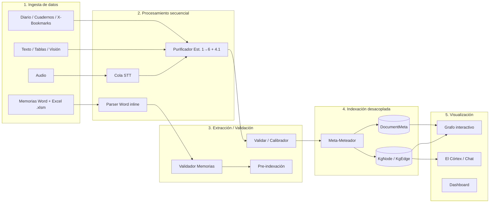
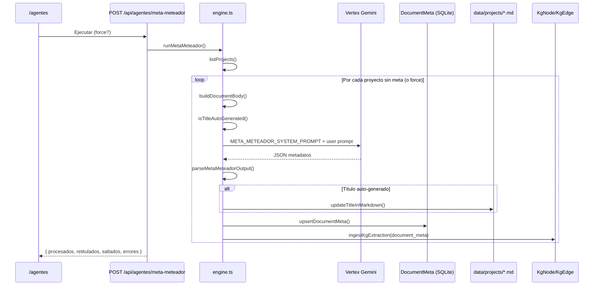
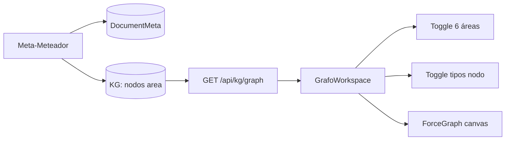

# Deprocast — Especificación Maestra (Single Source of Truth)

> **Documento:** `deprocast_spec.md`  
> **Versión del paquete:** `0.1.0`  
> **Fecha de referencia:** 25 de junio de 2026  
> **Repositorio:** `deprocast2` (Next.js 16 App Router, React 19, Prisma 7.8, SQLite)  
> **Propósito:** Única fuente de verdad para arquitectura, contratos de datos y desarrollo futuro de Deprocast.

---

## Tabla de contenidos

1. [Resumen ejecutivo](#1-resumen-ejecutivo-de-deprocast-estado-actual)
2. [Módulo 1: Validador de Memorias Laborales (Word vs Word)](#2-módulo-1-validador-de-memorias-laborales-word-vs-word)
3. [Módulo 2: Agente Meta-Meteador (Indexación Cuántica)](#3-módulo-2-el-agente-meta-meteador-indexación-cuántica)
4. [Módulo 3: Interfaz gráfica y visualización](#4-módulo-3-interfaz-gráfica-y-visualización-propuesta-de-dashboard-actualizado)
5. [Anexos técnicos](#5-anexos-técnicos)

---

## 1. Resumen ejecutivo de Deprocast (Estado Actual)

### 1.1 Qué es Deprocast hoy

**Deprocast** dejó de ser un simple transcriptor de audios. Hoy es un **sistema de Corpus Personal y Segundo Cerebro hiper-indexado**: un exoesqueleto cognitivo **local-first** que captura materia prima multimodal, la procesa de forma secuencial, somete el conocimiento a validación humana (HITL) y lo indexa en un Knowledge Graph desacoplado del texto original.

| Dimensión | Descripción |
|-----------|-------------|
| **Filosofía** | Circuito cerrado local: datos en `data/` + SQLite (`prisma/dev.db`). Egress limitado a STT (GCP Speech) y LLM (Vertex Gemini) cuando el usuario configura credenciales. |
| **Unidad documental** | Proyectos Markdown en `data/projects/{campoSlug}/{id}.md` tras aprobación HITL. |
| **Índice semántico** | Knowledge Graph en SQLite (`KgNode`, `KgEdge`, `KgMention`) + metadatos desacoplados (`DocumentMeta`) vía Meta-Meteador. |
| **Dominio laboral** | Validación de memorias anuales y cuentas (Boss 007 del grimorio Varona), con motor de reglas determinista y comparación interanual. |
| **Interacción cognitiva** | Exocórtex Interactivo (`/chat`) como único agente conversacional de cara al usuario. |

### 1.2 Evolución conceptual

```text
v0 (origen)     →  Transcripción de audio + limpieza básica
v1 (actual)     →  Corpus multimodal + Purifier 6 estaciones + KG + agentes especializados
v2 (en curso)   →  Indexación cuántica desacoplada + validador laboral Word↔Word + dashboard unificado
```

### 1.3 Arquitectura general del pipeline

El sistema sigue un flujo de **cinco fases** sin mezclar responsabilidades entre capas:



#### Fase 1 — Ingesta de datos

| Canal | Ruta / API | Destino inicial |
|-------|------------|-----------------|
| Audio | `POST /api/upload` → cola `lib/processing-queue.ts` | `public/uploads/` + `AudioAsset` (SQLite) |
| Texto | `captureAndPurify()` / `POST /api/ingesta/capture` | `data/raw_documents/pending_purification/` |
| Tablas | `POST /api/ingesta/tablas` | Purifier → proyectos Markdown |
| Visión | `POST /api/ingesta/vision` | Purifier |
| Diario | `POST /api/journal/save` | `data/journal/{YYYY-MM}/` |
| Memorias laborales | `POST /api/memorias/analyze` (texto) · *objetivo: upload Word + .xlsm* | Motor `lib/memorias/` |

#### Fase 2 — Procesamiento secuencial (Purificador)

Orquestador: `runPurificationPipeline()` en `lib/purifier/engine.ts`.

| Estación | Nombre | LLM | Función |
|----------|--------|-----|---------|
| 1 | Limpieza Regex | No | Loops Whisper, duplicados consecutivos de palabras |
| 2 | Editor Semántico | Sí (Vertex) | Muletillas, puntuación, marcadores `==DUDA:...==` |
| 3 | Deduplicación | No | Jaccard ≥ 0.82 con stopwords españolas |
| 4 | Esencias | Sí | Hasta 30 tags JSON atómicos |
| 4.1 | Extracción KG | Sí | Entidades y relaciones → SQLite |
| 5 | Archivista | Sí | Markdown + Siete Dimensiones YAML |
| 6 | Fractal | No | Chunks padre/hijo (4 líneas por hijo) |

#### Fase 3 — Extracción y validación (HITL)

- Revisión: `data/raw_documents/review/{reviewId}.json` + modelo `PurifierReview` (Prisma).
- UI: `/validar` (`app/validar/page.tsx`).
- Aprobación: `lib/purifier/approve.ts` → coagulación en `data/projects/{campoSlug}/` + ingesta KG.

#### Fase 4 — Indexación desacoplada

- **Meta-Meteador:** metadatos en `DocumentMeta` por `documentId`; **prohibido alterar el cuerpo** del documento.
- **KG:** ingesta incremental por hash (`lib/kg/incremental.ts`); fuentes: código, diario, proyectos, documentos, master plan, `document_meta`.

#### Fase 5 — Visualización

- Grafo force-directed: `/grafo` (`components/grafo/grafo-workspace.tsx`).
- APIs: `GET /api/kg/graph`, `GET /api/kg/nodes/[id]`, export JSON/GraphML.

### 1.4 Stack tecnológico

| Capa | Tecnología |
|------|------------|
| Framework | Next.js 16.2.x (App Router), React 19 |
| Persistencia estructurada | SQLite + Prisma 7.8 + `better-sqlite3` |
| Persistencia documental | Markdown en `data/` |
| STT | Google Cloud Speech `chirp_2` (`lib/gcp-speech/`) |
| LLM | Vertex AI Gemini `gemini-2.5-flash` (`lib/vertex-gemini/`) |
| Audio | FFmpeg estático |
| Tablas | `xlsx` npm (`.xlsx`, `.xls`; `.xlsm` reservado al validador laboral) |
| UI | Tailwind 4, shadcn/ui |

### 1.5 Variables de entorno críticas

Ver `.env.example`:

| Variable | Uso |
|----------|-----|
| `DATABASE_URL` | SQLite (`file:./prisma/dev.db`) |
| `GOOGLE_APPLICATION_CREDENTIALS` | GCP Speech |
| `GOOGLE_CLOUD_PROJECT`, `GCP_SPEECH_*` | STT `chirp_2`, locale `es-ES` |
| `GOOGLE_APPLICATION_CREDENTIALS2`, `GOOGLE_CLOUD_PROJECT2` | Vertex (proyecto separado) |
| `VERTEX_LOCATION`, `VERTEX_MODEL` | `europe-west1`, `gemini-2.5-flash` |
| `DEPROCAST_DATA_ROOT` | Raíz opcional de `data/` |

### 1.6 Siete dimensiones (contrato YAML universal)

Generadas por Purifier Estación 5 y alineadas con el grimorio (`deprocast_master_plan.md`):

```yaml
materia: "<formato del soporte>"
particula: "<identificador único kebab-case>"
posicion: "<observador|jugador|avatar>"
onda: "<área taxonómica>"
tiempo: "<fecha ISO-8601>"
espacio: "<entorno de captura>"
field: "<campo de influencia — default: babel>"
# Operativos adicionales:
title: "<título sugerido>"
prioridad: <1-12>
impacto: <1-12>
dificultad: <1-12>
meta_tags_secundarios: ["tag1", "tag2"]
```

> **Nota:** Las dimensiones del Purifier viven en el **frontmatter del Markdown**. La **Matriz Cuántica** del Meta-Meteador vive **desacoplada** en `DocumentMeta` (ver Módulo 2). Son capas complementarias, no duplicadas.

---

## 2. Módulo 1: Validador de Memorias Laborales (Word vs Word)

### 2.1 Objetivo

Automatizar la **revisión apartado por apartado** de memorias anuales y cuentas contables del despacho, comparando el ejercicio **N** contra el ejercicio **N-1**, detectando:

- Errores estructurales (apartados absorbidos, faltantes o desordenados).
- Pérdida de integridad tabular entre ejercicios.
- Incoherencias fiscales en la Sección 12 (Situación Fiscal).
- Descuadres numéricos memoria ↔ libro de cierre Excel (`.xlsm`).

**Origen de producto:** Boss 007 — *Comprobación de mínimos legales en memorias* (Alberto/Mayte), documentado en `deprocast_master_plan.md` §4.5.

### 2.2 Regla de oro arquitectónica

```text
┌─────────────────────────────────────────────────────────────────────┐
│  REGLA DE ORO                                                        │
│                                                                      │
│  La ESTRUCTURA (apartados, subapartados, tablas, narrativa) se      │
│  extrae ÚNICAMENTE de los archivos Word, en flujo SECUENCIAL         │
│  e INLINE (bloques texto/tabla en orden de aparición del documento). │
│                                                                      │
│  El Excel (.xlsm) actúa EXCLUSIVAMENTE como diccionario validador   │
│  numérico externo. Nunca construye estructura, títulos ni texto     │
│  para la vista de comparación.                                       │
└─────────────────────────────────────────────────────────────────────┘
```

Implementación de referencia de esta regla: `memorias/src/lib/validation/validate-numbers-with-excel.ts` (proyecto hermano `memorias/`).

### 2.3 Estado de implementación en `deprocast2`

| Capacidad | Estado | Ubicación |
|-----------|--------|-----------|
| Segmentación apartado por apartado (texto) | ✅ Implementado | `lib/memorias/segment.ts` |
| Comparación integridad tablas N vs N-1 | ✅ Implementado | `lib/memorias/integrity.ts` |
| Coherencia fiscal Sección 12 | ✅ Implementado | `lib/memorias/coherence.ts` |
| API HTTP de análisis | ✅ Implementado | `POST /api/memorias/analyze` |
| Script de verificación + fixtures | ✅ Implementado | `npm run memorias:verify` |
| Parser Word (.doc, .docx, RTF, PDF) | 🔶 Por portar | Referencia: `memorias/src/lib/parsers/memoria/` |
| Validación numérica vs `.xlsm` | 🔶 Por portar | Referencia: `memorias/src/lib/parsers/excel/` |
| UI de comparación visual apartado | 🔶 Por portar | Referencia: `memorias/src/components/review/` |

### 2.4 Pipeline de ingesta Word (especificación)

#### 2.4.1 Detección de formato real (no por extensión)

El parser **no confía en la extensión del archivo**. Inspecciona los magic bytes del buffer:

| Formato | Detección | Librería |
|---------|-----------|----------|
| `rtf` | Cabecera `{\rtf` | Parser propio `rtf.ts` |
| `doc_binario` | OLE2 (`0xD0 0xCF 0x11 0xE0`) | `word-extractor` |
| `docx` | ZIP (`0x50 0x4B`) | `mammoth` (texto crudo) |
| `pdf` | `%PDF` | `pdf-parse` |

```typescript
// Contrato de detección (referencia memorias/src/lib/parsers/memoria/parser.ts)
export type FormatoMemoria = "rtf" | "doc_binario" | "docx" | "pdf";

export function detectarFormatoMemoria(buffer: Buffer): FormatoMemoria | null;
```

#### 2.4.2 Excepciones de formatos legacy

##### A) Archivos `.DOC` binarios antiguos (OLE2 / A3SOC)

- Formato típico de memorias de despachos españoles generadas con software contable legacy.
- Extracción vía `word-extractor`: cuerpo + cabeceras (portada con «MEMORIA ABREVIADA {año}»).
- Las tablas usan **tabuladores** (`\t`) o el carácter de control **BEL** (`\u0007`) como separador de celda.
- Varias filas de una misma tabla pueden venir **concatenadas en una sola línea**, separadas por tabuladores dobles o `\u0007` dobles → requieren reconstrucción de filas.

##### B) Archivos RTF camuflados

- Archivos con extensión `.doc` que en realidad son RTF (`{\rtf...}`).
- La detección por contenido los clasifica como `rtf`, no como `doc_binario`.
- El extractor RTF reconstruye bloques desde controles `\trowd`, `\cell`, `\row`, `\lastrow` para preservar la estructura tabular inline.

##### C) Limpieza del carácter `\u0007` (BEL)

El carácter `\u0007` es un artefacto frecuente en exportaciones Word binarias de software contable. El pipeline lo trata así:

1. **Separador de celda:** cada `\u0007` o `\t` delimita una celda tabular.
2. **Limpieza intra-celda:** se eliminan controles `\u0000-\u0006`, `\u0008-\u001F`, `\u007F` vía `limpiarCeldaTabular()`.
3. **Normalización unificada:** todas las tablas se convierten al formato canónico `"celda1 | celda2 | celda3"` para que los extractores downstream trabajen sobre un único formato, independientemente del origen (RTF, DOC binario o DOCX).

```typescript
// Separador de celda en tablas Word binarias (A3SOC)
const SEPARADOR_CELDA_TABULAR = /[\t\u0007]+/;

function limpiarCeldaTabular(celda: string): string {
  return celda.replace(/[\u0000-\u0006\u0008-\u001F\u007F]/g, "").trim();
}
```

> En `deprocast2/lib/memorias/catalog.ts`, `normalizeMemoriaText()` limpia `\u00a0` (NBSP) pero **aún no** aplica la limpieza `\u0007` — pendiente de portar al integrar el parser Word.

#### 2.4.3 Flujo secuencial inline de bloques

Tras extraer y normalizar el texto, el documento se segmenta en **bloques ordenados** (`MemoriaBloque[]`):

```typescript
type MemoriaBloque =
  | { type: "text"; content: string }
  | { type: "table"; content: string[][] };
```

- **RTF:** bloques reconstruidos desde controles de tabla del stream RTF.
- **Resto:** `segmentarBloquesDeTexto()` sobre texto normalizado, separando tablas anuales del narrativo.

Los **apartados** se extraen desde estos bloques en orden de aparición (`extraerApartadosDesdeBloques`), nunca desde el Excel.

### 2.5 Segmentación apartado por apartado

#### 2.5.1 Reglas de frontera (implementado en `lib/memorias/segment.ts`)

```typescript
// Apartado de primer nivel: 7, 8, 9… (sin subíndice)
const TOP_LEVEL_SECTION_RE =
  /^(?:#{1,4}\s+)?(?:(?:Nota|Apartado|Seccion|Sección)\s+)?(\d{1,2})\s*[-–—.:]?\s*(.+?)\s*$/i;

// Subapartado: 7.1, 7.2… (anidado dentro del padre)
const SUBSECTION_RE =
  /^(?:#{1,4}\s+)?(?:(?:Nota|Apartado)\s+)?(\d{1,2})\.(\d+)\s*[-–—.:]?\s*(.+?)\s*$/i;
```

**Principio crítico (fix de refactorización reciente):** la segmentación usa **números de apartado** como fronteras estructurales, **no palabras clave**. Los apartados 8–11 **nunca** deben absorberse dentro del apartado 7. Fixture de regresión: `lib/memorias/fixtures/memoria-agrupamiento-masivo.txt`.

#### 2.5.2 Catálogo canónico de apartados

| Nº | Título canónico | Aliases |
|----|-----------------|---------|
| 7 | Inmovilizado intangible | intangibles |
| 8 | Arrendamientos | leasing |
| 9 | Inmovilizado material | inmovilizado inmaterial |
| 10 | Inversiones inmobiliarias | — |
| 11 | Inmovilizado financiero | instrumentos financieros a largo plazo |
| 12 | Situación fiscal | impuesto sobre beneficios, impuesto de sociedades |
| 23 | Operaciones con partes vinculadas | partes vinculadas, transacciones con partes vinculadas |

Secciones críticas para integridad tabular: **12** y **23** (`CRITICAL_TABLE_SECTIONS`).

#### 2.5.3 Tipos de alerta estructural

```typescript
type MemoriaAlertKind =
  | "section_absorbed"   // Apartado anidado o desordenado
  | "section_missing"    // Apartado requerido ausente como entidad independiente
  | "table_missing"      // Tabla presente en N-1 ausente en N
  | "table_empty"        // Tabla con datos en N-1 vacía en N
  | "fiscal_mismatch";   // Incoherencia numérica en Sección 12
```

### 2.6 Comparación Word vs Word (Año N vs Año N-1)

#### 2.6.1 Orquestador

`analyzeMemoriaReport()` en `lib/memorias/analyze.ts`:

1. Segmenta `textoN` → `ejercicioN`.
2. Segmenta `textoN1` → `ejercicioN1` (opcional).
3. Valida independencia de apartados (`validateSectionIndependence`).
4. Compara integridad tabular (`compareTableIntegrity`).
5. Verifica coherencia fiscal Sección 12 (`verifyFiscalCoherence`).

#### 2.6.2 Contrato API actual (texto plano)

```http
POST /api/memorias/analyze
Content-Type: application/json
```

```json
{
  "ejercicioN": "2025",
  "textoN": "...contenido memoria ejercicio actual...",
  "ejercicioN1": "2024",
  "textoN1": "...contenido memoria ejercicio anterior..."
}
```

**Respuesta:**

```json
{
  "ejercicioN": {
    "ejercicio": "2025",
    "sections": [ /* MemoriaSection[] */ ],
    "rawText": "..."
  },
  "ejercicioN1": { /* opcional */ },
  "alerts": [
    {
      "kind": "table_missing",
      "severity": "error",
      "sectionNumber": 23,
      "message": "Tabla ausente en 2025 (presente en 2024): ...",
      "details": { "fingerprint": "...", "previousRowCount": 12 }
    }
  ],
  "fiscalChecks": [
    {
      "field": "cuotaLiquida = cuotaIntegra - deducciones",
      "expected": 45000.0,
      "actual": 44999.5,
      "delta": 0.5,
      "ok": false
    }
  ],
  "sectionIndependenceOk": true
}
```

#### 2.6.3 Contrato API objetivo (upload binario)

```http
POST /api/memorias/analyze-files
Content-Type: multipart/form-data
```

| Campo | Tipo | Obligatorio | Descripción |
|-------|------|-------------|-------------|
| `memoriaN` | File | Sí | Word/PDF ejercicio N |
| `memoriaN1` | File | No | Word/PDF ejercicio N-1 |
| `libroCierre` | File (.xlsm) | No | Validador numérico externo |

El servidor ejecuta: `detectarFormatoMemoria` → `parseMemoria` (inline) → `parseExcel` (solo cifras) → `analyzeMemoriaReport` + reglas de cruce numérico.

#### 2.6.4 Comparación visual apartado (UI objetivo)

Referencia: `ApartadoMemoriaCompare.tsx` del proyecto `memorias/`.

- Vista lado a lado: columna N-1 | columna N.
- Diff por línea: `unchanged`, `expected` (marcadores azules), `structural` / `removed` / `added` (rojos).
- Diff carácter a carácter en cambios semánticos.
- Modo `diffsOnly` para filtrar bloques sin cambios.
- Comparación tabular con diff de celdas.

### 2.7 Rol del Excel `.xlsm` (solo validador numérico)

#### 2.7.1 Qué extrae el Excel

El libro de cierre del despacho (`.xlsm`, sin ejecutar macros) aporta:

| Hoja / concepto | Uso |
|-----------------|-----|
| Sumas y saldos | Cuentas normalizadas por prefijo PGC |
| Balance comparativo | Epígrafes año N y N-1 |
| P&G | Ingresos, gastos, resultado |
| CALCIS | Reserva de capitalización, datos fiscales |
| SYS / A3SOC | Cruce contable interno |

Parser: `xlsx` npm con whitelist de hojas ministeriales. **No alimenta la vista de apartados.**

#### 2.7.2 Cruces numéricos típicos

| Regla | Descripción |
|-------|-------------|
| `CIERRE_004` | Desglose fila a fila vinculadas memoria vs Excel |
| `CROSS_001` | Total vinculadas globales memoria vs Excel |
| `DIST_001` | Propuesta de aplicación de resultados vs cuentas 129/113/CALCIS |
| `FIN_002` | IS en memoria vs cuenta 630 |

Tolerancia por defecto: **±1 €** en comparaciones monetarias.

```typescript
// El Excel solo valida cifras ya extraídas del Word
export function validateNumbersWithExcel(data: CaseData, tolerancia = 1): ValidacionPropuestaExcel;
```

### 2.8 Verificación y CI

```bash
npm run memorias:verify
```

Ejecuta `scripts/memorias/verify-segmentation.ts` contra fixtures en `lib/memorias/fixtures/`:

- Independencia de apartados 7–11, 12, 23.
- Corrección del agrupamiento masivo histórico.
- Alertas de integridad tabular N vs N-1.
- Coherencia fiscal Sección 12.

### 2.9 Mapa de archivos

```
lib/memorias/
├── types.ts          # MemoriaSection, MemoriaAlert, MemoriaTable…
├── catalog.ts        # Catálogo apartados 7–12, 23
├── segment.ts        # Segmentación apartado por apartado
├── tables.ts         # Extracción tablas Markdown
├── integrity.ts      # Comparación tablas N vs N-1
├── coherence.ts      # Coherencia fiscal Sección 12
├── analyze.ts        # Orquestador principal
├── index.ts          # Re-exports
└── fixtures/         # Casos de regresión

app/api/memorias/analyze/route.ts   # Endpoint HTTP
scripts/memorias/verify-segmentation.ts
```

**Referencia de portación Word/Excel:** proyecto hermano `memorias/` (`src/lib/parsers/memoria/`, `src/lib/parsers/excel/`, `src/lib/validation/`).

---

## 3. Módulo 2: El Agente Meta-Meteador (Indexación Cuántica)

### 3.1 Objetivo

El **Meta-Meteador** es un motor de indexación semántica-estructural que procesa **documentos validados** (proyectos Markdown en `data/projects/`) y genera **exclusivamente** un objeto JSON de metadatos desacoplado, vinculado por `ID_Documento`. 

**Prohibición absoluta:** incrustar, alterar o sobrescribir el texto original del documento (salvo actualización del campo `title` en frontmatter cuando el título es auto-generado).

### 3.2 Estado de implementación

| Capacidad | Estado |
|-----------|--------|
| System prompt + reglas de negocio | ✅ `lib/meta-meteador/prompt.ts` |
| Parseo JSON tolerante + validación título | ✅ `lib/meta-meteador/parse.ts` |
| Orquestación Vertex + persistencia | ✅ `lib/meta-meteador/engine.ts` |
| Almacén SQLite `DocumentMeta` | ✅ `lib/meta-meteador/store.ts` |
| API GET cobertura / POST ejecución | ✅ `app/api/agentes/meta-meteador/route.ts` |
| Panel UI en `/agentes` | ✅ `components/agentes/meta-meteador-panel.tsx` |
| Proyección KG (`area` + `relevante_para`) | ✅ `buildKgProjection()` en engine |
| Catálogo de agentes | ✅ `lib/agentes/catalog.ts` |

### 3.3 Flujo de procesamiento



#### Entrada de documentos

- Fuente: `listProjects()` → todos los `.md` en `data/projects/{campoSlug}/`.
- Cuerpo analizado: `description` + `resultadoFinal` + entradas de `progressEntries` (máx. 12.000 caracteres en prompt).
- **No** procesa directamente `data/raw_documents/completed/`; el documento debe estar coagulado como proyecto.

#### Detección de título manual (`isTitleAutoGenerated`)

Un título se considera **auto-generado** (sobrescribible) si:

- Está vacío.
- Termina en `.md`.
- Coincide con `/sin[-_ ]?titulo/i`.
- Empieza con patrón `\d+_` (timestamp de ingesta).

En caso contrario → `titulo_es_manual: true` → el agente **conserva** `titulo_actual` intacto.

### 3.4 Reglas del campo `titulo`

| Regla | Detalle |
|-------|---------|
| Longitud | **3 a 7 palabras** obligatorias para títulos generados por IA |
| Excepción manual | Si `titulo_es_manual === true`, conservar `titulo_actual` sin cambios |
| Validación en código | `isValidGeneratedTitle()` en `lib/meta-meteador/parse.ts` |
| Persistencia título nuevo | Solo si auto-generado: `updateTitleInMarkdown()` en frontmatter del `.md` |
| Bloqueo en DB | `tituloLocked: true` cuando el título es manual |

### 3.5 Estructura `metadata_del_todo` (Matriz Cuántica)

Seis pilares cuántico-filosóficos. Cada campo: **máximo 4 palabras**.

| Campo JSON | Dimensión | Semántica |
|------------|-----------|-----------|
| `materia` | Materia | Tema denso, objeto o sustancia principal del texto |
| `particula` | Partícula | Componente mínimo, detalle técnico o unidad de acción |
| `campo` | Campo | Entorno, disciplina o ecosistema donde opera |
| `onda` | Onda | Tendencia, movimiento, flujo de energía o impacto |
| `tiempo_espacio` | Tiempo-Espacio | Dimensión temporal, época, plazos o entorno físico/virtual |
| `posicion` | Posición | Estado actual, postura del autor o ubicación en el mapa de acción |

Valores por defecto si la IA omite un campo: `"sin-clasificar"` (normalización en `parseMetadataDelTodo()`).

### 3.6 Ponderación de relevancia semántica (escala 1–12)

#### 3.6.1 Las 6 áreas fijas

| Clave JSON | Etiqueta UI | Dominio semántico |
|------------|-------------|-------------------|
| `Salud` | Salud | Cuerpo, mente, alma, bienestar |
| `Legal` | Legal | Leyes, normativas, contratos, algoritmos normativos |
| `Finanzas` | Finanzas | Economía, dinero, presupuestos, emprendimiento |
| `Tecnologia` | Tecnología | Código, software, IA, herramientas, desarrollo |
| `Arte` | Arte | Arte, entretenimiento, diseño, creatividad, educación |
| `Comunidad` | Comunidad | Familia, relaciones, amigos, entorno social |

> **Convención de nomenclatura:** la clave JSON usa `Tecnologia` (sin tilde) por compatibilidad con el parser. La UI muestra «Tecnología».

#### 3.6.2 Escala y conversión porcentual

- **Score:** entero de **1** (relevancia mínima) a **12** (relevancia absoluta).
- **Porcentaje:** `(score / 12) × 100`, redondeado a **1 decimal**.

```typescript
export function computePorcentaje(score: number): number {
  const clamped = Math.min(12, Math.max(1, Math.round(score)));
  return Math.round((clamped / 12) * 1000) / 10;
}
```

Ejemplos:

| score_1_12 | porcentaje |
|------------|------------|
| 1 | 8.3% |
| 6 | 50.0% |
| 12 | 100.0% |

La normalización en `normalizeAreasRelevancia()` **recalcula** el porcentaje server-side aunque la IA lo devuelva, garantizando coherencia.

### 3.7 Formato JSON de salida obligatorio

```json
{
  "id_documento": "550e8400-e29b-41d4-a716-446655440000",
  "titulo": "Revisión Memoria Anual 2025",
  "metadata_del_todo": {
    "materia": "auditoría contable",
    "particula": "apartado doce fiscal",
    "campo": "despacho tributario",
    "onda": "cierre estacional",
    "tiempo_espacio": "ejercicio 2025",
    "posicion": "revisión pendiente"
  },
  "areas_relevancia": {
    "Salud": { "score_1_12": 2, "porcentaje": 16.7 },
    "Legal": { "score_1_12": 9, "porcentaje": 75.0 },
    "Finanzas": { "score_1_12": 11, "porcentaje": 91.7 },
    "Tecnologia": { "score_1_12": 4, "porcentaje": 33.3 },
    "Arte": { "score_1_12": 1, "porcentaje": 8.3 },
    "Comunidad": { "score_1_12": 3, "porcentaje": 25.0 }
  }
}
```

### 3.8 Almacenamiento desacoplado (`DocumentMeta`)

#### Modelo Prisma

```prisma
model DocumentMeta {
  documentId    String   @id          // = project.id (UUID del .md)
  titulo        String
  tituloLocked  Boolean  @default(false)
  materia       String
  particula     String
  campo         String
  onda          String
  tiempoEspacio String               // tiempo_espacio del JSON
  posicion      String
  areas         Json                 // AreasRelevancia serializado
  modelUsed     String?
  processedAt   DateTime @default(now())
  updatedAt     DateTime @updatedAt
}
```

#### Vinculación `ID_Documento`

```text
data/projects/{campoSlug}/{documentId}.md
         │
         │  project.id  ═══════════════════  DocumentMeta.documentId
         │
         └── El cuerpo Markdown NO contiene la matriz cuántica ni areas_relevancia
```

### 3.9 Proyección al Knowledge Graph

Tras persistir metadatos, `buildKgProjection()` ingesta en el KG:

| Elemento | Tipo | Relación |
|----------|------|----------|
| Título del documento | `documento` | — |
| Cada área (Salud…Comunidad) | `area` | `relevante_para` desde el documento |
| Título anterior del proyecto | `proyecto` | `documenta` (si difiere del nuevo título) |

- Arista `relevante_para`: `weight = score_1_12`, `context` descriptivo.
- Fuente de ingesta: `source.type = "document_meta"` (`MENTION_SOURCE_TYPES`).
- Confianza: 0.85.

### 3.10 API

#### Cobertura

```http
GET /api/agentes/meta-meteador
```

```json
{
  "totalDocuments": 42,
  "withMeta": 38,
  "pending": 4
}
```

#### Ejecución

```http
POST /api/agentes/meta-meteador
POST /api/agentes/meta-meteador?force=true
```

`maxDuration: 300` segundos.

```json
{
  "procesados": 4,
  "retitulados": 3,
  "saltados": 38,
  "errores": [
    { "documentId": "abc-123", "error": "El documento no tiene contenido analizable." }
  ]
}
```

- Sin `force`: salta proyectos que ya tienen entrada en `DocumentMeta`.
- Con `force=true`: reprocesa todos.

### 3.11 Mapa de archivos

```
lib/meta-meteador/
├── prompt.ts       # META_METEADOR_SYSTEM_PROMPT + buildMetaMeteadorUserPrompt()
├── types.ts        # META_AREAS, AreasRelevancia, computePorcentaje()
├── parse.ts        # parseMetaMeteadorOutput(), isValidGeneratedTitle()
├── engine.ts       # runMetaMeteador(), buildKgProjection()
└── store.ts        # upsertDocumentMeta(), countDocumentMeta()

app/api/agentes/meta-meteador/route.ts
components/agentes/meta-meteador-panel.tsx
prisma/schema.prisma                    # model DocumentMeta
prisma/migrations/20260625140000_document_meta/
```

---

## 4. Módulo 3: Interfaz Gráfica y Visualización (Propuesta de Dashboard Actualizado)

### 4.1 Estado actual vs. propuesta

| Aspecto | Implementado hoy | Propuesta (este documento) |
|---------|------------------|----------------------------|
| Navegación principal | Header horizontal (`components/app-header.tsx`) con 12 rutas | **Sidebar vertical** con 4 secciones macro |
| Chat cognitivo | `/chat` (Exocórtex) | **El Córtex** (misma ruta, renombrado UX) |
| Historial | Disperso (diario sidebar, calibrador) | **Historial** unificado |
| Agentes | `/agentes` | **Agentes** (sin cambio de ruta) |
| Ajustes | No existe `/ajustes` | **Ajustes** (tema, respaldo, credenciales) |
| Toggles en grafo | Por **tipo de nodo KG** | Por **tipo de nodo** + **6 áreas Meta-Meteador** |

### 4.2 Arquitectura de layout propuesta

```text
┌──────────────────────────────────────────────────────────────────┐
│  Deprocast                                            [tema] [?] │
├────────────┬─────────────────────────────────────────────────────┤
│            │                                                     │
│  SIDEBAR   │              ÁREA DE TRABAJO                        │
│  (240px)   │                                                     │
│            │   ┌─────────────────────────────────────────────┐   │
│ ◉ El Córtex│   │  Contenido de la sección activa             │   │
│ ○ Historial│   │  (Chat / Timeline / Agentes / Settings)      │   │
│ ○ Agentes  │   │                                             │   │
│ ○ Ajustes  │   └─────────────────────────────────────────────┘   │
│            │                                                     │
│ ─────────  │                                                     │
│ Accesos    │                                                     │
│ rápidos:   │                                                     │
│ · Ingesta  │                                                     │
│ · Validar  │                                                     │
│ · Grafo    │                                                     │
│ · Proyectos│                                                     │
└────────────┴─────────────────────────────────────────────────────┘
```

#### 4.2.1 Sección «El Córtex»

- **Ruta:** `/chat` (alias UX: «El Córtex»).
- **Componente:** `components/chat/chat-workspace.tsx`.
- **Funcionalidad actual:**
  - Sesiones persistentes en SQLite (`ChatSession`, `ChatMessage`).
  - Menciones `@` con resolución de entidades del KG.
  - Búsqueda híbrida léxica (`hybridSearch`) sobre `KgMention`, `KgEdge` y diario.
  - Contexto inyectado: últimos 10 turnos + bloque de contexto por menciones.
  - System prompt: `CHAT_SYSTEM_PROMPT` en `lib/chat/prompts.ts`.
- **Sidebar interno:** `SessionSidebar` para gestión de sesiones de chat (se mantiene dentro del área de trabajo).

#### 4.2.2 Sección «Historial»

- **Ruta propuesta:** `/historial`.
- **Agregación de fuentes:**

| Fuente | Datos | Ubicación actual |
|--------|-------|------------------|
| Diario | Entradas Markdown mensuales | `/diario` + `data/journal/` |
| Validaciones | Aprobaciones/rechazos Purifier | `data/raw_documents/completed/` |
| Calibraciones Vibe | Votos HITL 1–12 | `VibeCalibrationSession` (Prisma) |
| Sesiones Focus | Sesiones laborales | `POST /api/laboral/focus` (stub) |
| Meta-Meteador | Procesamientos de metadatos | `DocumentMeta.processedAt` |

- **UX:** timeline unificado filtrable por Campo, área de relevancia y tipo de evento.

#### 4.2.3 Sección «Agentes»

- **Ruta:** `/agentes` (`components/agentes/agentes-workspace.tsx`).
- **Contenido actual:**
  - Mapa de agentes operativos (`lib/agentes/catalog.ts`).
  - Panel **Meta-Meteador** integrado (`meta-meteador-panel.tsx`).
  - Subprocesadores del Purifier (Est. 1, 3, 6).
  - Laboratorio de incubación (Somatometrón, LudusDirector, Mnemosyne — diseño).
- **Agentes operativos:**

| ID | Nombre | Ruta UI |
|----|--------|---------|
| `exocortex` | Exocórtex Interactivo | `/chat` |
| `meta-meteador` | Meta-Meteador | `/agentes` |
| `vibe-calibrator` | Calibrador de Vibe | `/calibrador` |

#### 4.2.4 Sección «Ajustes»

- **Ruta propuesta:** `/ajustes`.
- **Funcionalidades a consolidar:**

| Panel | Fuente actual |
|-------|---------------|
| Tema claro/oscuro | `ThemeToggle` en header |
| Copia de seguridad | `/respaldo` (`components/backup/backup-workspace.tsx`) |
| Variables de entorno | `.env` (solo lectura informativa) |
| Regenerar contexto | `npm run context` → `deprocast_state.md` |
| KG mantenimiento | `npm run kg:scan`, `kg:backfill` |

### 4.3 Vista de Grafo interactivo

#### 4.3.1 Implementación actual

- **Ruta:** `/grafo`.
- **Componentes:** `grafo-workspace.tsx`, `force-graph.tsx`, `graph-semantic-search.tsx`.
- **Canvas:** force-directed propio (sin librería externa de grafos).
- **Pestañas:** Grafo · Proyectos · Estadísticas · Duplicados.
- **API:** `GET /api/kg/graph?excludeCode=true&limit=2000`.

#### 4.3.2 Controles de filtrado actuales

| Control | Comportamiento |
|---------|----------------|
| Tipos de nodo | Toggle por `NODE_TYPES` (persona, proyecto, documento, **area**, etc.) |
| Clic simple | Aísla un tipo |
| Ctrl+clic | Acumula/deselecciona tipos |
| «Ocultar código» | `excludeCode=true` en API |
| Búsqueda semántica | Scoring léxico sobre snapshot en cliente |

Color del tipo `area`: `#ec4899` (`components/grafo/types.ts`).

#### 4.3.3 Propuesta: Toggles por las 6 áreas Meta-Meteador

Panel de checkboxes dedicado para encender/apagar conexiones `relevante_para` hacia cada área:

```text
┌─ Áreas de relevancia ─────────────────┐
│ ☑ Salud          (12 nodos, 48 aristas)│
│ ☑ Legal          (12 nodos, 62 aristas)│
│ ☑ Finanzas       (12 nodos, 35 aristas)│
│ ☑ Tecnología     (12 nodos, 71 aristas)│
│ ☑ Arte           (12 nodos, 28 aristas)│
│ ☑ Comunidad      (12 nodos, 41 aristas)│
└────────────────────────────────────────┘
```

**Lógica de filtrado propuesta:**

```typescript
const META_AREAS = ["Salud", "Legal", "Finanzas", "Tecnologia", "Arte", "Comunidad"] as const;

function filterByEnabledAreas(
  snapshot: GraphSnapshot,
  enabledAreas: Set<MetaArea>,
): GraphSnapshot {
  const areaNodeIds = new Set(
    snapshot.nodes
      .filter((n) => n.type === "area" && enabledAreas.has(n.name as MetaArea))
      .map((n) => n.id),
  );

  const edges = snapshot.edges.filter((e) => {
    if (e.relationType !== "relevante_para") return true; // mantener otras relaciones
    return areaNodeIds.has(e.target) || areaNodeIds.has(e.source);
  });

  const nodeIds = new Set<string>();
  for (const e of edges) {
    nodeIds.add(e.source);
    nodeIds.add(e.target);
  }
  // Incluir siempre nodos no-area conectados o todos los nodos si ningún filtro activo
  const nodes = snapshot.nodes.filter(
    (n) => n.type !== "area" ? nodeIds.has(n.id) : areaNodeIds.has(n.id),
  );

  return { nodes, edges };
}
```

**Comportamiento UX:**

- Todos los checkboxes activos por defecto.
- Desactivar un área oculta sus nodos `area` y todas las aristas `relevante_para` hacia/desde esa área.
- Compatible con el filtro existente por tipo de nodo (intersección de filtros).
- Contador dinámico de nodos/aristas visibles por área.

#### 4.3.4 Integración Meta-Meteador ↔ Grafo



### 4.4 Rutas de navegación — mapa completo

#### Sidebar macro (propuesta)

| Sección | Ruta | Icono |
|---------|------|-------|
| El Córtex | `/chat` | 🧠 |
| Historial | `/historial` | 📜 |
| Agentes | `/agentes` | 🤖 |
| Ajustes | `/ajustes` | ⚙️ |

#### Accesos rápidos (secundarios en sidebar o command palette)

| Ruta | Función |
|------|---------|
| `/` | Dashboard / Centro de Control |
| `/ingesta` | Canales de captura multimodal |
| `/validar` | HITL Purifier |
| `/proyectos` | Tablero por Campos |
| `/grafo` | Knowledge Graph visual |
| `/diario` | Captura diaria |
| `/personas` | CRM de personas |
| `/calibrador` | Calibrador de Vibe |
| `/salud` | Registros de salud |
| `/respaldo` | Import/export backup |

### 4.5 Tokens de diseño (sidebar)

Variables CSS ya definidas en `app/globals.css`:

```css
--sidebar: oklch(0.98 0.004 85);
--sidebar-foreground: oklch(0.21 0.02 265);
--sidebar-primary: oklch(0.28 0.03 265);
--sidebar-accent: oklch(0.955 0.006 85);
--sidebar-border: oklch(0.88 0.008 85);
/* + variantes dark en .dark */
```

Listas para consumo por componente `Sidebar` de shadcn/ui.

---

## 5. Anexos técnicos

### 5.1 APIs internas (resumen)

| Grupo | Rutas clave |
|-------|-------------|
| Audio | `/api/upload`, `/api/process/*`, `/api/transcripts/*` |
| Purifier | `/api/purifier/purify`, `/api/purifier/review`, `/api/purifier/approve` |
| Ingesta | `/api/ingesta/capture`, `/api/ingesta/tablas`, `/api/ingesta/vision` |
| Proyectos | `/api/proyectos`, `/api/proyectos/[id]/progress` |
| KG | `/api/kg/graph`, `/api/kg/nodes`, `/api/kg/merge`, `/api/kg/export` |
| Chat | `/api/chat/send`, `/api/chat/sessions`, `/api/chat/mentions` |
| Meta-Meteador | `/api/agentes/meta-meteador` |
| Memorias | `/api/memorias/analyze` |
| Backup | `/api/backup/export`, `/api/backup/import` |

Sin autenticación — asume entorno `localhost`.

### 5.2 Scripts npm relevantes

| Script | Acción |
|--------|--------|
| `npm run dev` | Servidor de desarrollo |
| `npm run build` | `prisma generate` + `next build` |
| `npm run context` | Genera `deprocast_state.md` |
| `npm run kg:scan` | Escaneo determinístico código → KG |
| `npm run kg:backfill` | Backfill KG desde todas las fuentes |
| `npm run memorias:verify` | Verificación segmentación memorias |
| `npm run db:meta` | Push schema + generate (DocumentMeta) |

### 5.3 Documentos relacionados

| Archivo | Rol |
|---------|-----|
| `Audio.md` | Pipeline de audio: ingesta, STT, Purifier, validación y agentes |
| `deprocast_master_plan.md` | Grimorio de arquitectura y visión de producto |
| `agentes.md` | Catálogo narrativo de agentes |
| `datainfo.md` | Pipeline de datos (8 etapas) |
| `knowledge-graph.md` | Modelo y operación del KG |
| `resumen-integral-deprocast.md` | Estado verificable en código |
| `memorias/contexto_memorias.md` | Spec del módulo Word/Excel (proyecto hermano) |

### 5.4 Brechas conocidas (backlog desde esta spec)

| ID | Brecha | Prioridad |
|----|--------|-----------|
| B1 | Portar parser Word/RTF/DOC + limpieza `\u0007` a `deprocast2` | Alta |
| B2 | Integrar validación numérica `.xlsm` (solo cifras) | Alta |
| B3 | UI `/memorias` con comparación visual apartado | Alta |
| B4 | Sidebar macro (El Córtex / Historial / Agentes / Ajustes) | Media |
| B5 | Toggles individuales por 6 áreas en `/grafo` | Media |
| B6 | Meta-Meteador: procesar también `raw_documents/completed/` | Baja |
| B7 | RAG / embeddings vectoriales | Baja (techo premium) |
| B8 | Cola STT persistente (sobrevive reinicio) | Media |

### 5.5 Criterios de aceptación para cerrar brechas B1–B3

- [ ] Upload de `.doc` binario A3SOC → apartados 7–11 independientes verificados.
- [ ] Upload de `.doc` camuflado RTF → detectado como `rtf`, tablas inline correctas.
- [ ] Celdas con `\u0007` → normalizadas a formato `a | b | c`.
- [ ] `.xlsm` adjunto → cruces numéricos sin alterar estructura Word.
- [ ] `npm run memorias:verify` pasa con fixtures Word binarios (no solo texto).
- [ ] UI muestra diff apartado por apartado N vs N-1.

---

*Este documento es la única fuente de verdad para el desarrollo futuro de Deprocast. Actualizar cuando cambien módulos críticos (schema Prisma, contratos API, flujos de ingesta o hitos de producto).*
