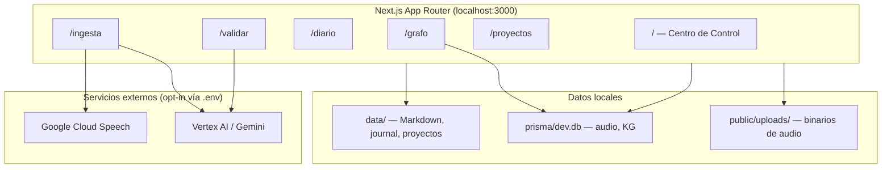
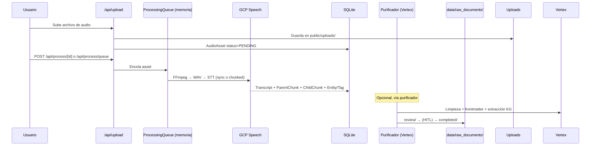
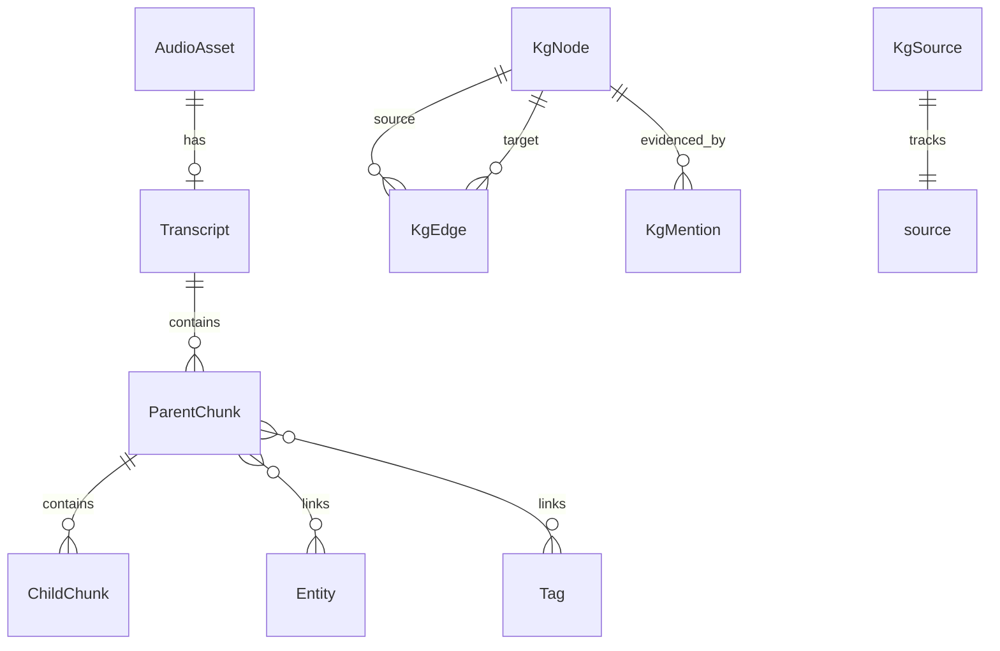
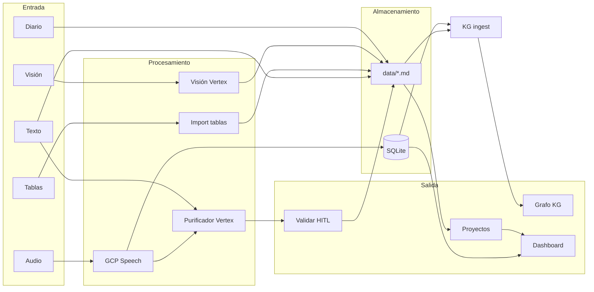

# Resumen integral — Deprocast

> Documento de contexto persistente generado a partir del análisis del repositorio `deprocast2`.  
> **Fecha de referencia:** 17 de junio de 2026 · **Versión del paquete:** 0.1.0  
> Solo describe lo verificable en código y documentación del repo. Las dudas se marcan explícitamente.

---

## Tabla de contenidos

1. [Qué es el proyecto](#1-qué-es-el-proyecto)
2. [Cómo funciona](#2-cómo-funciona)
3. [Estructura del repositorio](#3-estructura-del-repositorio)
4. [Módulos del sistema](#4-módulos-del-sistema)
5. [Estado de implementación](#5-estado-de-implementación)
6. [Datos que maneja](#6-datos-que-maneja)
7. [APIs internas y servicios externos](#7-apis-internas-y-servicios-externos)
8. [Riesgos y deuda técnica](#8-riesgos-y-deuda-técnica)
9. [Próximos pasos sugeridos](#9-próximos-pasos-sugeridos)
10. [Referencias en el repo](#10-referencias-en-el-repo)

---

## 1. Qué es el proyecto

**Deprocast** (paquete `deprocast2`) es una aplicación web **local-first** que funciona como **exoesqueleto cognitivo**: captura materia prima (audio, texto, tablas, imágenes/PDF), la procesa, estructura y conecta el conocimiento del usuario sin depender de un backend SaaS.

### Visión declarada

La especificación de producto vive en `deprocast_master_plan.md` (“Grimorio de Arquitectura”). Define:

- **Circuito cerrado local:** datos en la máquina del usuario (`data/`, SQLite).
- **Observador + Estudianta:** el humano valida (HITL); un avatar gamificado ejecuta microtareas (diseño futuro).
- **Siete dimensiones de metadatos** en frontmatter YAML (`materia`, `particula`, `posicion`, `onda`, `tiempo`, `espacio`, `field`).
- **Hito de cierre planificado:** 7 de julio de 2026 (según el grimorio).

### Qué es en la práctica hoy

Una app **Next.js 16** (App Router) en `localhost:3000` que combina:

| Capa | Tecnología |
|------|------------|
| UI | React 19, Tailwind 4, shadcn/ui |
| Persistencia estructurada | SQLite vía Prisma 7.8 + `better-sqlite3` |
| Persistencia documental | Archivos Markdown en `data/` |
| STT (speech-to-text) | Google Cloud Speech (`chirp_2`) |
| Extracción semántica | Vertex AI / Gemini (`gemini-2.5-flash`) |
| Audio | FFmpeg / FFprobe (binarios estáticos npm) |

El `README.md` del repo es el template genérico de `create-next-app` y **no documenta el dominio**. La documentación real está en `deprocast_master_plan.md`, `knowledge-graph.md` y este archivo.

---

## 2. Cómo funciona

### Arquitectura general



### Flujos principales

#### 2.1 Audio → transcripción → purificación



- Cola de procesamiento: **en memoria** (`lib/processing-queue.ts`), singleton por proceso Node.
- Un job activo a la vez; soporta cancelación (`lib/processing-cancellation.ts`).
- Detalle de asset: página `/audio/[id]`.

#### 2.2 Texto y documentos

- `POST /api/documents` → guarda Markdown en `data/raw_documents/pending/`.
- Hook no bloqueante hacia el knowledge graph (`lib/kg/`).

#### 2.3 Purificador (HITL)

- `POST /api/purifier/purify` procesa texto con Vertex.
- Resultados en `data/raw_documents/review/`.
- UI en `/validar` para revisar y `POST /api/purifier/approve` → `completed/`.
- Incluye amputación de bucles tipo Whisper en texto (`lib/purifier/engine.ts`) — limpieza heurística, no implica uso de Whisper.

#### 2.4 Diario

- Entradas Markdown bajo `data/journal/{YYYY-MM}/`.
- API: `GET /api/journal/list`, `POST /api/journal/save`, `GET /api/journal/[id]`.
- Ingesta al KG al guardar.

#### 2.5 Proyectos

- Un proyecto = un archivo `.md` en `data/projects/{campoSlug}/{id}.md`.
- **Campos** (`campoSlug`): contenedores soberanos; default `babel` (“materia prima sin clasificar”).
- CRUD vía `GET|POST /api/proyectos`, progreso vía `POST /api/proyectos/[id]/progress`.
- “Bosses activos” en el dashboard = proyectos con `prioridad >= 10` **o** `impacto >= 10` (`lib/projects/priority.ts`).

#### 2.6 Ingesta de tablas y visión

- **Tablas:** Excel/CSV → proyectos Markdown (`lib/ingesta/tablas/`, `POST /api/ingesta/tablas` y server actions en `app/ingesta/actions.ts`).
- **Visión:** imágenes/PDF → descripción/OCR con Vertex (`lib/ingesta/vision/`, `POST /api/ingesta/vision`).

#### 2.7 Knowledge Graph

- Nodos, aristas, menciones y fuentes en SQLite (`KgNode`, `KgEdge`, `KgMention`, `KgSource`).
- Ingesta incremental por hash de contenido (`lib/kg/incremental.ts`).
- Fuentes: código (determinístico), diario, proyectos, documentos, master plan.
- Extracción semántica con Gemini (`lib/kg/extract.ts`).
- Visualización interactiva en `/grafo` (canvas force-directed propio, sin librería de grafos externa).
- Scripts CLI: `npm run kg:scan`, `npm run kg:backfill`.

#### 2.8 Métricas del dashboard

`GET /api/metrics` devuelve:

| Campo | Fuente |
|-------|--------|
| `pureSignal` | Audios con status `COMPLETED` |
| `pendingRawMatter` | Audios pendientes/procesando + docs en `pending/` |
| `pendingProjects` | Conteo de archivos de proyecto |
| `signalPoints` | **Stub fijo en 0** (sin `FocusSession` en Prisma) |

---

## 3. Estructura del repositorio

**No hay carpeta `src/`** — el código vive en la raíz.

```
deprocast2/
├── app/                    # Páginas y route handlers (App Router)
│   ├── api/                # ~35 endpoints REST
│   ├── ingesta/            # Workspace de ingesta (+ actions.ts)
│   ├── diario/
│   ├── validar/
│   ├── proyectos/
│   ├── grafo/
│   ├── audio/[id]/
│   └── laboral/            # Redirige a /proyectos
├── components/             # UI por dominio + components/ui/ (shadcn)
├── lib/                    # Lógica de negocio
├── prisma/                 # schema.prisma + migrations
├── scripts/                # context, KG scan/backfill, rebuild-native
├── docs/                   # knowledge-graph.md
├── types/                  # Declaraciones .d.ts
├── public/uploads/         # Audios subidos (gitignored parcialmente)
├── data/                   # Datos de usuario (gitignored)
├── docs/deprocast_master_plan.md
└── [configs: next.config.ts, tsconfig.json, eslint, tailwind, etc.]
```

### Scripts npm relevantes

| Script | Acción |
|--------|--------|
| `npm run dev` | Servidor de desarrollo |
| `npm run build` | `prisma generate && next build` |
| `npm run context` | Genera `deprocast_state.md` (El Reflector) |
| `npm run kg:scan` | Escaneo determinístico del código → KG |
| `npm run kg:backfill` | Backfill KG desde todas las fuentes |

---

## 4. Módulos del sistema

| Módulo | Ubicación principal | Rol |
|--------|---------------------|-----|
| **Dashboard** | `app/page.tsx`, `components/home/` | Métricas, bosses activos, ingesta rápida, tabla de audios |
| **Ingesta** | `app/ingesta/`, `lib/ingesta/` | Texto, audio, tablas, visión; tacho en `data/tacho/` |
| **Audio / STT** | `lib/gcp-speech/`, `lib/gcp-speech-processor.ts`, `lib/processing-queue.ts` | Upload, cola, transcripción GCP, chunks |
| **Purificador** | `lib/purifier/`, `lib/purifier-pipeline.ts`, `app/validar/` | Limpieza LLM, revisión HITL, export a Markdown |
| **Diario** | `lib/journal/`, `app/diario/` | Captura de entradas personales |
| **Proyectos** | `lib/projects/`, `app/proyectos/` | Tablero por Campos, CRUD Markdown |
| **Knowledge Graph** | `lib/kg/`, `app/grafo/`, `app/api/kg/` | Grafo local, consultas, fusión de duplicados, export |
| **Laboral (legacy)** | `lib/laboral/`, `components/laboral/`, `app/api/laboral/` | Import CSV Varona, challenges, focus stub |
| **Documentos** | `lib/documents.ts`, `lib/document-constants.ts` | Constantes y utilidades de documentos crudos |
| **El Reflector** | `scripts/generate-context.ts` | Estado vivo del repo en `deprocast_state.md` |

### Navegación (header)

Rutas activas en `components/app-header.tsx`: Dashboard, Ingesta, Diario, Validar, Proyectos, Grafo.

---

## 5. Estado de implementación

### Implementado (verificado en código)

| Área | Estado | Notas |
|------|--------|-------|
| UI base + tema | ✅ | shadcn, dark/light, layout con header sticky |
| Upload y procesamiento de audio | ✅ | GCP Speech `chirp_2`, FFmpeg, cola en memoria |
| Transcripción → chunks + entidades/tags | ✅ | Modelos Prisma `Transcript`, `ParentChunk`, `ChildChunk`, `Entity`, `Tag` |
| Ingesta de texto | ✅ | `POST /api/documents` → `pending/` |
| Purificador + validación HITL | ✅ | Vertex, carpetas `review/` y `completed/` |
| Diario | ✅ | Markdown mensual, búsqueda, ingesta KG |
| Proyectos (CRUD Markdown) | ✅ | Campos dinámicos, import desde tablas |
| Ingesta tablas (xlsx/csv) | ✅ | Mapeo de columnas → proyectos |
| Portal de visión | ✅ | Vertex para imágenes/PDF |
| Knowledge Graph completo | ✅ | Modelo, ingesta incremental, UI `/grafo`, merge, export JSON/GraphML |
| Import CSV laboral | ✅ | API + parser; escribe en `data/projects/laboral/pending/` |
| Métricas básicas | ✅ | Parcial: `signalPoints` es stub |
| Script de contexto | ✅ | `npm run context` |
| Descarga de transcripciones | ✅ | Markdown individual y masivo |

### Parcialmente implementado

| Área | Qué hay | Qué falta |
|------|---------|-----------|
| **Gamificación / Focus Work** | API `POST /api/laboral/focus` crea sesión en memoria/JSON; componentes `components/laboral/` | Modelos Prisma `Project`/`Microtask`/`FocusSession`, UI `/focus`, persistencia, puntos de señal reales |
| **Módulo laboral** | APIs y componentes existen | Página `/laboral` redirige a `/proyectos`; `LaboralDashboard` no se monta en ninguna ruta |
| **Siete dimensiones** | Prompts y purificador las generan | No hay columnas/index en chunks Prisma ni RAG que las filtre (solo diseño en grimorio) |
| **Bosses / microtareas** | Proyectos con prioridad/impacto; grimorio define fragmentación | Sin desglose automático en microtareas ≤15 min |
| **Tacho de la boludez** | Rutas definidas (`data/tacho/`) | **Duda:** no está claro si hay watchers/daemon automático; en código solo paths y expectativas en `generate-context.ts` |

### No implementado (ausente en código activo)

| Área | Evidencia |
|------|-----------|
| **RAG / embeddings vectoriales** | Mencionado en grimorio y metadata de layout; sin modelos ni índice vectorial en Prisma |
| **Whisper + VAD local** | Grimorio lo planifica; pipeline activo usa GCP Speech |
| **Daemon `.exe` de ingesta** | Solo en especificación (`deprocast_master_plan.md`) |
| **Modelos Prisma de gamificación** | `Project`, `Microtask`, `FocusSession` — en grimorio, no en `schema.prisma` |
| **`components/focus-work/`** | Referenciado en `generate-context.ts`; carpeta no existe |
| **`scripts/import-varona-bosses.ts`** | Mencionado en grimorio; no existe (hay `lib/laboral/` + API import) |
| **Autenticación / multi-usuario** | Sin `middleware.ts`, sin rutas de login |
| **Tests automatizados** | Sin archivos `*.test.*` / `*.spec.*`, sin script `test` en `package.json` |
| **Telemetría biométrica** | Solo en grimorio (premium) |

### Discrepancias documentación ↔ código

| Dónde | Qué dice | Qué hace el código |
|-------|----------|-------------------|
| `app/layout.tsx` metadata | “transcripción simulada” | Pipeline real con GCP Speech |
| Grimorio §6.2 | Importador Varona “por implementar” | Existe `POST /api/laboral/import` y `lib/laboral/` |
| Grimorio | Proyectos en Prisma | Proyectos solo en Markdown (`data/projects/`) |
| Import laboral | Challenges en `laboral/pending/` | `listProjects()` lee `data/projects/{campoSlug}/*.md` — **no** el subdirectorio `pending/` |

---

## 6. Datos que maneja

### 6.1 SQLite (`prisma/dev.db`)



| Modelo | Contenido |
|--------|-----------|
| `AudioAsset` | Metadatos de audio, status, `partialText` durante STT |
| `Transcript` | Texto crudo transcrito |
| `ParentChunk` / `ChildChunk` | Segmentación temporal y semántica |
| `Entity` / `Tag` | Entidades y etiquetas por chunk |
| `KgNode` | Entidades del grafo (persona, proyecto, idea, módulo, etc.) |
| `KgEdge` | Relaciones con `context` obligatorio y `weight` 1–12 |
| `KgMention` | Evidencia textual de cada nodo |
| `KgSource` | Hash de contenido para ingesta incremental |

### 6.2 Sistema de archivos (`data/`)

| Ruta | Contenido |
|------|-----------|
| `data/journal/{YYYY-MM}/` | Entradas del diario (Markdown + frontmatter) |
| `data/projects/{campoSlug}/{id}.md` | Proyectos por Campo |
| `data/projects/laboral/pending/` | Retos importados del CSV laboral (**separado** del listado general de proyectos) |
| `data/raw_documents/pending/` | Documentos de texto crudos |
| `data/raw_documents/review/` | Salida del purificador en revisión |
| `data/raw_documents/completed/` | Documentos aprobados |
| `data/tacho/{celulares,notas,capturas,misc}/` | Inbox de materia prima (estructura esperada) |
| `public/uploads/` | Binarios de audio subidos |

### 6.3 Tipos de nodo del KG (constantes en código)

`persona`, `organizacion`, `proyecto`, `idea`, `concepto`, `lugar`, `tecnologia`, `ley`, `proceso`, `documento`, `archivo`, `modulo` — ver `knowledge-graph.md`.

### 6.4 Metadatos de siete dimensiones

Contrato YAML usado en grimorio y generado por purificador/KG. **Duda:** grado de cumplimiento obligatorio en todos los flujos de ingesta manual no verificado exhaustivamente.

---

## 7. APIs internas y servicios externos

### 7.1 APIs REST internas (resumen)

| Grupo | Rutas | Métodos |
|-------|-------|---------|
| Audio | `/api/upload`, `/api/assets`, `/api/assets/[id]`, `/api/process/*`, `/api/transcripts/*` | POST, GET, DELETE |
| Purificador | `/api/purifier/purify`, `/api/purifier/review`, `/api/purifier/review/[id]`, `/api/purifier/approve` | GET, POST |
| Documentos | `/api/documents` | POST |
| Diario | `/api/journal/list`, `/api/journal/save`, `/api/journal/[id]` | GET, POST |
| Ingesta | `/api/ingesta/tablas`, `/api/ingesta/vision` | POST |
| Proyectos | `/api/proyectos`, `/api/proyectos/[id]/progress` | GET, POST |
| Laboral | `/api/laboral/challenges`, `/api/laboral/import`, `/api/laboral/focus` | GET, POST |
| Knowledge Graph | `/api/kg/*` (ingest, nodes, graph, stats, duplicates, merge, export, centrality, ideas, projects, code) | GET, POST |
| Métricas | `/api/metrics` | GET |

Todas las rutas son **públicas** en localhost (sin capa de auth).

### 7.2 Servicios externos

Configuración en `.env.example`:

| Servicio | Variables | Uso |
|----------|-----------|-----|
| **Google Cloud Speech** | `GOOGLE_APPLICATION_CREDENTIALS`, `GOOGLE_CLOUD_PROJECT`, `GCP_SPEECH_*` | Transcripción de audio |
| **Vertex AI / Gemini** | `GOOGLE_APPLICATION_CREDENTIALS2`, `GOOGLE_CLOUD_PROJECT2`, `VERTEX_*` | Purificador, visión, extracción KG |
| **FFmpeg / FFprobe** | `FFMPEG_PATH`, `FFPROBE_PATH` (opcional) | Conversión de audio; default: paquetes npm estáticos |

**Proyectos GCP distintos** en el ejemplo: Speech (`local-transcriber-498907`) y Vertex (`varonapi-496707`).

**Filosofía:** datos locales en SQLite/Markdown; egress limitado a llamadas STT/LLM cuando el usuario configura credenciales.

### 7.3 Dependencias npm clave

`next`, `react`, `prisma`, `better-sqlite3`, `@google-cloud/speech`, `@google-cloud/vertexai`, `ffmpeg-static`, `ffprobe-static`, `xlsx`, `jszip`, shadcn stack.

---

## 8. Riesgos y deuda técnica

| Riesgo / deuda | Severidad | Detalle |
|----------------|-----------|---------|
| **Cola de audio en memoria** | Alta | Se pierde al reiniciar el servidor; no hay persistencia de cola |
| **Sin autenticación** | Alta (si expuesto) | Cualquier proceso en la máquina puede llamar APIs; asume uso local exclusivo |
| **Dependencia de GCP** | Media | STT y extracción requieren credenciales y red; contradice parcialmente el ideal 100 % offline del grimorio |
| **Doble almacén de proyectos** | Media | Proyectos generales vs `laboral/pending/` no unificados en `/api/proyectos` |
| **Código huérfano** | Baja | `lib/mock-processor.ts`, `components/ingesta/future-channels.tsx`, UI laboral sin ruta |
| **Grimorio desactualizado** | Media | Estado de features no siempre coincide con el código (ver §5) |
| **Sin tests** | Alta | Regresiones no detectadas automáticamente |
| **Migraciones Prisma** | Baja | Comentarios indican aplicación vía `db push` en dev; verificar flujo en otros entornos |
| **Node para KG backfill** | Media | `knowledge-graph.md` exige Node 24 por `better-sqlite3` — **duda:** versión mínima en otros scripts |
| **Metadata obsoleta** | Baja | `layout.tsx` menciona “transcripción simulada” y “búsqueda vectorial” no implementada |
| **Credenciales en .env.example** | Informativo | Nombres de archivos JSON de ejemplo; archivos reales están en `.gitignore` |

---

## 9. Próximos pasos sugeridos

Ordenados según el grimorio (hito 7-jul-2026) y brechas detectadas en código:

### Prioridad alta (cierre de hito)

1. **Unificar almacén de proyectos laborales** — decidir si retos CSV van a `data/projects/laboral/` o se integran en el servicio `listProjects()`.
2. **Modelos Prisma de gamificación** — `Microtask`, `FocusSession` (y si aplica `Project` en DB o seguir solo Markdown).
3. **UI Focus Work** — ruta `/focus`, timer ≤15 min, modal HITL de frustración, persistencia de `signalPoints`.
4. **Fragmentación de Bosses en microtareas** — lógica de desglose (probablemente Vertex + plantillas).
5. **Reactivar o eliminar módulo laboral** — montar `LaboralDashboard` o fusionar con `/proyectos`; limpiar redirect confuso.

### Prioridad media

6. **Pipeline audio local** — loudnorm + VAD + Whisper (grimorio §3.3–3.4); GCP como fallback.
7. **Siete dimensiones en chunks Prisma** — metadata indexable para futuro RAG.
8. **Tests** — al menos smoke de APIs críticas (upload, process, purifier, KG ingest).
9. **Sincronizar documentación** — actualizar grimorio, README, metadata de layout.
10. **Persistencia de cola de audio** — sobrevivir reinicios del dev server.

### Prioridad baja / techo premium (grimorio)

11. RAG con embeddings y filtros dimensionales.
12. Daemon `.exe` con watchers de carpetas/NFC.
13. Telemetría biométrica para calibrar microtareas.

### Comandos útiles para mantener contexto

```bash
npm run context          # Regenera deprocast_state.md
npm run kg:scan          # Actualiza subgrafo de código
npm run kg:backfill      # Ingesta completa al KG (requiere Vertex)
```

---

## 10. Referencias en el repo

| Archivo | Propósito |
|---------|-----------|
| `deprocast_master_plan.md` | Especificación de arquitectura y producto |
| `knowledge-graph.md` | Modelo y operación del KG |
| `prisma/schema.prisma` | Esquema SQLite canónico |
| `.env.example` | Variables de entorno |
| `scripts/generate-context.ts` | Generador de estado vivo |
| `AGENTS.md` | Aviso: Next.js 16 ≠ APIs de versiones anteriores |

---

## Diagrama de módulos y dependencias



---

*Este documento debe actualizarse cuando cambien módulos críticos (schema Prisma, rutas API, flujos de ingesta o hito de producto). Para estado puntual del working tree, ejecutar `npm run context`.*
