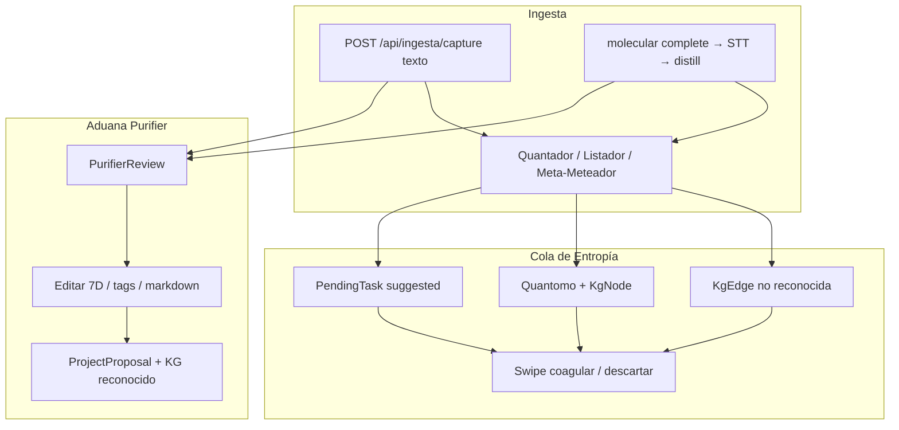

# Validación HITL en Deprocast

> **Documento:** `docs/validacion.md`  
> **Última revisión:** julio 2026  
> **Ruta UI:** `/validar`

Este documento explica cómo funciona la superficie de validación humana (HITL): qué información entra, qué hace la IA antes de que el operador vea algo, qué decide el usuario en cada cola, y qué ocurre después de coagular o aprobar.

---

## 1. Visión general

`/validar` no es un único “inbox”. Hay **dos colas independientes** bajo la misma página:

| Modo | Query | Qué lista | Origen típico |
|------|-------|-----------|---------------|
| **Cola de Entropía** | `/validar` (default) | `PendingTask` sugeridos, `Quantomo` sin coagular, `KgEdge` propuestas | Quantador, Listador, Meta-Meteador |
| **Aduana Purifier** | `/validar?modo=aduana` | `PurifierReview` en `pendiente_purificacion` \| `pendiente_validacion` | Texto, audio destilado, visión, tablas, diario |

**Regla práctica:** la captura de texto/audio primaria cae en **Aduana**. Los deep-links deben usar `modo=aduana&id={reviewId}` (helper `buildValidarAduanaHref`). Si solo abrís `/validar?id=…` sin modo, el shell fuerza Aduana cuando detecta `id` o `review`.



### Qué **no** alimenta `/validar`

- **`/yo`** (bautismo, misiones, HUD): ancla identidad del operador (`Yo` + `KgNode` persona) para espejar asaltos al grafo. **No crea** reviews ni tareas de triage.
- Toast de upload de audio post-STT: significa “transcripción lista / destilación en curso”, no “ya está en Aduana”.

---

## 2. Aduana Purifier

### Entrada de datos

| Canal | Endpoint / disparo | Persistencia inicial |
|-------|--------------------|----------------------|
| Texto | `POST /api/ingesta/capture` (`channel: "texto"`, sync) | `OriginAttribution` + stub `PurifierReview` + MD en `pending_purification` |
| Audio | Destil post-STT (`runDistillPipelineAfterStt`) o `POST /api/ingesta/capture` / purify | Igual + link a `AudioAsset` |
| Visión / tablas | actions de ingesta | Igual vía captura/OCR |
| Diario | `POST /api/journal/save` con purify | Review opcional |

Flujo interno (`captureAndPurify` en `lib/purifier/capture.ts`):

1. `prima_materia` → stub en DB  
2. `pendiente_purificacion` → pipeline de 6 estaciones  
3. `pendiente_validacion` → visible para HITL en Aduana  
4. Tras approve → `molecularizado`

Estados de cola Aduana (`ADUANA_QUEUE_STATUSES`): `pendiente_purificacion` y `pendiente_validacion` (también se puede abrir un stub aún purificando).

### Qué le manda el sistema a la IA (Purifier)

Motor: `lib/purifier/engine.ts` (Cohere). Estaciones:

| # | Estación | Qué hace | Prompt / lógica clave |
|---|----------|----------|------------------------|
| 1 | Regex / loops | Quita bucles STT y ruido mecánico | Reglas locales (frases whisper, stopwords) |
| 2 | Cleanup LLM | Limpia muletillas sin inventar hechos | `CLEANUP_SYSTEM_PROMPT` — editor STT ES; marca `==DUDA:…==` |
| 3 | Dedup | Fusiona párrafos casi iguales (umbral ~0.82) | Heurística local |
| 4 | Meta-tags estrictos | 6 tags taxonómicos | `EXTRACT_STRICT_META_TAGS_PROMPT` |
| 4.1 | Extracción KG (opcional) | Entidades/relaciones candidatas | `extractKgFromText` |
| 5 | Normalización | Markdown + Siete Dimensiones + gravedad 1–12 | `buildNormalizeSystemPrompt` (archivista DeProcast) |
| 6 | Segmentación fractal | Padres/hijos para chunks | Local (`station6FractalSegmentation`) |

Side effects post-purify (no bloquean la Aduana):

- Registro Babel (`registerBabelRecord`) — sello de universo  
- Trailing commands  
- Historial  
- **Quantador** (salvo `skipQuantador`) → alimenta Entropía

### Qué valida el usuario en Aduana

UI: `ValidarWorkspace` (`components/validar/validar-workspace.tsx`).

- Título, campo (`campoSlug`), cuerpo markdown  
- Dimensiones: materia, posición, onda, origen, field  
- Meta-tags (6 estrictos + secundarios)  
- Proyectos vinculados  
- Auditoría de estaciones / dudas `==DUDA==`

Acciones:

| Acción | Efecto |
|--------|--------|
| **Aprobar** (`approveToProposal`) | Crea `ProjectProposal`, indexa Mnemosyne, ingiere KG con `reconocido: true`, persiste chunks fractales si hay transcript, marca asset coagulable, `pipelineStatus → molecularizado` |
| **Rechazar** | Borra el `PurifierReview` de la cola |

Deep-link correcto: `/validar?modo=aduana&id={reviewId}`.

---

## 3. Cola de Entropía

### Entrada de datos

Lista unificada (`listTriageQueue` en `lib/cortex/triage-queue.ts`):

| Entidad | Criterio en cola | Quién la crea |
|---------|------------------|---------------|
| `PendingTask` | `status === "suggested"` | Quantador, Listador, trailing-commands, task-breaker |
| `Quantomo` | `kgNode.reconocido === false` | Quantador (`vincularOrigen` + espejo KgNode) |
| `KgEdge` | `reconocido === false` | Meta-Meteador / ingesta KG |

La UI (`TriageStack`) hace poll periódico vía `listTriageQueueAction` (desde `ValidarShell`) para no quedar congelada tras un Quantador async.

### Qué le manda el sistema a la IA (Quantador)

`lib/agentes/quantador.ts` — prompt de sistema (resumen):

> Sos el Quantador: fragmentás texto masivo en partículas atómicas (“Quantomos”). Devolvé JSON con `titleSugerido`, `content`, `tagsSemanticos`, `universo` opcional. Máx. 12; sin inventar duplicados.

Pipeline:

1. `segmentarTexto` (Cohere JSON; fallback local si falla)  
2. `Quantomo.create` + embeddings + espejo `KgNode type=quantomo`  
3. `PendingTask` `status: "suggested"`, `source: "quantador"`  
4. `syncAsaltoMirrorFromTask(action: "suggest")` — espejo grafo (hub operador; fallback soberano **Mastropiero** si `/yo` vacío)

### Qué valida el usuario en Entropía

Gestos en `TriageStack`:

| Gesto | Acción | Efecto |
|-------|--------|--------|
| Swipe → / coagular | `coagulateEntity` | PendingTask → `recognized` + espejo asalto; Quantomo/KgEdge → `reconocido: true` |
| Swipe ← / descartar | `discardEntity` | Reject/delete según tipo |
| Swipe ↑ / editar | `editAndCoagulateEntity` | Edita título/peso y coagula |

Al reconocer un PendingTask también se intenta marcar el audio asociado como COAG si hay `sourceRef`.

---

## 4. Audio: toast OK vs “nada en Validar”

Cadena real:

```
init/chunk/complete → STT → toast éxito
                    → distill async: LINEAGE → Purifier → QUANT → VECTORS → HITL
```

- El toast del complete **no** garantiza review en Aduana.  
- Si distill falla, la card de metabolismo muestra `pipelineStation: ERROR` y el mensaje en `pipelineError` (reiniciar con Process).  
- Cuando hay `reviewId` en HITL, el link **Senado** apunta a Aduana (`buildValidarAduanaHref`).

---

## 5. Identidad `/yo` y el espejo de asaltos

Sin bautismo, el sistema **no bloquea** el Atanor: `ensureOperatorPersonaNode` / `resolveSelfNodeId` usan `DEFAULT_SOVEREIGN_OPERATOR_NAME = "Mastropiero"` y escriben el hub persona en el KG.

Bautizar en `/yo` solo cambia el nombre real del hub; **no** encola materia en `/validar`.

---

## 6. Universos (Babel)

- Universo raíz `babel`: sin filtro de cola.  
- Otros universos: `filterReviewRecordsForUniverse` exige sello Babel / proyección / asset del universo. La captura ahora **espera** `registerBabelRecord` antes de soltar side-effects, para no ocultar reviews recién creados.

---

## 7. Archivos clave

| Área | Path |
|------|------|
| Página | `app/validar/page.tsx` |
| Shell / tabs | `components/validar/validar-shell.tsx` |
| Aduana UI | `components/validar/validar-workspace.tsx` |
| Entropía UI | `components/cortex/TriageStack.tsx` |
| Cola Entropía | `lib/cortex/triage-queue.ts`, `lib/cortex/actions.ts` |
| Captura | `lib/purifier/capture.ts`, `app/api/ingesta/capture/route.ts` |
| Purifier | `lib/purifier/engine.ts`, `lib/purifier/pipeline-status.ts` |
| Approve | `lib/purifier/approve.ts` |
| Quantador | `lib/agentes/quantador.ts` |
| Espejo asaltos | `lib/pendientes/asalto-mirror.ts` |
| Deep-link helper | `lib/navigation/resolve-href.ts` → `buildValidarAduanaHref` |
| Destil audio | `lib/audio-station/distill-pipeline.ts` |

---

## 8. Checklist operativo

1. Ingestá texto → toast “Ir a Validar” → debés caer en **Aduana** con el review.  
2. Si mirás **Cola de Entropía** justo después: puede estar vacía unos segundos hasta que termine Quantador (el poll refresca).  
3. Audio: esperá estación HITL en la card; si ves ERROR, leé el tooltip / `pipelineError` y reintentá Process.  
4. `/yo` no puebla validación; usá Ingesta / Altar de audio.
