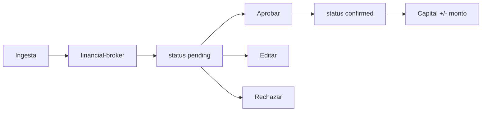

# mod-eco2107 — Módulo Finanzas (Eco)

> **Fecha:** 21 de julio de 2026  
> **Ruta UI:** `/finanzas`  
> **Agentes:** `financial-broker`, `eco-pulse`

---

## Objetivo UX

Fricción cero al ingresar datos, máxima claridad al visualizarlos. El operador captura movimientos en lenguaje natural (texto, voz o captura) y el sistema propone un borrador que requiere un solo click para confirmar.

---

## Modelo de datos

### FinancialTransaction

| Campo | Tipo | Descripción |
|-------|------|-------------|
| `type` | `ingreso` \| `egreso` | Naturaleza del movimiento |
| `amount` | Float | Monto positivo |
| `currency` | String | ISO 4217 (default EUR) |
| `concept` | String | Descripción corta |
| `vendor` | String? | Comercio o servicio |
| `incomeCategory` | sueldo \| inversiones \| pasivos \| ventas | Solo ingresos |
| `expenseTier` | necesarios \| primarios \| secundarios \| terciarios | Solo egresos |
| `projectLabel` | String? | Deprocast, Studianta, Versa, Personal… |
| `status` | pending \| confirmed \| rejected | Flujo HITL |
| `sourceChannel` | text \| audio \| image \| manual | Canal de ingesta |
| `isRecurring` | Boolean | Suscripciones SaaS |
| `isActive` | Boolean | Semáforo SaaS |

### FinancialCapital (singleton `operator`)

| Campo | Tipo | Descripción |
|-------|------|-------------|
| `amount` | Float | Capital económico ("lo que tengo") |
| `currency` | String | Moneda del capital |
| `note` | String? | Nota opcional |

---

## Taxonomía

### Ingresos
- **Sueldo:** nómina fija
- **Inversiones:** rendimientos
- **Pasivos:** ingresos pasivos
- **Ventas:** ventas / consultoría

### Egresos (Tiers)
- **Necesarios:** impuestos, alquiler, comida base
- **Primarios:** operatividad, documentación, vestimenta
- **Secundarios:** ocio, contingencias, imprevistos
- **Terciarios / SaaS:** Cursor, Google Pro, Vercel, Supabase, Perplexity…

---

## Flujo HITL



1. Usuario ingresa texto/audio/imagen
2. `financial-broker` genera borrador (nunca confirma directo)
3. Tarjeta aparece en "Pendientes de aprobación"
4. Un click aprueba; también batch "Aprobar todos"
5. Al aprobar: capital se ajusta (+ ingreso / − egreso)

---

## Métricas (eco-pulse)

| Métrica | Fórmula |
|---------|---------|
| **Runway Vital** | `capital / max(1, suma egresos confirmed del mes con tier necesarios\|primarios)` |
| **Burn mínimo vital** | necesarios + primarios (mes actual) |
| **Burn operativo** | todos los egresos confirmed del mes |
| **Semáforo SaaS** | egresos confirmed `terciarios` con `isActive=true` |

---

## Mapa de archivos

```
prisma/schema.prisma                          # FinancialTransaction, FinancialCapital
prisma/migrations/20260721120000_financial_ledger/
lib/finanzas/
  constants.ts                                # Taxonomía y labels
  types.ts                                    # Zod schemas y DTOs
  broker.ts                                   # Prompt LLM + parse
  broker-multimodal.ts                        # Orquestación texto/audio/imagen
  service.ts                                  # CRUD + HITL + capital
  metrics.ts                                  # eco-pulse
app/api/finanzas/
  ingest/route.ts
  transactions/route.ts
  transactions/approve-all/route.ts
  transactions/[id]/route.ts
  transactions/[id]/approve/route.ts
  transactions/[id]/reject/route.ts
  capital/route.ts
  metrics/route.ts
app/finanzas/page.tsx
components/finanzas/
  finanzas-workspace.tsx
  ingest-box.tsx
  pending-approvals.tsx
  capital-panel.tsx
  runway-vital.tsx
  burn-pulse.tsx
  saas-semaphore.tsx
lib/agentes/catalog.ts                        # financial-broker, eco-pulse
lib/backup/domains.ts                         # dominio finanzas
```

---

## APIs

| Método | Ruta | Descripción |
|--------|------|-------------|
| POST | `/api/finanzas/ingest` | Ingesta multimodal → borrador pending |
| GET | `/api/finanzas/transactions` | Listar transacciones (`?status=pending`) |
| PATCH | `/api/finanzas/transactions/[id]` | Editar borrador |
| POST | `/api/finanzas/transactions/[id]/approve` | Confirmar + ajustar capital |
| POST | `/api/finanzas/transactions/approve-all` | Batch aprobar pendientes |
| POST | `/api/finanzas/transactions/[id]/reject` | Rechazar |
| GET/PUT | `/api/finanzas/capital` | Leer/actualizar capital |
| GET | `/api/finanzas/metrics` | Métricas eco-pulse |

---

## Navegación

- Ruta: `/finanzas`
- Hotkey: `F` (command menu)
- Categoría: `nav` en `lib/navigation/routes.ts`
