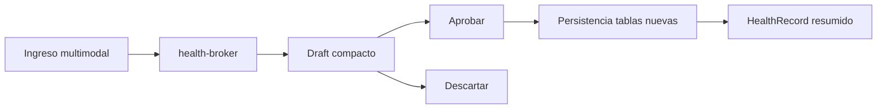

# mod-salud2107 — Módulo Salud (Alimentación + Entrenamiento)

> **Fecha:** 21 de julio de 2026  
> **Ruta UI:** `/salud`  
> **Agentes:** `health-broker`, `nutrimetron`, `kinetometro`, `centinela-somatico`

---

## Objetivo UX

Crear una experiencia densa, directa y sin fricción para registrar salud en una sola pantalla: escribir, dictar o subir imagen; revisar un borrador compacto; confirmar con un click.

---

## Modelo de datos

### NutritionEntry

| Campo | Tipo | Descripción |
|-------|------|-------------|
| `summary` | String | Resumen corto de ingesta |
| `sourceChannel` | `text\|table\|audio\|image` | Canal de entrada |
| `sourceRaw` | String? | Texto original capturado |
| `occurredAt` | DateTime | Momento real de la ingesta |
| `parsedBy` | String | Agente extractor |
| `confidence` | Float? | Confianza del parseo |
| `totalCalories/protein/carbs/fat` | Float? | Totales diarios |
| `healthRecordId` | String? | Compatibilidad con timeline salud |

### NutritionItem

| Campo | Tipo | Descripción |
|-------|------|-------------|
| `entryId` | FK | Vincula cabecera de ingesta |
| `name` | String | Alimento |
| `quantity/grams` | String?/Float? | Cantidad capturada |
| `calories/protein/carbs/fat` | Float? | Macros por ítem |

### TrainingSession

| Campo | Tipo | Descripción |
|-------|------|-------------|
| `summary` | String | Resumen corto de sesión |
| `sourceChannel` | `text\|table\|audio\|image` | Canal de entrada |
| `occurredAt` | DateTime | Momento real del entrenamiento |
| `durationMin` | Int? | Duración |
| `totalVolumeKg` | Float? | Volumen total de carga |
| `intensity` | String? | baja/media/alta |
| `healthRecordId` | String? | Compatibilidad con timeline salud |

### TrainingSet

| Campo | Tipo | Descripción |
|-------|------|-------------|
| `sessionId` | FK | Vincula sesión |
| `exercise` | String | Nombre del ejercicio |
| `series/reps/weightKg` | Int?/Int?/Float? | Carga principal |
| `durationMin/distanceKm` | Int?/Float? | Métricas alternativas |

---

## Flujo HITL



1. Usuario ingresa texto libre, tabla, audio o imagen.
2. `health-broker` clasifica dominio y parsea estructura.
3. UI muestra tarjeta flotante de confirmación.
4. Solo al aprobar se persiste en `NutritionEntry`/`TrainingSession` y se publica a timeline.

---

## Mapa de archivos

```text
app/api/salud/ingest/route.ts
app/api/salud/records/route.ts
components/salud/salud-workspace.tsx
components/salud/shared/health-draft-card.tsx
components/salud/shared/health-quick-table.tsx
lib/agentes/health-broker.ts
lib/health/entries-service.ts
lib/health/time-parser.ts
prisma/schema.prisma
prisma/migrations/20260721132000_health_broker_refactor/migration.sql
```

---

## APIs

| Método | Ruta | Descripción |
|--------|------|-------------|
| `POST` | `/api/salud/ingest` | Genera draft parseado desde entrada multimodal |
| `PUT` | `/api/salud/ingest` | Confirma draft HITL y persiste |
| `GET` | `/api/salud/records?view=today` | Devuelve resumen diario compacto |

---

## Navegación

- Ruta principal: `/salud`
- Vista compacta de dos tabs: Alimentación y Entrenamiento
- Sin selectores rígidos de tiempo; interpretación natural en broker
