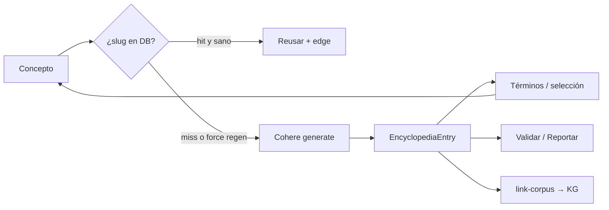
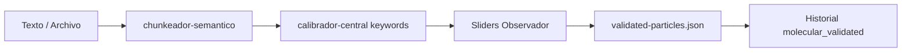
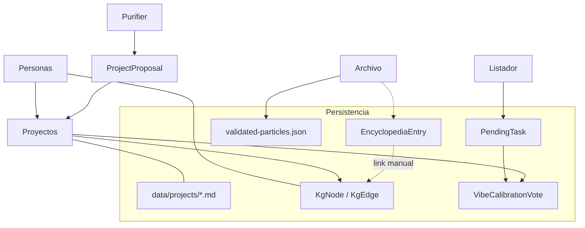

# reporte2107 — Personas · Proyectos · Enciclopedia · Molecular · Calibrador

> **Fecha:** 21 de julio de 2026  
> **Propósito:** Documento de análisis profundo para otra IA (contexto de arquitectura + superficie de cambio).  
> **Ámbito:** cinco módulos del Atanor local Deprocast.  
> **Core Deprocast (contexto):** Exoesqueleto cognitivo de circuito cerrado; el Observador valida (HITL); la IA propone; la escala 1–12 mide gravedad/fricción; el conocimiento es compostaje continuo (luz vs ruido); soberanía local (Prisma/SQLite + filesystem).

---

## Índice

1. [Mapa de agentes (resumen cruzado)](#1-mapa-de-agentes-resumen-cruzado)
2. [Personas](#2-personas)
3. [Proyectos](#3-proyectos)
4. [Enciclopedia](#4-enciclopedia)
5. [Molecular](#5-molecular)
6. [Calibrador (Vibe)](#6-calibrador-vibe)
7. [Integraciones cruzadas y huecos](#7-integraciones-cruzadas-y-huecos)
8. [Recomendaciones](#8-recomendaciones)

---

## 1. Mapa de agentes (resumen cruzado)

| Sistema | Agentes primarios (id catálogo) | Tipo | ¿LLM? | Ruta UI |
|---------|--------------------------------|------|-------|---------|
| **Personas** | `motor-kg`, `exocortex`, `grafologo-castillo`, `incubador-atanor` (stubs) | Consumidores / extractores | Sí (KG/chat) | `/personas` |
| **Proyectos** | `incubador-atanor`, `orquestador` (Purifier→propuestas), `mago-22`, `ludus`, `motor-kg`, fuente `projects` | Incubación + gamificación | Sí (incubador) | `/proyectos`, `/proyectos/nuevo` |
| **Enciclopedia** | `enciclopediador` (+ `motor-kg` vía corpus-link) | Generativo + HITL feedback | Sí (Cohere) | `/enciclopedia` |
| **Molecular** | `chunkeador-semantico`, `calibrador-central` | Pipeline determinístico + HITL | **No** | `/molecular` |
| **Calibrador Vibe** | `calibrador` (+ `task-calibrator`, `listador` como upstream) | Cola HITL de gravedad | **No** | `/calibrador` |

**Confusión de nombres crítica:** existen **dos “Calibradores”** distintos:

| Id | Nombre UI | Qué calibra | Persistencia |
|----|-----------|-------------|--------------|
| `calibrador-central` | Calibrador Central (panel Molecular) | Ejes X/Y/Z de **partículas de texto** | `data/molecular/validated-particles.json` |
| `calibrador` | Calibrador de Vibe | Peso 1–12 de **proyectos / retos / PendingTask** | Prisma `VibeCalibrationSession` + `VibeCalibrationVote` |

Además, `task-calibrator` (en `/pendientes`) calibra tareas individuales y alimenta el adapter `generated` del Vibe Calibrator; **no** es la misma UI que `/calibrador`.

---

## 2. Personas

### 2.1 Concepto

CRM de contexto construido **sobre el Knowledge Graph**, no sobre una tabla `Persona`. Cada persona es un `KgNode` con `type: "persona"`. Las relaciones son `KgEdge`. El módulo `/personas` es la fachada de dominio.

### 2.2 Rutas UI

| Ruta | Componente | Qué ve el usuario |
|------|------------|-------------------|
| `/personas` | `personas-dashboard.tsx` | Tabs **Lista** (tabla/tarjetas) y **Grafo**; búsqueda; FAB “Añadir persona” |
| `/personas/[id]` o `/personas/<slug>` | `persona-detail-workspace.tsx` | Ficha: notas, vínculos, bucles abiertos (proyectos activos), muro de actividad |

Navegación: `lib/navigation/routes.ts` → id `personas`, href `/personas`.

### 2.3 Modelo de datos

Persistido en Prisma `KgNode` / `KgEdge` / `KgMention`; mapeado en `lib/personas/`.

**Persona (dominio):**
- `id`, `nombrePrincipal`, `aliases[]`, `notasGenerales`
- Metadata extendida: `personaKind` (`fisica` | `juridica`), `legalName`, `roles[]`, `campoSlug`, `alsoProject`, `linkedProjectNodeId`, `secondaryTypes[]`

**Relaciones tipadas (todas `KgEdge`):**
| Kind | relationType(s) | Semántica |
|------|-----------------|-----------|
| Persona↔Persona | `colabora_con`, `subordinado_de`, `relacionado_con`, `cliente_de`, `competidor_de`, `menciona_a` | Red social de contexto |
| Persona↔Proyecto | `participa_en` + `metadata.rolPrincipal` | Rol libre (responsable, colaborador…) |
| Persona↔Campo | `pertenece_a` → nodo `concepto` con `campoSlug` | Afiliación a Campo soberano |

**DTOs UI:** `PersonaCardDto`, `PersonaDetailDto` (incluyen proyectos, openLoops, activity).

### 2.4 Agentes involucrados

| Agente | Rol respecto a Personas |
|--------|-------------------------|
| **`motor-kg`** | Extrae/tipifica nodos `persona` (aliases, `personaKind`) desde texto ingerido |
| **`exocortex`** | Resuelve `@menciones` de personas en chat |
| **`grafologo-castillo`** | Incluye personas en mapa ego-céntrico del Castillo |
| **`incubador-atanor`** | Crea stubs de persona (`ensurePersonaStub`) al consolidar proyectos |
| *(sin agente LLM dedicado de CRM)* | CRUD y vínculos son **acción directa del Observador** |

### 2.5 Qué puede hacer el usuario

1. **CRUD:** crear (con aliases + notas), editar, eliminar (cascade de aristas/menciones).
2. **Deduplicación:** al crear, merge de aliases por identidad normalizada (`lib/kg/identity.ts`).
3. **Vincular:** sheet de relaciones → destino persona/proyecto/campo + tipo/rol + contexto libre.
4. **Grafo interactivo:** modos Exclusivo (persona↔persona) y Mixto (+proyectos/campos); Shift+arrastrar para crear vínculo; eliminar aristas; panel lateral al seleccionar nodo.
5. **Lista:** toggle tabla/tarjetas, búsqueda por nombre/alias/rol, badges de proyectos activos.
6. **Ficha detalle:** muro de actividad (menciones KG con deep-links a diario/chat/audio + relaciones de chat).
7. **Open loops:** ver proyectos vinculados aún no cerrados (`estado` ∉ Implantado/Descartado y avance &lt; 100%).

### 2.6 APIs

| Método | Ruta | Función |
|--------|------|---------|
| GET/POST | `/api/personas` | Listar (universo Babel) / crear |
| GET/PATCH/DELETE | `/api/personas/[id]` | Ficha / editar / eliminar |
| GET | `/api/personas/graph?mode=` | Snapshot exclusive \| mixed |
| POST | `/api/personas/relations` | Crear relación (discriminada por `kind`) |
| PATCH/DELETE | `/api/personas/relations/[edgeId]` | Editar / borrar arista |
| GET | `/api/personas/link-targets` | Buscador de destinos |
| GET/POST | `/api/kg/personas` | Búsqueda KG genérica / stub (`ensurePersonaStub`) |

### 2.7 HITL

- Edición en `/personas` es **directa** (sin cola de aprobación).
- HITL indirecto: nodos/aristas extraídos por `motor-kg` nacen con `reconocido: false` hasta validación en `/validar` (flujo KG general, no exclusivo de personas).

### 2.8 Archivos clave

```
lib/personas/{model,types,service,queries,relations,graph,mappers,slug}.ts
lib/kg/{types,personas,identity,normalize,queries}.ts
app/personas/page.tsx · app/personas/[id]/page.tsx
app/api/personas/** · app/api/kg/personas/route.ts
components/personas/*
```

---

## 3. Proyectos

### 3.1 Concepto

Los proyectos **consolidados viven en filesystem** como Markdown + frontmatter YAML (`data/projects/<campoSlug>/<id>.md`), no como filas Prisma. Prisma solo guarda el **pre-proyecto**: `ProjectProposal` (bandeja) y `ProjectIncubationSession` (chat incubador). Los **Campos** son contenedores soberanos (dirs + `.campo.json`); el Campo `babel` es sumidero por defecto.

### 3.2 Rutas UI

| Ruta | Vista | Componente |
|------|-------|------------|
| `/proyectos` | Activos (tablero por Campo) | `proyectos-dashboard` + `project-board` |
| `/proyectos?view=campos` | Gestión de Campos | `campos-workspace` |
| `/proyectos?view=propuestas` | Bandeja pending | `proposals-workspace` |
| `/proyectos?view=archivo` | Propuestas archivadas | idem `status=archived` |
| `/proyectos/nuevo` | Incubador conversacional | `incubation-workspace` |

### 3.3 Modelo de datos

**`Project` (frontmatter → `lib/projects/types.ts`):**  
`id, title, tipo (proyecto|reto|area), campo, campoSlug, metaTagsSecundarios[], description, responsable, subpersonasCargo[], fechaInicio, fechaObjetivo, prioridad/impacto/dificultad (1–12), horasEstimadas/Realizadas, avancePorcentaje, estado (Idea|Diseño|Desarrollo|Pruebas|Implantado|Descartado), resultadoFinal, progressEntries[], filename, filePath`.

**`Campo`:** `slug, label, count, description, createdAt, projectIds[]`; puede ligarse a `universeSlug` Babel.

**`ProjectProposal` (Prisma):** `status pending|archived|activated`, `originType purifier|quick_create|ai_chat`, sugerencias de campo/tipo, mvp, firstStep, priorityReason, `sourcePayload`, `activatedProjectId`.

**`ProjectIncubationSession`:** mensajes JSON + `extractionState` (3 bloques: identidad / ecosistema / ejecución) + `status active|consolidated|abandoned`.

### 3.4 Agentes involucrados

| Agente | Rol |
|--------|-----|
| **`incubador-atanor`** | Entrevista 1 pregunta/turno; re-extrae `IncubationExtraction`; consolida a `.md` |
| **`orquestador` (Purifier)** | Puede crear `ProjectProposal` (`originType: purifier`) al aprobar contenido |
| **`motor-kg` + fuente `projects`** | Ingesta determinística de frontmatter → nodos/aristas KG |
| **`mago-22`** | Proyecta colecciones 1–22; fricción por inactividad (`fogLevel`) |
| **`ludus` / Castillo** | Vision board, microtareas, asaltos |
| **`grafologo-castillo`** | Proyectos en mapa semántico |
| **`exocortex`** | `@menciones` a proyectos |

### 3.5 Qué puede hacer el usuario

**Tablero Activos**
- Filtrar por Campo; ver prioridad/impacto/avance/horas/estado; “boss” si prioridad o impacto ≥ 10.
- Abrir detalle: descripción, **mover de Campo**, **añadir bitácora de progreso** (re-ingesta KG forzada).

**Campos**
- Crear / editar label y descripción; ver proyectos vinculados; asignación rápida desde Babel (sacar del sumidero).

**Propuestas (HITL de activación)**
- Tres densidades (localStorage): Simple / Moderado / Completo (MVP, primer paso, motivo, sliders gravedad, dimensiones Purifier).
- Elegir tipo, multi-Campo, personas (`PersonBadgeSelect`).
- **Activar** → crea `Project` real; o **Archivar**.

**Incubador (`/proyectos/nuevo`)**
- Chat conversacional + panel HITL lateral editable en vivo.
- Checklist Identidad / Ecosistema / Ejecución.
- **Consolidar** solo si `readiness.isReady` (obligatorios: nombre, campo, estado_actual).
- Al consolidar: stubs de personas + `.md` + ingesta KG async.

### 3.6 APIs

| Método | Ruta | Función |
|--------|------|---------|
| GET/POST | `/api/proyectos` | Listar / crear proyecto o propuesta `mode:"quick"` |
| POST | `/api/proyectos/[id]/progress` | Bitácora + re-ingesta KG |
| PATCH | `/api/proyectos/[id]/campo` | Reasignar Campo (mueve archivo) |
| CRUD | `/api/campos`, `/api/campos/[slug]` | Campos |
| GET/POST | `/api/proyectos/proposals` | Listar / crear propuesta |
| GET/PATCH | `/api/proyectos/proposals/[id]` | Ver / editar campos HITL |
| POST | `.../approve` · `.../archive` | Activar / archivar |
| POST | `/api/proyectos/incubation/sessions` | Nueva sesión |
| POST | `.../sessions/[id]/turn` | Turno chat + re-extracción |
| POST | `.../sessions/[id]/consolidate` | Consolidar → Project |

### 3.7 Flujos

```mermaid
flowchart TB
  subgraph A[Incubación conversacional]
    S[Sesión] --> T[Turnos LLM]
    T --> E[Extraction merge]
    E --> H[HITL panel]
    H --> C[Consolidar]
    C --> P[.md Project]
  end
  subgraph B[Bandeja propuestas]
    Q[purifier / quick / ai_chat] --> Prop[ProjectProposal pending]
    Prop --> Act[Activar]
    Prop --> Arch[Archivar]
    Act --> P
  end
  P --> KG[ingestSingleProject async]
  P --> Ludus[Castillo / Mago / Trinchera]
  P --> Vib[/calibrador validated]
```

### 3.8 Archivos clave

```
lib/projects/{types,service,campos,campo-meta,markdown,paths,priority,proposal-store,activate-proposal}.ts
lib/projects/incubation/{schema,readiness,engine,extract,consolidate,session-store,prompts}.ts
lib/kg/sources/projects.ts
app/proyectos/** · app/api/proyectos/** · app/api/campos/**
components/proyectos/*
```

---

## 4. Enciclopedia

### 4.1 Concepto

Agente **`enciclopediador`**: genera entradas enciclopédicas a partir de un concepto, sugiere términos explorables, mantiene un **grafo de sesión** (no global) y permite vincular al Corpus (KG) con feedback HITL (validar/reportar). Scoped por universo Babel.

### 4.2 Rutas UI

- Única: `/enciclopedia` → `EnciclopediaWorkspace` (stack de exploración en memoria: breadcrumb + Volver).
- Fases UX numeradas: 01 Pregunta → 02/03 Descubre/Explora → 04 Conecta → 05 Vincula → 06 Reporta.

### 4.3 Modelo de datos (Prisma)

| Modelo | Campos relevantes |
|--------|-------------------|
| `EncyclopediaEntry` | `slug`, `title`, `body`, `explorableTerms`, `parentEntryId`, `triggerTerm`, `model`, `validatedCount`, `reportCount`, `kgNodeId` |
| `EncyclopediaEdge` | `fromEntryId`, `toEntryId`, `triggerTerm` (unique compuesto) |
| `EncyclopediaReport` | `type validate\|inaccuracy\|missing\|other`, `comment`, `bodySnapshot` |

### 4.4 Agentes involucrados

| Agente | Rol |
|--------|-----|
| **`enciclopediador`** | Generación Cohere JSON (`title`, `body` markdown, 3–15 `explorableTerms`); caché por slug; regeneración forzada si reportes &gt; validaciones y ≥ 3 reportes |
| **`motor-kg`** (indirecto) | Al vincular corpus: `ingestDocumentSource` + `KgEdge` |

### 4.5 Qué puede hacer el usuario

1. Preguntar un concepto → entrada raíz (o hit de caché).
2. Explorar chips de términos o **selección libre de texto** (2–120 chars) → nueva entrada hija + arco.
3. Ver/navegar grafo force-directed de la sesión.
4. Vincular a nodos KG (proyecto/persona/área/concepto) con relación `relacionado_con | define | relevante_para | menciona_a | documenta`.
5. Validar entrada o reportar inexactitud/falta/otro.
6. Nueva sesión (reset estado cliente); al cambiar universo Babel se resetea.

### 4.6 APIs

| Método | Ruta | Función |
|--------|------|---------|
| POST | `/api/enciclopedia/explore` | Generar/recuperar + arco |
| GET | `/api/enciclopedia/entries/[id]` | Detalle + últimos reportes |
| GET | `/api/enciclopedia/graph?entryIds=` | Snapshot sesión |
| POST | `/api/enciclopedia/report` | Validar / reportar |
| POST | `/api/enciclopedia/link-corpus` | Crear/asegurar KgNode concepto + edge |

### 4.7 Flujo



### 4.8 Archivos clave

```
lib/enciclopedia/{types,constants,slug,generator,service,corpus-link,index}.ts
components/enciclopedia/*
app/enciclopedia/{page,layout}.tsx
app/api/enciclopedia/**
```

### 4.9 Integraciones

- **Babel:** `universeFetch` + reset al cambiar universo.
- **KG/Corpus:** vinculación **manual** (no automática).
- **Historial:** `logEncyclopediaGeneratedActivity`.
- **Sin puente de código** hacia Molecular ni Vibe Calibrator.

---

## 5. Molecular

### 5.1 Concepto

Pipeline de **desintegración semántica** del corpus: texto → partículas → propuesta de posición en espacio 3 ejes → validación humana. Es el único calibrador **determinístico por keywords** del catálogo (sin LLM). UI en dos columnas: Chunkeador (Agente 01) + Calibrador Central (Agente 02).

**Fórmula:** `Currency Potencial = ejeY ÷ ejeZ` (impacto / fricción), compartida con utilidades de `lib/jornada/`.

### 5.2 Rutas UI

- `/molecular` → `MolecularWorkspace` + `PipelineIndicator` (Chunkear → Calibrar → Validar).

### 5.3 Modelo (`lib/molecular-processing/types.ts`)

| Tipo | Contenido |
|------|-----------|
| `ParticulaMetadata` | `id`, `textoFragmento`, `fuenteOrigen`, `fechaIngesta` |
| `CalibracionEjes` | `ejeX` BloquePrioridad (Meta/Salud/Educación/Finanzas/Leyes/Tech), `ejeY` 1–12 impacto, `ejeZ` 1–12 fricción |
| `CalibracionPropuesta` | ejes + `currencyPotencial` + `confianza` + `razonamiento` |
| `ParticulaValidada` | ejes finales + `validada: true` + `validadaAt` + `propuestaOriginal` (auditoría) |

Persistencia: **JSON filesystem** `data/molecular/validated-particles.json` (no Prisma).

### 5.4 Agentes involucrados

| Agente | Tipo | Qué hace |
|--------|------|----------|
| **`chunkeador-semantico`** | Determinístico | Segmenta por párrafos/oraciones (min 24 / target 180 / max 420 chars); simula latencia UX |
| **`calibrador-central`** | Keywords + HITL | Infiere X/Y/Z; usuario ajusta sliders y valida |

### 5.5 Qué puede hacer el usuario

1. Entrada **Manual** (pegar texto + fuente) o **Desde Archivo** (`/api/molecular/sources`, filtrado Babel).
2. “Desintegrar →” → chunk → auto-calibración (~900 ms).
3. Por partícula: sliders Eje X/Y/Z; ver flag si recalibró vs propuesta; “Validar partícula →”.
4. **Modo batch** “Calibrar todo”: recorre fuentes documento a documento; saltar / detener.
5. Reiniciar pipeline.

### 5.6 APIs

| Método | Ruta | Función |
|--------|------|---------|
| POST | `/api/molecular/chunk` | Chunkeador |
| POST | `/api/molecular/calibrate` | Calibrador Central |
| GET | `/api/molecular/sources` | Docs del Archivo (universo) |
| POST/GET | `/api/molecular/validate` | Persistir / listar validadas |

### 5.7 Pipeline



### 5.8 Archivos clave

```
lib/molecular-processing/{types,constants,semantic-chunker,calibrator,store,index}.ts
components/molecular/*
app/molecular/{page,layout}.tsx
app/api/molecular/**
data/molecular/validated-particles.json
```

### 5.9 Relación con otros

- Comparte escala 1–12 y bloques de prioridad con Jornada / filosofía Deprocast.
- **Sin imports cruzados** con `lib/vibe-calibrator` ni Enciclopedia.
- Fuentes leen del mismo Archivo que otros módulos.

---

## 6. Calibrador (Vibe)

### 6.1 Concepto

Agente **`calibrador`**: sesión tipo juego/cartas donde el Observador asigna **gravedad subjetiva 1–12** a ítems de cola. Sin LLM. Distinto del Calibrador Central (Molecular) y del Calibrador de Tareas (`/pendientes`).

### 6.2 Rutas UI

- `/calibrador` → config centrada + modal fullscreen de sesión (`createPortal`), layout sin scroll de página (experiencia “juego”).

### 6.3 Modelo y fuentes de cartas

**Card:** `{ id, title, description, source: "validated"|"generated", sourceRef?, metadata }`.

| Source | Adapter | Origen de datos |
|--------|---------|-----------------|
| `validated` | `adapters/validated.ts` | Retos laborales (`laboral_varona`) + **proyectos** (`listProjects`, filtro universo) |
| `generated` | `adapters/generated.ts` | `PendingTask` con status `recognized` \| `calibrated` |

Cola: paralelo + dedupe por id + `limit` 1–100 (default 20).

**Prisma:** `VibeCalibrationSession` (config JSON, started/completed) → N `VibeCalibrationVote` (cardId, cardSource, weight, metadata).

### 6.4 Agentes involucrados

| Agente | Rol |
|--------|-----|
| **`calibrador`** | Orquesta cola, sesión, votos |
| **`task-calibrator`** | Upstream de tareas; comparte `weight-slider`; actualiza PendingTask por su propia API |
| **`listador`** / Extractor Trailing | Generan `PendingTask` que entran en source `generated` |

### 6.5 Qué puede hacer el usuario

1. Config: toggles Validadas/Generadas, filtro `campoSlug`, límite; preview live de tamaño de cola.
2. Iniciar sesión → cartas con flip 3D (frente: título + WeightSlider; dorso: historial de votos de la sesión).
3. Soltar slider → voto optimista + POST background + avance animado.
4. Completar cola → resumen + marcar sesión completa + log Historial.
5. Cerrar mid-sesión: confirmación si ya hay votos.
6. Cambio de universo Babel → resetea sesión.

### 6.6 APIs

| Método | Ruta | Función |
|--------|------|---------|
| GET | `/api/vibe-calibrator/queue` | Preview sin sesión |
| POST | `/api/vibe-calibrator/session` | Crear sesión + cola |
| GET | `/api/vibe-calibrator/session?sessionId=` | Recuperar |
| PATCH | `/api/vibe-calibrator/session` | `action: complete` |
| POST | `/api/vibe-calibrator/vote` | Registrar peso |

Todas respetan filtro de universo Babel.

### 6.7 Nota de integración (gap)

Los votos del Vibe Calibrator **se persisten en SQLite** pero **no se observa** en el código actual que actualicen automáticamente el `prioridad` del Project frontmatter ni el `weight` de la `PendingTask` origen. El `task-calibrator` en `/pendientes` sí escribe peso en la tarea vía `PATCH .../calibrate`. Son flujos paralelos con UI compartida (slider).

### 6.8 Archivos clave

```
lib/vibe-calibrator/{types,constants,build-queue,persist,index}.ts
lib/vibe-calibrator/adapters/{validated,generated}.ts
components/vibe-calibrator/*
app/calibrador/{page,layout}.tsx
app/api/vibe-calibrator/**
```

---

## 7. Integraciones cruzadas y huecos



| Conexión | Estado actual |
|----------|---------------|
| Personas ↔ Proyectos | Fuerte (`participa_en`, openLoops, stubs en incubación) |
| Proyectos → KG | Fuerte (ingesta async) |
| Enciclopedia → KG | Débil/manual (`link-corpus`) |
| Molecular ↔ Vibe | **Ausente** (filosofía similar, cero código compartido de datos) |
| Molecular → Enciclopedia / Proyectos | **Ausente** |
| Vibe votes → Project.prioridad | **Ausente** (gap) |
| Babel universe | Filtra personas/proyectos/enciclopedia/molecular sources/calibrador |

---

## 8. Recomendaciones

Ideas alineadas al core Deprocast (Observador soberano, HITL, compostaje de luz, gravedad 1–12, fricción mínima, circuito local). Priorizadas por apalancamiento, no por estética.

### 8.1 Unificar la “gravedad” como SSOT

Hoy coexisten: prioridad/impacto/dificultad de Project, weight de PendingTask, votos Vibe, ejes Y/Z Molecular, actionCost de calendario.  
**Idea:** definir un contrato único `GravitySignal { entityType, entityId, weight1to12, source, votedAt, agentId }` y hacer que Vibe Calibrator **escriba de vuelta** al Project frontmatter y/o PendingTask (con preview HITL “aplicar a origen”). Sin eso, calibrar vibe es ritual sin efecto operativo en Ludus/Trinchera.

### 8.2 Puente Molecular → Propuestas / Pendientes

Partículas validadas con alto Currency Potencial (Y/Z alto) deberían poder **coagular** en `ProjectProposal` o `PendingTask` con un click (“Ascender a misión”). Hoy el Molecular termina en un JSON muerto para el resto del OS. Encaja con la metáfora Atanor: desintegrar → calibrar → **materializar**.

### 8.3 Enciclopedia como “campo semántico” de Campos/Proyectos

Al consolidar un proyecto o crear un Campo, ofrecer “generar entrada enciclopédica ancla” y auto-`link-corpus` con `documenta` / `define`. Al revés: desde una entrada, “crear propuesta de proyecto” si el concepto es accionable. Cierra el ciclo luz estructurada ↔ ejecución.

### 8.4 Personas: HITL ligero sobre extracción KG

El CRM es potente pero las personas “aparecidas” por `motor-kg` no tienen bandeja propia.  
**Idea:** tab “Candidatas” en `/personas` (nodos `persona` con `reconocido: false`) con merge/descartar/promover — mismo patrón que Propuestas. Reduce ruido en el grafo Mixto.

### 8.5 Open loops accionables

En ficha de persona, “bucles abiertos” hoy son informativos.  
**Idea:** CTA “Coagular en mazo” / “Crear PendingTask de follow-up” / deep-link a `/calendario` con carta preseleccionada. Personas dejan de ser CRM pasivo y pasan a ser **generadores de fricción reducida**.

### 8.6 Clarificar naming en UI y catálogo

Renombrar en superficie para el Observador:
- Molecular → “Calibrador de partículas” o mantener “Central” con subtítulo “ejes X/Y/Z”.
- `/calibrador` → “Calibrador de Vibe / Gravedad”.
- Evitar el mismo emoji ⚖️ en ambos agentes del catálogo sin badge distintivo más fuerte.

Reduce errores al pedir cambios a otra IA o al operador.

### 8.7 Batch Molecular con feedback de calidad

El modo “Calibrar todo” es potente pero el keyword-scorer es tosco (default Meta).  
**Ideas:** (a) mostrar confianza y permitir “aceptar propuesta” con Enter sin tocar sliders; (b) opcionalmente sustituir inferencia por un LLM *solo* cuando `confianza < umbral`, manteniendo el default determinístico local-first; (c) migrar `validated-particles.json` a Prisma para backup/Historial/Babel por universo.

### 8.8 Densidad de propuestas ↔ incubador

El incubador conversacional y la bandeja de propuestas son dos puertas al mismo `Project`.  
**Idea:** desde una propuesta Moderada/Completa, botón “Profundir en incubador” (pre-carga extractionState); y desde incubador incompleto, “Guardar como propuesta” sin consolidar. Unifica el funnel Idea → Luz → Boss.

### 8.9 Grafo de sesión Enciclopedia → grafo global opcional

Hoy el grafo muere al cerrar sesión. Persistir `EncyclopediaEdge` ya existe; falta UI “Exploraciones guardadas” y proyección en `/grafo` o Castillo como nodos `concepto` con `metadata.source: enciclopedia`. Compostaje: la exploración no es efímera.

### 8.10 Señal cruzada Personas–Calibrador

Permitir filtrar cola Vibe por `responsable` / personas vinculadas al proyecto (no solo `campoSlug`). El Observador calibra “lo de Ignacio” o “lo de Varona” en una sesión — alineado a Posición (Observador|Jugador|Avatar) del grimorio.

### 8.11 Telemetría mínima de compostaje

Para decidir qué cambiar después: dashboard liviano (o sección en Historial) con tasas:
- % propuestas activadas vs archivadas  
- % partículas Molecular cuya Currency no generó downstream  
- correlación votos Vibe vs prioridad actual del Project  
- entradas Enciclopedia con `reportCount > validatedCount`

Mide dónde la luz se pierde.

### 8.12 Principio de diseño al implementar cambios

Cualquier evolución de estos cinco módulos debería preservar:

1. **HITL por defecto** — la IA propone; el Observador confirma.  
2. **Local-first** — filesystem + SQLite; Babel como sellado de contexto, no multi-tenant cloud.  
3. **Escala 1–12** — una sola gramática de gravedad/fricción.  
4. **Una acción primaria por vista** — no convertir dashboards en cementerios de cards.  
5. **Trazabilidad** — `propuestaOriginal`, `originType`, `sourceRef`, agentId en Historial.

---

## Anexo A — Inventario rápido de rutas

| Módulo | UI | API root |
|--------|-----|----------|
| Personas | `/personas`, `/personas/[id]` | `/api/personas`, `/api/kg/personas` |
| Proyectos | `/proyectos`, `/proyectos/nuevo` | `/api/proyectos`, `/api/campos` |
| Enciclopedia | `/enciclopedia` | `/api/enciclopedia` |
| Molecular | `/molecular` | `/api/molecular` |
| Calibrador Vibe | `/calibrador` | `/api/vibe-calibrator` |

## Anexo B — Cómo usar este documento en otra IA

Prompt sugerido:

> Sos arquitecto de Deprocast. Leé `reporte2107.md`. Quiero cambiar [X]. Respetá HITL, escala 1–12, agentes listados, y no confundas `calibrador` (Vibe) con `calibrador-central` (Molecular). Proponé diff mínimo por archivos clave del anexo de cada sección.

---

*Fin de reporte2107 — generado 2026-07-21 a partir del código en `c:\Dev\deprocast`.*
